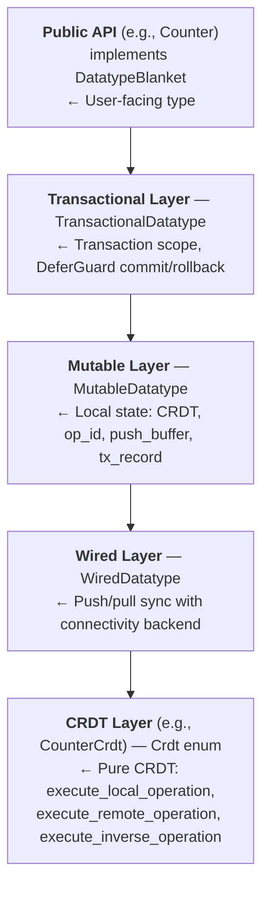
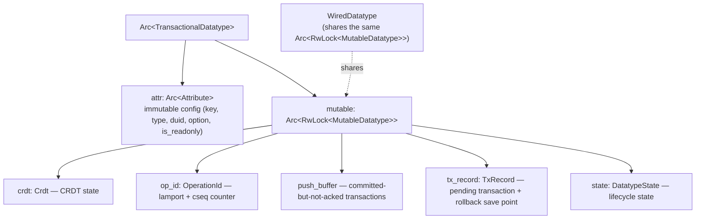
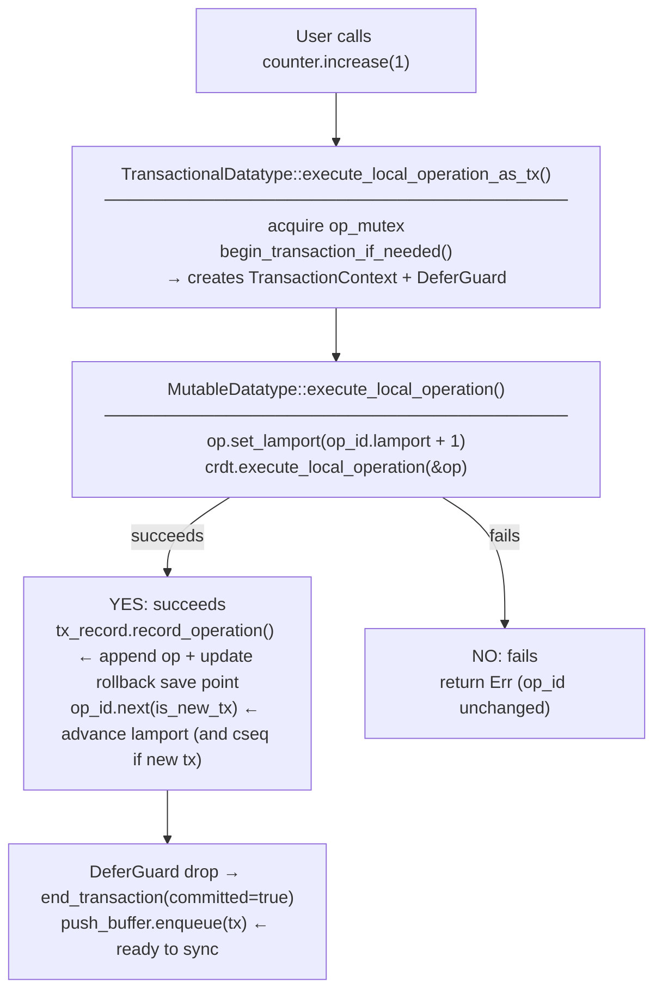
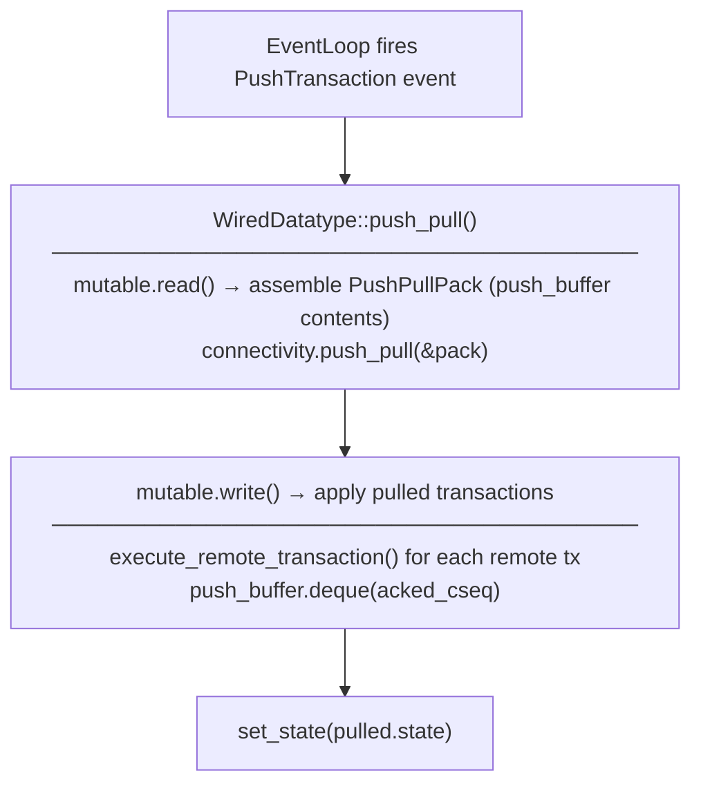

# Qortoo-rs Architecture

## Overview

Qortoo-rs is a Rust SDK for CRDTs (Conflict-free Replicated Data Types) with distributed synchronization. All datatype instances are thread-safe and support atomic transactions with rollback.

## Datatype Layer Stack

Each datatype is composed of five layers stacked vertically. A user operation passes through all layers top-down.

> For datatype lifecycle states and write-access rules see [`docs/datatype-state.md`](datatype-state.md).
> For event loop internals (channel architecture, BackOff, Notify flow) see [`docs/event-loop.md`](event-loop.md).
> For error taxonomy and `RecoveryAction` routing see [`docs/error-handling.md`](error-handling.md).

### Layer Responsibilities

| Layer | Struct | Key Responsibility |
|-------|--------|--------------------|
| Public API | `Counter`, etc. | User-facing methods; implements `DatatypeBlanket` |
| Transactional | `TransactionalDatatype` | Transaction scope via `TransactionContext` and `DeferGuard`; serializes concurrent ops via `op_mutex` / `tx_mutex` |
| Mutable | `MutableDatatype` | Owns `Crdt`, `OperationId`, `PushBuffer`, `TxRecord`; executes and records operations |
| Wired | `WiredDatatype` | Assembles `PushPullPack` and calls `Connectivity::push_pull`; drives the event loop |
| CRDT | `CounterCrdt`, … | Pure state machine; no I/O, no locking |

## Shared State Model

`Arc<Attribute>` is shared across all layers and is the best place for per-datatype cross-cutting concerns (handler registry, push buffer options, etc.).

## Operation Flow

### Local write

### Sync (push/pull)

## Concurrency Model

- `mutable: Arc<RwLock<MutableDatatype>>` — all CRDT mutation is serialized here
- `op_mutex: NoGuardMutex` — serializes concurrent `execute_local_operation` calls
- `tx_mutex: NoGuardMutex` — serializes concurrent transaction scopes
- Handler notifications are dispatched via `rt_handle.spawn` **after** the write lock is released to avoid deadlock (handlers may call `get_value()` which takes a read lock)

## Key Types Quick Reference

| Type | Location | Purpose |
|------|----------|---------|
| `OperationId` | `src/types/operation_id.rs` | `(lamport, cuid, cseq)` — identifies an operation's position |
| `Operation` | `src/operations/mod.rs` | Single CRDT operation with `OperationBody` and `lamport` |
| `Transaction` | `src/operations/transaction.rs` | Ordered group of operations sharing `cuid`/`cseq` |
| `TxRecord` | `src/datatypes/tx_record.rs` | Pending transaction buffer + rollback save point |
| `PushPullPack` | `src/types/push_pull_pack.rs` | Wire format for push/pull exchange |
| `Attribute` | `src/datatypes/common.rs` | Immutable per-datatype config shared across layers |
| `DatatypeState` | `src/types/datatype.rs` | Lifecycle state machine; see [`docs/datatype-state.md`](datatype-state.md) |
