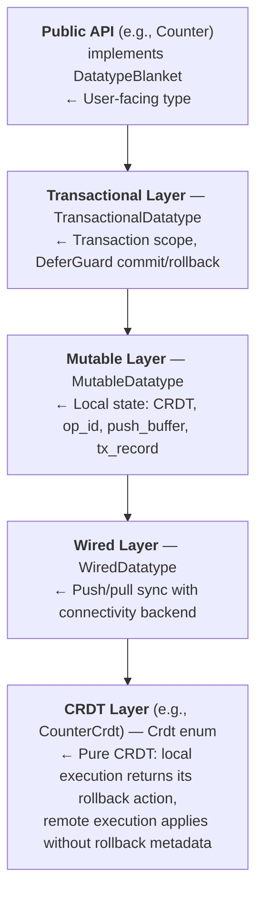
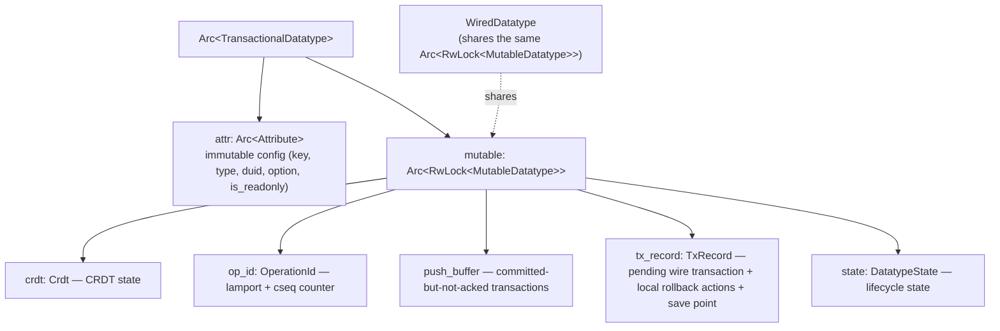
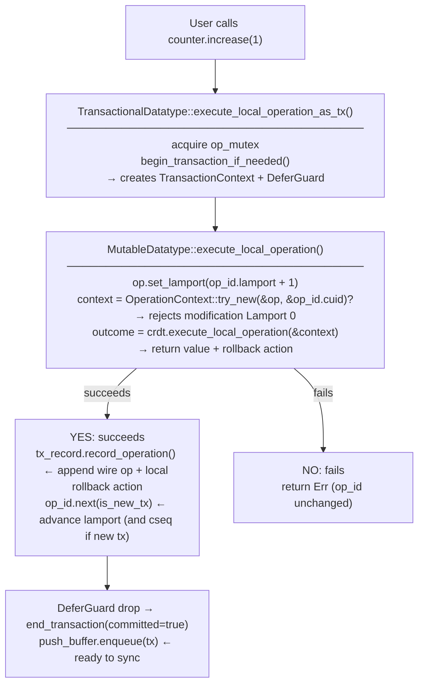
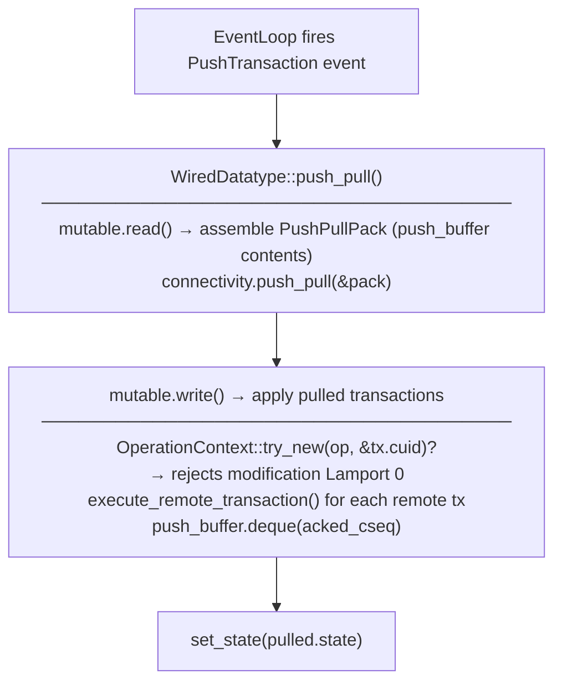

# Qortoo-rs Architecture

## Overview

Qortoo-rs is a Rust SDK for CRDTs (Conflict-free Replicated Data Types) with distributed synchronization. All datatype instances are thread-safe and support atomic transactions with rollback.

## Datatype Layer Stack

Each datatype is composed of five layers stacked vertically. A user operation passes through all layers top-down.

```mermaid
flowchart TD
    API["<b>Public API</b> (e.g., Counter)<br/>implements DatatypeBlanket<br/>← User-facing type"]
    TX["<b>Transactional Layer</b> — TransactionalDatatype<br/>← Transaction scope, DeferGuard commit/rollback"]
    MU["<b>Mutable Layer</b> — MutableDatatype<br/>← Local state: CRDT, op_id, push_buffer, tx_record"]
    WI["<b>Wired Layer</b> — WiredDatatype<br/>← Push/pull sync with connectivity backend"]
    CR["<b>CRDT Layer</b> (e.g., CounterCrdt) — Crdt enum<br/>← Pure CRDT: local execution returns its rollback action,<br/>remote execution applies without rollback metadata"]

    API --> TX --> MU --> WI --> CR
```

> For datatype lifecycle states and write-access rules see [`docs/datatype-state.md`](datatype-state.md).
> For event loop internals (channel architecture, BackOff, Notify flow) see [`docs/event-loop.md`](event-loop.md).
> For error taxonomy and `RecoveryAction` routing see [`docs/error-handling.md`](error-handling.md).
> For UID roles, CRDT ordering keys, and client/server transaction sequence types see [`docs/core-types.md`](core-types.md).

### Layer Responsibilities

| Layer | Struct | Key Responsibility |
|-------|--------|--------------------|
| Public API | `Counter`, `Variable` | User-facing methods; implements `DatatypeBlanket` |
| Transactional | `TransactionalDatatype` | Transaction scope via `TransactionContext` and `DeferGuard`; serializes concurrent ops via `op_mutex` / `tx_mutex` |
| Mutable | `MutableDatatype` | Owns `Crdt`, `OperationId`, `PushBuffer`, `TxRecord`; executes and records operations |
| Wired | `WiredDatatype` | Assembles `PushPullPack` and calls `Connectivity::push_pull`; drives the event loop |
| CRDT | `CounterCrdt`, `VariableCrdt` | Pure state machine; no I/O, no locking; see [`docs/variable.md`](variable.md) for the LWW Variable |

## Shared State Model

```mermaid
flowchart TD
    ATD["Arc&lt;TransactionalDatatype&gt;"]
    ATTR["attr: Arc&lt;Attribute&gt;\nimmutable config (key, type, duid, option, is_readonly)"]
    MUT["mutable: Arc&lt;RwLock&lt;MutableDatatype&gt;&gt;"]
    CRDT["crdt: Crdt — CRDT state"]
    OPID["op_id: OperationId — lamport + cseq counter"]
    PB["push_buffer — committed-but-not-acked transactions"]
    TXR["tx_record: TxRecord — pending wire transaction + local rollback actions + save point"]
    STATE["state: DatatypeState — lifecycle state"]
    WD["WiredDatatype\n(shares the same Arc&lt;RwLock&lt;MutableDatatype&gt;&gt;)"]

    ATD --> ATTR
    ATD --> MUT
    MUT --> CRDT
    MUT --> OPID
    MUT --> PB
    MUT --> TXR
    MUT --> STATE
    WD -.->|shares| MUT
```

`Arc<Attribute>` is shared across all layers and is the best place for per-datatype cross-cutting concerns (handler registry, push buffer options, etc.).

## Operation Flow

### Local write

```mermaid
flowchart TD
    User["User calls counter.increase(1)"]
    TX["TransactionalDatatype::execute_local_operation_as_tx()\n──────────────────────────────────────\nacquire op_mutex\nbegin_transaction_if_needed()\n→ creates TransactionContext + DeferGuard"]
    MU["MutableDatatype::execute_local_operation()\n──────────────────────────────────────\nop.set_lamport(op_id.lamport + 1)\ncontext = OperationContext::try_new(&op, &op_id.cuid)?\n→ rejects modification Lamport 0\noutcome = crdt.execute_local_operation(&context)\n→ return value + rollback action"]
    Ok["YES: succeeds\ntx_record.record_operation() ← append wire op + local rollback action\nop_id.next(is_new_tx) ← advance lamport (and cseq if new tx)"]
    Err["NO: fails\nreturn Err (op_id unchanged)"]
    Defer["DeferGuard drop → end_transaction(committed=true)\npush_buffer.enqueue(tx) ← ready to sync"]

    User --> TX --> MU
    MU -->|"succeeds"| Ok --> Defer
    MU -->|"fails"| Err
```

### Sync (push/pull)

```mermaid
flowchart TD
    EL["EventLoop fires PushTransaction event"]
    PP["WiredDatatype::push_pull()\n──────────────────────────────────────\nmutable.read() → assemble PushPullPack (push_buffer contents)\nconnectivity.push_pull(&pack)"]
    Apply["mutable.write() → apply pulled transactions\n──────────────────────────────────────\nOperationContext::try_new(op, &tx.cuid)?\n→ rejects modification Lamport 0\nexecute_remote_transaction() for each remote tx\npush_buffer.deque(acked_cseq)"]
    State["set_state(pulled.state)"]

    EL --> PP --> Apply --> State
```

## Concurrency Model

- `mutable: Arc<RwLock<MutableDatatype>>` — all CRDT mutation is serialized here
- `op_mutex: NoGuardMutex` — serializes concurrent `execute_local_operation` calls
- `tx_mutex: NoGuardMutex` — serializes concurrent transaction scopes
- Handler notifications are dispatched via `rt_handle.spawn` **after** the write lock is released to avoid deadlock (handlers may call `get_value()` which takes a read lock)

## Key Types Quick Reference

| Type | Location | Purpose |
|------|----------|---------|
| `Uid` / `Cuid` / `Duid` | `src/types/uid.rs` | Immutable identities for clients and logical datatypes; see [`docs/core-types.md`](core-types.md) |
| `Timestamp` / `ElementId` | `src/types/timestamp.rs`, `src/types/element_id.rs` | CRDT precedence and exact element identity; see [`docs/core-types.md`](core-types.md) |
| `OperationContext` | `src/types/operation_context.rs` | Validated execution-only combination of a positive-Lamport modification operation and its origin-derived `Timestamp`; snapshot application bypasses it |
| `LocalOperationOutcome` | `src/datatypes/crdts/execution.rs` | Local execution result containing the caller value and local-only rollback action |
| `RollbackAction` | `src/datatypes/crdts/execution.rs` | Top-level wrapper that dispatches a CRDT-specific rollback action to the matching CRDT |
| `OperationId` | `src/types/operation_id.rs` | Mutable local Lamport/cseq progress; see [`docs/core-types.md`](core-types.md) |
| `CheckPoint` | `src/types/checkpoint.rs` | Carries server-side and client-side transaction sequences; see [`docs/core-types.md`](core-types.md) |
| `Operation` | `src/operations/operation.rs` | Single CRDT operation with `OperationBody` and `lamport` |
| `Transaction` | `src/operations/transaction.rs` | Ordered group of operations sharing `cuid`/`cseq` |
| `TxRecord` | `src/datatypes/tx_record.rs` | Pending wire transaction + local rollback actions + rollback save point |
| `PushPullPack` | `src/types/push_pull_pack.rs` | Wire format for push/pull exchange |
| `Attribute` | `src/datatypes/common.rs` | Immutable per-datatype config shared across layers |
| `DatatypeState` | `src/types/datatype.rs` | Lifecycle state machine; see [`docs/datatype-state.md`](datatype-state.md) |
