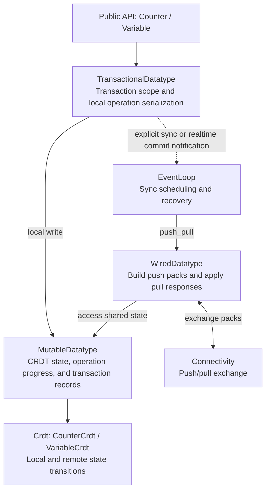
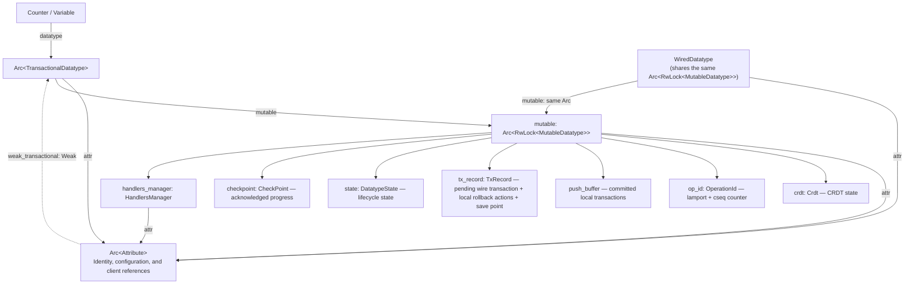
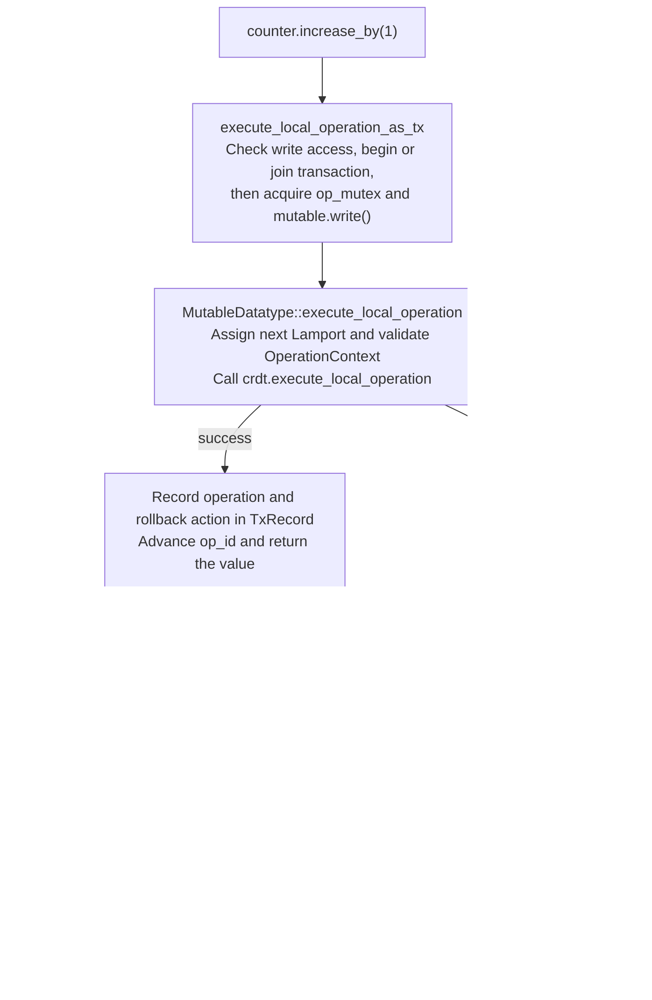
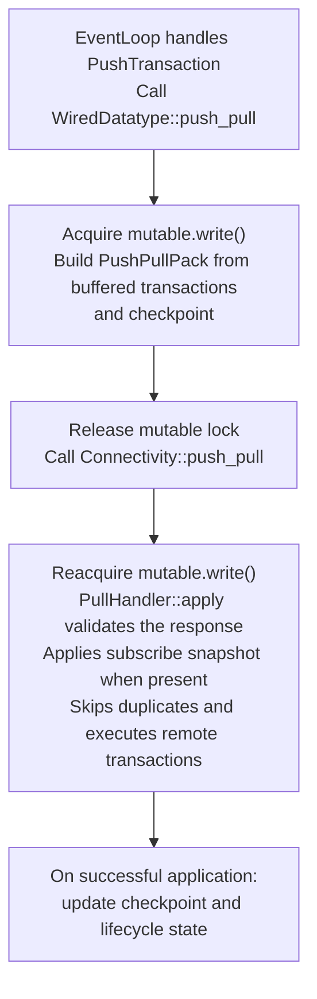

# Qortoo-rs Architecture

## Overview

Qortoo-rs is a Rust SDK for CRDTs (Conflict-free Replicated Data Types) with distributed synchronization. All datatype instances are thread-safe and support atomic transactions with rollback.

## Datatype Layer Stack

The public API, transaction handling, mutable state, synchronization, and CRDT logic
have separate responsibilities. Local writes reach the CRDT through the transactional
and mutable layers. Synchronization runs through the event loop and Wired layer,
which shares the same mutable state.

```mermaid
flowchart TD
    API["Public API: Counter / Variable"]
    TX["TransactionalDatatype<br/>Transaction scope and local operation serialization"]
    MU["MutableDatatype<br/>CRDT state, operation progress, and transaction records"]
    CR["Crdt: CounterCrdt / VariableCrdt<br/>Local and remote state transitions"]
    EL["EventLoop<br/>Sync scheduling and recovery"]
    WI["WiredDatatype<br/>Build push packs and apply pull responses"]
    CONN["Connectivity<br/>Push/pull exchange"]

    API --> TX
    TX -->|local write| MU
    MU --> CR
    TX -.->|explicit sync or realtime commit notification| EL
    EL -->|push_pull| WI
    WI -->|access shared state| MU
    WI <-->|exchange packs| CONN
```

> For datatype lifecycle states and write-access rules see [`docs/datatype-state.md`](datatype-state.md).
> For event loop internals (channel architecture, BackOff, Notify flow) see [`docs/event-loop.md`](event-loop.md).
> For error taxonomy and `RecoveryAction` routing see [`docs/error-handling.md`](error-handling.md).
> For UID roles, CRDT ordering keys, and client/server transaction sequence types see [`docs/core-types.md`](core-types.md).

### Layer Responsibilities

| Layer | Struct | Key Responsibility |
|-------|--------|--------------------|
| Public API | `Counter`, `Variable` | User-facing methods; implements `DatatypeBlanket` |
| Transactional | `TransactionalDatatype` | Transaction scope via `TransactionContext` and `DeferGuard`; serializes concurrent ops via `op_mutex` / `tx_mutex` |
| Mutable | `MutableDatatype` | Owns `Crdt`, `OperationId`, `MemoryPushBuffer`, `TxRecord`, checkpoint, lifecycle state, and handlers; executes and records operations |
| Wired | `WiredDatatype` | Called by `EventLoop` to assemble `PushPullPack`, call `Connectivity::push_pull`, and apply responses through `PullHandler` |
| CRDT | `CounterCrdt`, `VariableCrdt` | Pure state machine; no I/O, no locking; see [`docs/variable.md`](variable.md) for the LWW Variable |

## Shared State Model

```mermaid
flowchart TD
    API["Counter / Variable"]
    ATD["Arc&lt;TransactionalDatatype&gt;"]
    ATTR["Arc&lt;Attribute&gt;<br/>Identity, configuration, and client references"]
    MUT["mutable: Arc&lt;RwLock&lt;MutableDatatype&gt;&gt;"]
    CRDT["crdt: Crdt — CRDT state"]
    OPID["op_id: OperationId — lamport + cseq counter"]
    PB["push_buffer — committed local transactions"]
    TXR["tx_record: TxRecord — pending wire transaction + local rollback actions + save point"]
    STATE["state: DatatypeState — lifecycle state"]
    CP["checkpoint: CheckPoint — acknowledged progress"]
    HM["handlers_manager: HandlersManager"]
    WD["WiredDatatype\n(shares the same Arc&lt;RwLock&lt;MutableDatatype&gt;&gt;)"]

    API -->|datatype| ATD
    ATD -->|attr| ATTR
    ATD -->|mutable| MUT
    WD -->|attr| ATTR
    MUT -->|attr| ATTR
    ATTR -.->|weak_transactional: Weak| ATD
    MUT --> CRDT
    MUT --> OPID
    MUT --> PB
    MUT --> TXR
    MUT --> STATE
    MUT --> CP
    MUT --> HM
    HM -->|attr| ATTR
    WD -->|mutable: same Arc| MUT
```

Solid arrows show ownership or shared `Arc` references; the dashed arrow is a weak
back-reference. `TransactionalDatatype` constructs `WiredDatatype` with clones of its
`attr` and `mutable` handles and starts the event-loop task with that Wired handle.
Local operations and synchronization therefore access one CRDT state.

`Attribute` holds the key, datatype kind, readonly flag, push-buffer options, and client
reference. Its `duid` and weak transactional back-reference are protected by their own
`RwLock`s. `MutableDatatype` owns the handler registry and the state that changes during
operation execution and synchronization.

See the fields and constructors in [`transactional.rs`](../src/datatypes/transactional.rs),
[`wired.rs`](../src/datatypes/wired.rs), [`mutable.rs`](../src/datatypes/mutable.rs), and
[`common.rs`](../src/datatypes/common.rs).

## Operation Flow

### Local write

```mermaid
flowchart TD
    User["counter.increase_by(1)"]
    TX["execute_local_operation_as_tx<br/>Check write access, begin or join transaction,<br/>then acquire op_mutex and mutable.write()"]
    MU["MutableDatatype::execute_local_operation<br/>Assign next Lamport and validate OperationContext<br/>Call crdt.execute_local_operation"]
    Record["Record operation and rollback action in TxRecord<br/>Advance op_id and return the value"]
    Err["Return error<br/>This failed operation does not advance op_id"]
    Commit["On successful transaction scope exit:<br/>enqueue pending local transaction in push_buffer<br/>Discard rollback actions"]
    Abort["On transaction abort or enqueue failure:<br/>restore recorded state through rollback actions"]

    User --> TX --> MU
    MU -->|success| Record
    MU -->|error| Err
    Record -.->|scope commits| Commit
    Record -.->|scope aborts| Abort
    Err -.->|scope aborts| Abort
    Commit -->|enqueue fails| Abort
```

`begin_transaction()` creates a guard for a new scope or joins the matching active
`TransactionContext`. A successful write inside an explicit transaction records its
result immediately; enqueue happens when the enclosing scope commits. The standalone
write creates its own scope. Detailed rollback and commit-error handling are described
in [Transaction and Rollback](transaction-and-rollback.md).

### Local read

`Counter::get_value()` reads the CRDT under `mutable.read()`. `Variable::get()` clones
the stored value's `Arc` under that read lock, then decodes outside the lock. These
reads do not create operations or request synchronization; see
[`counter.rs`](../src/datatypes/counter.rs) and [`variable.rs`](../src/datatypes/variable.rs).

### Sync (push/pull)

```mermaid
flowchart TD
    EL["EventLoop handles PushTransaction<br/>Call WiredDatatype::push_pull"]
    Pack["Acquire mutable.write()<br/>Build PushPullPack from buffered transactions<br/>and checkpoint"]
    Exchange["Release mutable lock<br/>Call Connectivity::push_pull"]
    Apply["Reacquire mutable.write()<br/>PullHandler::apply validates the response<br/>Applies subscribe snapshot when present<br/>Skips duplicates and executes remote transactions"]
    State["On successful application:<br/>update checkpoint and lifecycle state"]

    EL --> Pack --> Exchange --> Apply --> State
```

The mutable lock is held while building the outgoing pack and applying the response,
but not during the backend exchange. Remote modification operations reach the CRDT
through `MutableDatatype::execute_remote_transaction`, using the transaction's origin
CUID in `OperationContext`; subscribe snapshots use the separate snapshot path.
The checkpoint determines which buffered transactions are included in subsequent
pushes. See [`WiredDatatype::do_push_pull`](../src/datatypes/wired.rs) and
[`PullHandler`](../src/datatypes/pull_handler.rs) for the exchange and application paths;
sync errors are covered by [Error Handling](error-handling.md).

## Concurrency Model

- `mutable: Arc<RwLock<MutableDatatype>>` — all CRDT mutation is serialized here
- `op_mutex: NoGuardMutex` — serializes concurrent `execute_local_operation` calls
- `tx_mutex: NoGuardMutex` — serializes concurrent transaction scopes
- Handler callbacks run in separately spawned tasks; see [Handler System](handler-system.md) for their dispatch contract

## Key Types Quick Reference

| Type | Location | Purpose |
|------|----------|---------|
| `Uid` / `Cuid` / `Duid` | `src/types/uid.rs` | Immutable identities for clients and logical datatypes; see [`docs/core-types.md`](core-types.md) |
| `Timestamp` / `ElementId` | `src/types/timestamp.rs`, `src/types/element_id.rs` | CRDT precedence and exact element identity; see [`docs/core-types.md`](core-types.md) |
| `OperationContext` | `src/types/operation_context.rs` | Validated execution-only combination of a positive-Lamport modification operation and its origin-derived `Timestamp`; snapshot application bypasses it |
| `LocalOperationOutcome` | `src/datatypes/crdts/execution.rs` | Local execution result containing the caller value and local-only rollback action |
| `RollbackAction` | `src/datatypes/crdts/execution.rs` | Top-level wrapper that dispatches a CRDT-specific rollback action to the matching CRDT |
| `OperationId` | `src/types/operation_id.rs` | Mutable local Lamport/cseq progress; see [`docs/core-types.md`](core-types.md) |
| `CheckPoint` | `src/types/checkpoint.rs` | Carries server-side and client-side transaction sequences; see [`docs/core-types.md`](core-types.md) |
| `Operation` | `src/operations/operation.rs` | Single CRDT operation with `OperationBody` and `lamport` |
| `Transaction` | `src/operations/transaction.rs` | Ordered group of operations sharing `cuid`/`cseq` |
| `TxRecord` | `src/datatypes/tx_record.rs` | Pending wire transaction + local rollback actions + rollback save point |
| `PushPullPack` | `src/types/push_pull_pack.rs` | Wire format for push/pull exchange |
| `Attribute` | `src/datatypes/common.rs` | Shared identity, configuration, and client references; DUID and the weak transactional reference have interior mutability |
| `DatatypeState` | `src/types/datatype.rs` | Lifecycle state machine; see [`docs/datatype-state.md`](datatype-state.md) |
