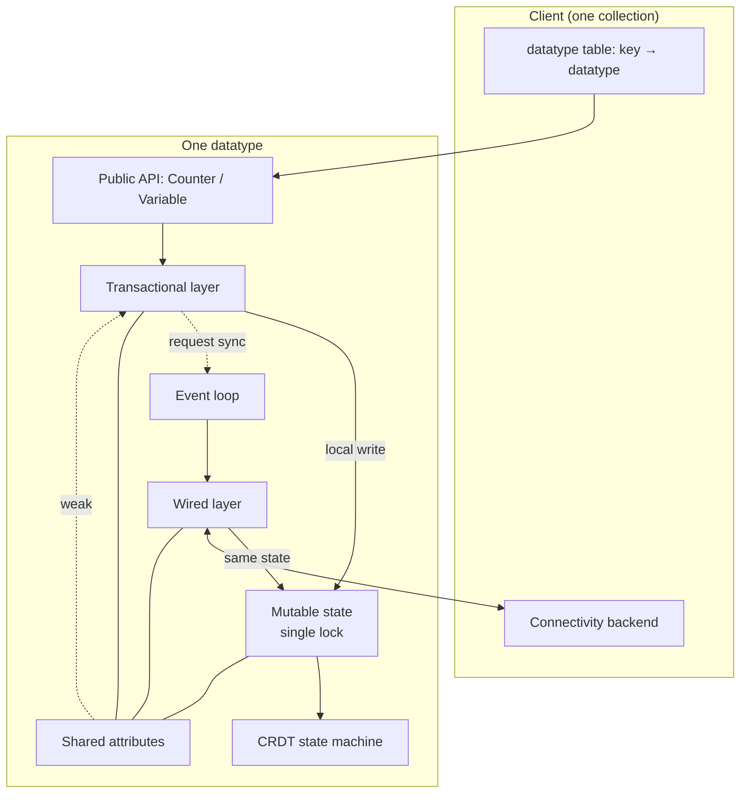
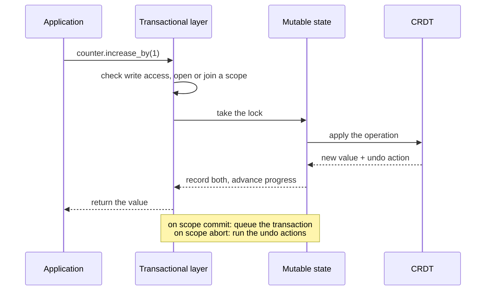
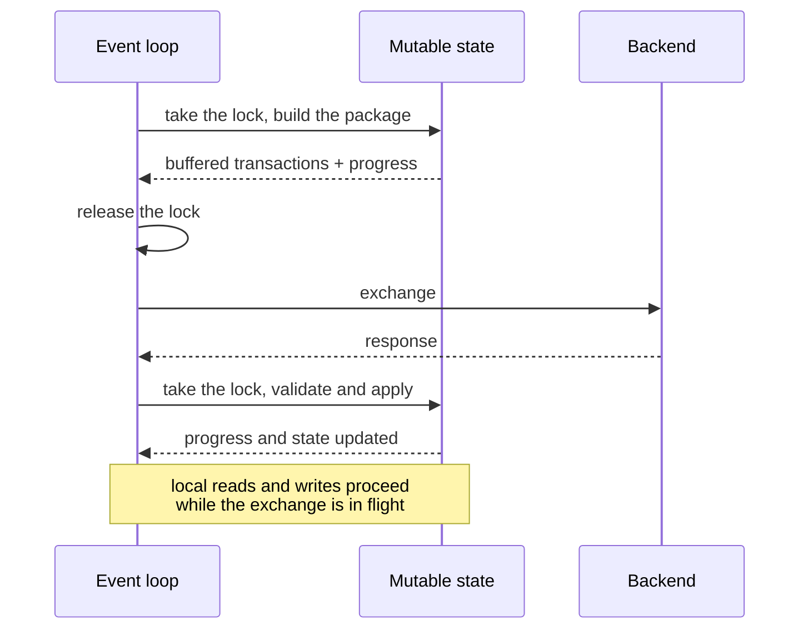

# Architecture

Qortoo-rs replicates values across clients without coordination: each client applies a
change locally, exchanges it with a backend when it can, and converges with everyone else.
This document defines how one client and its datatypes are composed to make that possible —
what owns what, which state is shared, and what the runtime and locking rules are. It is the
entry point for readers who need the whole shape before a specific subsystem; each subsystem
is defined in its own document, linked from here.

## Model

| Term | Meaning |
|------|---------|
| Client | A handle to one collection, carrying that client's identity and its connection to a backend |
| Collection | The namespace a client works in; a datatype key is unique within one collection |
| Datatype | One replicated value — a `Counter` or a `Variable` — addressed by key within a collection |
| Datatype table | The client's map from key to live datatype, so one key yields one instance |
| Layer | One of the five responsibilities every datatype is composed from, listed below |
| Mutable state | The per-datatype state that changes as operations execute and sync completes, guarded by a single lock |
| Event loop | A per-datatype loop that drives synchronization for that datatype |
| Shared attributes | Per-datatype identity and configuration, plus the references a datatype needs to reach its client |

A client owns a datatype table and hands out datatype handles; the handles are cheap to
clone and every clone refers to the same replicated value. Nothing is replicated between two
datatypes of the same client — a datatype converges only with the same key in the same
collection on other clients.

Each datatype is composed from five layers:

| Layer | Responsibility |
|-------|----------------|
| Public API | The methods an application calls, one type per datatype kind |
| Transactional | Transaction scope, write-access checks, and serialization of concurrent local operations |
| Mutable | The datatype's changing state: CRDT value, operation progress, buffered transactions, transaction record, lifecycle state, checkpoint, and handler registry |
| Wired | Assembling what to send, applying what comes back |
| CRDT | The convergence rules themselves — a pure state machine with no I/O and no locking |

These five are responsibilities, not a containment chain. The transactional layer and the
wired layer both hold the same mutable state and both write to it: local operations arrive
through one, synchronization through the other. Understanding a datatype means knowing that
one state has two writers, not that each layer wraps the next.

```mermaid
flowchart TD
    subgraph Client["Client (one collection)"]
        DTT["datatype table: key → datatype"]
        CONN["Connectivity backend"]
    end

    subgraph Datatype["One datatype"]
        API["Public API: Counter / Variable"]
        TX["Transactional layer"]
        MUT["Mutable state<br/>single lock"]
        CRDT["CRDT state machine"]
        EL["Event loop"]
        WI["Wired layer"]
        ATTR["Shared attributes"]
    end

    DTT --> API
    API --> TX
    TX -->|local write| MUT
    MUT --> CRDT
    TX -.->|request sync| EL
    EL --> WI
    WI -->|same state| MUT
    WI <--> CONN
    TX --- ATTR
    WI --- ATTR
    MUT --- ATTR
    ATTR -.->|weak| TX
```

## Rules and Guarantees

**Addressing.** A datatype is identified by its collection and key. Within one client a key
holds at most one live datatype: building a datatype for a key the table already holds fails,
whether or not the requested kind and state match what is there. Reaching an existing datatype
is a lookup by key, not a second build. Naming rules for collections and keys are defined in
[`docs/client-and-datatype-builder.md`](client-and-datatype-builder.md).

**Composition.** Every datatype has exactly one mutable state. The transactional layer
creates it and the wired layer is constructed with a reference to the same one, so a local
write and an applied remote transaction act on the same CRDT value. No layer holds a private
copy.

**Thread safety.** `Client` and every public datatype handle are `Send + Sync`. Handles may
be cloned and moved across threads freely; clones share one state rather than diverging.

**Serialization of writes.** All mutation of a datatype's state passes through that
datatype's single lock. Concurrent local operations and concurrent transaction scopes are
serialized by the transactional layer before they reach it; the mechanism and the transaction
semantics it enforces are defined in
[`docs/transaction-and-rollback.md`](transaction-and-rollback.md). Reads take the same lock
for shared access and create no operations.

**Runtime.** Datatypes do not run on the application's runtime. Building a client builds a
multi-threaded Tokio runtime for it, sized to the machine's available parallelism, with
threads named after the client. Runtimes are held in a process-global map keyed by a string
that includes the client's identity, so in practice each client has its own. Within a client,
each datatype's event loop occupies one blocking-pool thread for the datatype's lifetime,
while handler callbacks are spawned as ordinary tasks onto the worker threads. Thread and
memory cost therefore scales with the number of clients and datatypes; that cost has not been
characterized here.

**Synchronization boundaries.** The lock is held while assembling what to send and while
applying what comes back, and released across the backend exchange, so a slow or unreachable
backend does not block local reads and writes. What is sent, what is skipped, and how errors
are routed are defined in [`docs/connectivity.md`](connectivity.md),
[`docs/event-loop.md`](event-loop.md), and
[`docs/error-handling.md`](error-handling.md).

**Lifetime.** Shared attributes hold a weak reference back to the transactional layer, so the
datatype's own references do not keep it alive. Dropping the last handle stops its event
loop. A datatype that transitions to disabled removes itself from the client's table, and only
if the table still holds that same instance.

**Limits on the guarantees.** Convergence is a property of the CRDT layer and holds for
datatypes that actually exchange operations; the default backend exchanges with no one, so
two clients built with it never converge. Nothing here guarantees when a local change reaches
another client, only that a change is recorded locally before the call returns and is
delivered in order once an exchange succeeds.

## Behavior

**Building a datatype.** A datatype is built through the client's builder, which fails if the
key is already taken. Otherwise the client constructs the layers, places the datatype in its
table, registers it with the backend, and starts its event loop. The handle is usable
immediately: the datatype starts in a creating or subscribing state, is writable or read-only
according to that state, and reports the transition to subscribed once the backend confirms
it.

**A local write.** The call checks write access, opens or joins a transaction scope, takes
the datatype's lock, and applies the operation to the CRDT. The operation and an action that
would undo it are recorded, and the value is returned. When the enclosing scope commits, the
recorded transaction is queued for the backend; when it aborts, the recorded undo actions
restore the previous state.

```mermaid
sequenceDiagram
    participant App as Application
    participant TX as Transactional layer
    participant MUT as Mutable state
    participant CRDT as CRDT

    App->>TX: counter.increase_by(1)
    TX->>TX: check write access, open or join a scope
    TX->>MUT: take the lock
    MUT->>CRDT: apply the operation
    CRDT-->>MUT: new value + undo action
    MUT-->>TX: record both, advance progress
    TX-->>App: return the value
    Note over TX,MUT: on scope commit: queue the transaction<br/>on scope abort: run the undo actions
```

**A local read.** A read takes the lock for shared access, copies what it needs, and returns.
It creates no operation, queues nothing, and does not request synchronization. A read
reflects every local write that has returned, whether or not it has reached the backend.

**A sync exchange.** The event loop wakes on a queued transaction, an explicit sync request,
or a notification from the backend. It takes the lock, builds a package from the buffered
transactions and the datatype's acknowledged progress, and releases the lock. It then calls
the backend. On a response it takes the lock again, validates the response, applies a state
snapshot if one is present, skips transactions it has already seen, executes the rest against
the CRDT, and updates the acknowledged progress and lifecycle state.

```mermaid
sequenceDiagram
    participant EL as Event loop
    participant MUT as Mutable state
    participant CONN as Backend

    EL->>MUT: take the lock, build the package
    MUT-->>EL: buffered transactions + progress
    EL->>EL: release the lock
    EL->>CONN: exchange
    CONN-->>EL: response
    EL->>MUT: take the lock, validate and apply
    MUT-->>EL: progress and state updated
    Note over EL,MUT: local reads and writes proceed<br/>while the exchange is in flight
```

**A backend that fails.** A failed exchange does not lose the buffered transactions: they
stay queued until the backend acknowledges them. What the datatype does next — retry, resubscribe,
disable — is decided by the recovery action for that error, defined in
[`docs/error-handling.md`](error-handling.md).

## Rationale

**One state with two writers, rather than layers that wrap each other.** Synchronization has
to apply remote transactions to the same value local writes act on, and it must do so without
opening a user transaction, checking write access, or recording undo actions — none of which
apply to a change that already happened elsewhere. Giving the wired layer its own reference to
the mutable state keeps the sync path out of the transaction machinery while still leaving one
CRDT value per datatype. The cost is that the mutable state's invariants are a joint property
of both paths rather than something the transactional layer alone can enforce.

**The CRDT layer holds no locks and performs no I/O.** Convergence rules are the part that has
to be right regardless of scheduling. Keeping them in a pure state machine means they can be
tested by applying operations in different orders with no runtime involved, and it keeps
locking a concern of exactly one layer.

**Shared attributes hold a weak reference back to the datatype.** Callbacks are handed a
datatype handle, so the lower layers need a way to produce one. A strong reference there would
form a cycle that keeps every datatype alive forever. The weak reference also gives the
lifetime rule its meaning: once the last handle is gone the reference stops resolving, which is
what makes notifications for a dropped datatype quietly do nothing.

**The SDK owns its runtime rather than borrowing the application's.** A datatype needs threads
for its event loop whether or not the application runs an async runtime, and the public API is
synchronous, so there is no runtime to inherit from the caller. Owning one also keeps the SDK's
threads identifiable — they carry a `qortoo-` prefix and the client's name — which matters when
profiling an application that runs its own runtime alongside.

**The event loop runs on the blocking pool, not as an async task.** It is a synchronous loop
that blocks on channel receives and holds the datatype lock across applying a response. Running
it as an async task would occupy a worker thread for the same durations while giving up nothing
in return.

## Code Map

| Concern | Location |
|---------|----------|
| `Client`, its builder, and the datatype table it owns | `src/clients/client.rs` |
| `ClientCommon` — collection, client identity, runtime handle, backend | `src/clients/common.rs` |
| `DatatypeManager` — key-to-datatype table, subscribe-or-create, detach | `src/clients/datatype_manager.rs` |
| Shared runtimes keyed by group | `src/utils/runtime.rs` |
| `TransactionalDatatype` — scope, write-access checks, construction of the layers, event-loop start | `src/datatypes/transactional.rs` |
| `MutableDatatype` — the per-datatype state behind the lock | `src/datatypes/mutable.rs` |
| `WiredDatatype` — package assembly and the backend call | `src/datatypes/wired.rs` |
| `PullHandler` — validating and applying a response | `src/datatypes/pull_handler.rs` |
| `Attribute` — shared attributes and the weak back-reference | `src/datatypes/common.rs` |
| `Crdt` and its per-datatype implementations | `src/datatypes/crdts/` |
| Public datatype handles | `src/datatypes/counter.rs`, `src/datatypes/variable.rs` |

| Verified by | Tests |
|-------------|-------|
| `Client` and datatype handles are `Send + Sync` | `can_assert_send_and_sync_traits` in `src/clients/client.rs`, `src/datatypes/counter.rs`, `src/datatypes/variable.rs` |
| A key already in the table cannot be built a second time | `can_use_subscribe_or_create_datatype` in `src/clients/datatype_manager.rs` |
| Concurrent local operations are serialized | `can_run_transactions_concurrently` in `src/datatypes/counter.rs` |
| Two clients converge over a shared backend | `can_sync_bidirectionally_between_two_clients` in `src/connectivity/local_datatype_server.rs` |
| Convergence is independent of exchange order | `can_converge_via_cuid_tie_break_regardless_of_sync_order` in `src/datatypes/variable.rs` |
| A disabled datatype detaches from the client's table | `can_auto_detach_after_datatype_unsubscribe_sync` in `src/clients/client.rs` |
| Building datatypes through the client builder | `tests/datatype_builder.rs` |

## Related Concepts

- [`docs/client-and-datatype-builder.md`](client-and-datatype-builder.md) — building a client, naming rules, and the datatype builder chain
- [`docs/core-types.md`](core-types.md) — identities, CRDT ordering keys, and progress counters
- [`docs/datatype-state.md`](datatype-state.md) — the lifecycle states and the write access each allows
- [`docs/transaction-and-rollback.md`](transaction-and-rollback.md) — transaction scope, serialization, and undo actions
- [`docs/variable.md`](variable.md) — the LWW `Variable` datatype
- [`docs/connectivity.md`](connectivity.md) — the backend interface and the bundled backends
- [`docs/event-loop.md`](event-loop.md) — event priorities, channels, and retry behavior
- [`docs/handler-system.md`](handler-system.md) — how a datatype reports state changes and errors
- [`docs/error-handling.md`](error-handling.md) — the error taxonomy and recovery actions
- [`docs/observability.md`](observability.md) — tracing, metrics, and profiling
- [`docs/performance.md`](performance.md) — the benchmark harness and its comparison contract
- [`docs/go-binding.md`](go-binding.md) — the C ABI and native SDK layered on this core
