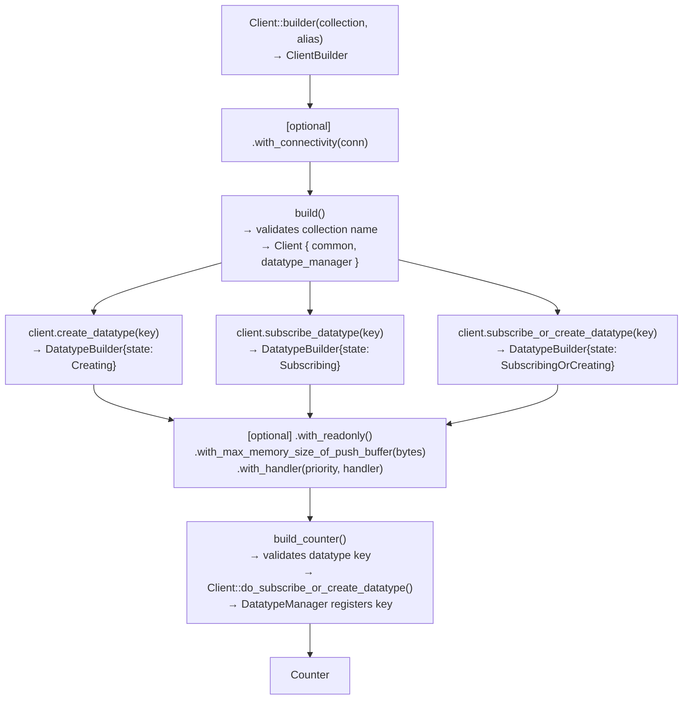

# Client and DatatypeBuilder

`Client` is the entry point for the SDK: it is scoped by a collection and an alias, owns the connectivity backend, and hands out `DatatypeBuilder`s that carry the lifecycle intent (create, subscribe, or subscribe-or-create) all the way to the concrete datatype they build.

## Overview

## Core Types

| Type | Location | Purpose |
|------|----------|---------|
| `Client` | `src/clients/client.rs` | Facade for creating/subscribing datatypes; owns `ClientCommon` and the `DatatypeManager` |
| `ClientBuilder` | `src/clients/client.rs` | Collects `collection`, `alias`, and an optional `Connectivity` before `build()` |
| `ClientCommon` | `src/clients/common.rs` | Shared immutable-ish client state: `collection`, `alias`, `cuid`, the tokio `Handle`, and the `Connectivity` `Arc` |
| `DatatypeManager` | `src/clients/datatype_manager.rs` | Owns the `key → DatatypeSet` map; enforces one registration per key |
| `DatatypeBuilder` | `src/datatypes/builder.rs` | Per-datatype builder; carries the lifecycle `DatatypeState` decided by which `Client` method created it |
| `DatatypeOption` | `src/datatypes/option.rs` | Clamped push-buffer size (`with_max_memory_size_of_push_buffer`) |

## How It Works

1. `Client::builder(collection, alias)` returns a `ClientBuilder` defaulted to `NullConnectivity`. Call `.with_connectivity(conn)` to swap in `LocalConnectivity` or another backend before finalizing.
2. `.build()` validates the collection name via `is_valid_collection_name` (`src/utils/name_validator.rs`: 1–47 characters, must start with a letter or underscore, and must not start with `system.` or contain `.system.`) and fails fast with `ClientError::InvalidCollectionName` before any datatype-level state exists. On success it builds `ClientCommon` (which allocates the client's `cuid` and tokio runtime handle) and an empty `DatatypeManager`.
3. `Client::create_datatype(key)`, `subscribe_datatype(key)`, and `subscribe_or_create_datatype(key)` each return a `DatatypeBuilder` pre-loaded with the matching `DatatypeState` (`Creating`, `Subscribing`, or `SubscribingOrCreating` — see [`docs/datatype-state.md`](datatype-state.md)). The state is fixed at this point; nothing later in the chain can change it.
4. Optional builder methods — `.with_readonly()`, `.with_max_memory_size_of_push_buffer(bytes)` (clamped through `DatatypeOption::new`), `.with_handler(priority, handler)` (see [`docs/handler-system.md`](handler-system.md)) — configure the datatype before construction.
5. `.build_counter()` validates the datatype key via `is_valid_datatype_key` (non-empty, no NUL byte, ≤255 characters, must not start with `$`), then calls `Client::do_subscribe_or_create_datatype`, which delegates to `DatatypeManager::subscribe_or_create_datatype`. The manager inserts into its `HashMap<key, DatatypeSet>` via `Entry`: an `Entry::Occupied` key returns `ClientError::FailedToSubscribeOrCreateDatatype` — this is the "once per client instance" rule.
6. The registered `DatatypeSet` is unwrapped into the concrete public type (currently `Counter`) and returned to the caller.

## Key Design Decisions

- **Lifecycle state is fixed at builder acquisition, not at `build_counter()`**: `Client::create_datatype` / `subscribe_datatype` / `subscribe_or_create_datatype` each construct the `DatatypeBuilder` with its `DatatypeState` already set. This keeps "how was this datatype requested" and "how is it configured" as separate concerns — no builder method can accidentally change the requested lifecycle.
- **Key uniqueness enforced by `DatatypeManager`, not `Client`**: `Client` is a thin facade; `DatatypeManager` owns the `HashMap` and is the single place the "once per client instance" invariant is checked, via ordinary `Entry` matching rather than a separate existence check plus insert (avoids a check-then-act race under the manager's own write lock).
- **`DatatypeBuilder<'c>` borrows `&'c Client` instead of holding an `Arc`**: the builder is a short-lived staging value consumed by the terminal `build_counter()` call in the same expression chain — it never outlives the `Client` reference, so a borrow is simpler than reference counting.
- **Two validation points, two rule sets**: the collection name is checked once at `Client::builder().build()` (`is_valid_collection_name`), while each datatype key is checked per builder at `build_counter()` (`is_valid_datatype_key`). They're different identifiers with different constraints (collection names disallow the `system.` reservation; datatype keys disallow a `$`-prefix and NUL bytes), so validating them separately keeps each rule next to the identifier it governs.

## Related Concepts

- [`docs/architecture.md`](architecture.md) — where the Public API layer (e.g., `Counter`) sits in the datatype layer stack
- [`docs/datatype-state.md`](datatype-state.md) — the lifecycle states a `DatatypeBuilder` can produce and their write-access rules
- [`docs/handler-system.md`](handler-system.md) — registering handlers via `.with_handler()` at build time
- [`docs/connectivity.md`](connectivity.md) — the `Connectivity` backend supplied via `.with_connectivity()`
