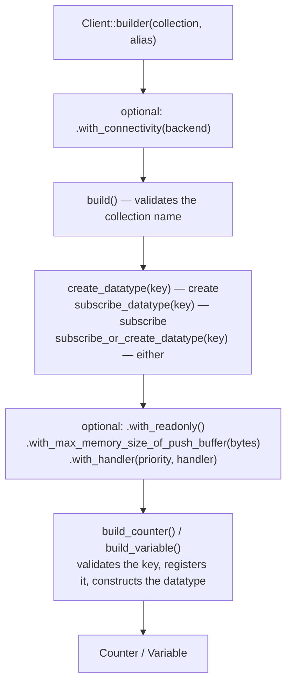

# Client and Datatype Builder

A client is the entry point to the SDK. It is scoped to one collection, carries the identity
other clients see, holds the backend it exchanges through, and is the only way to obtain a
datatype. Asking for a datatype is a two-step chain: the client method chosen decides what the
datatype is being asked to do — create it, subscribe to an existing one, or either — and the
builder returned collects configuration until a terminal call constructs the concrete type.
This document owns the naming rules for collections and keys, and defines where each one is
checked.

## Model

| Term | Meaning |
|------|---------|
| Collection | The namespace a client is scoped to, named at client construction and fixed for its life |
| Alias | A human-readable name for the client, used in tracing and in the names of the threads it runs on |
| Key | The name a datatype is addressed by within a collection |
| Lifecycle intent | What the caller is asking for — create, subscribe, or subscribe-or-create — chosen by which client method returns the builder |
| Datatype builder | A short-lived value that carries the key and the intent and collects optional configuration |
| Terminal call | The builder method that fixes the datatype's kind and constructs it |
| Backend | The connectivity implementation the client exchanges through, defaulting to one that exchanges with no one |

## Naming Rules

Collection names and datatype keys are different identifiers with different rules. Both
lengths are measured in **bytes**, not characters, so a name using non-ASCII characters counts
each one as the number of bytes it encodes to.

### Collection name

| Rule | Detail |
|------|--------|
| Length | 1 to 47 bytes |
| First character | An ASCII letter or `_` |
| Remaining characters | ASCII letters and digits, `.`, `_`, `~`, `-` |
| Reserved | Must not start with `system.` and must not contain `.system.` |

| Accepted | Rejected |
|----------|----------|
| `hello_world`, `a`, `Collection123` | `` (empty), 48 bytes or more |
| `my-collection`, `my.collection`, `my~collection` | `1hello`, `-hello`, `.hello` — first character |
| `_private`, `a-b.c~d_e` | `hello@world`, `hello world` — disallowed characters |
| `system`, `system123`, `hello.system` | `system.hello`, `my.system.hello` — reserved |

The reservation is on the prefix `system.` and the infix `.system.` only. A collection named
`system`, or one ending in `.system`, is a valid name.

### Datatype key

| Rule | Detail |
|------|--------|
| Length | 1 to 255 bytes |
| Content | Any UTF-8 except a NUL byte |
| Reserved | Must not start with `$` |

| Accepted | Rejected |
|----------|----------|
| `hello_world`, `simple`, `a` | `` (empty), 256 bytes or more |
| `user:123:profile`, `with-dash-and.dot` | a key containing a NUL byte |
| `한글키` and other non-ASCII text | `$hello` — reserved prefix |

A key is far more permissive than a collection name: punctuation, non-ASCII text, and a
leading digit or symbol other than `$` are all accepted.

The alias is not validated. It names the client in traces and threads and has no effect on
addressing.

## Rules and Guarantees

**Client construction.** A client is built from a collection and an alias, with a backend that
defaults to one exchanging with no one. The collection name is validated at construction and a
client is never created with an invalid one, so no datatype-level state exists before the name
is known to be good.

**Lifecycle intent is fixed when the builder is obtained.** Which client method produced the
builder decides the state the datatype starts in, and nothing later in the chain can change it.
Configuration methods and the terminal call cannot alter what was requested. See
[`docs/datatype-state.md`](datatype-state.md) for what each state permits.

**Key validation happens at the terminal call.** The key travels through the builder unchecked
and is validated when the datatype is constructed, so an invalid key fails at the point the
datatype would have been registered rather than when the builder was created.

**One datatype per key.** Registration fails if the client already holds that key, whatever
kind or state is requested. An existing datatype is reached by looking it up on the client, not
by building it again. A key becomes available for a new build only after the previous datatype
detaches, which happens when it reaches the disabled state.

**Configuration is datatype-agnostic.** Readonly, push-buffer size, and handlers are collected
the same way regardless of which terminal call follows; only the kind differs between terminal
calls.

**Push-buffer size is clamped, not rejected.** A requested size outside the supported range is
brought to the nearest bound rather than refused. The default is 100 MB, the lower bound 1 MB,
and the upper bound 1 GB.

**Limits on the guarantees.** Validation covers the shape of a name, not its availability: a
well-formed collection or key that the server refuses still fails later, as a routed error
rather than at build time. A successfully built datatype is also not yet synchronized — it
starts in the requested state and reaches subscribed only when the backend confirms it.

## Behavior

**Building a client.** `Client::builder("my-collection", "web-1").build()` validates the
collection name and returns a client with the default backend, which exchanges with no one.
Passing a backend before `build()` replaces it. An invalid collection name fails here, before
any datatype exists.

**Requesting a datatype three ways.** `create_datatype(key)` asks the server to create it and
starts in the creating state. `subscribe_datatype(key)` asks for one that already exists and
starts read-only in the subscribing state. `subscribe_or_create_datatype(key)` accepts either
outcome. Each returns a builder already carrying that intent.

**Configuring before construction.** `.with_readonly()` makes the datatype refuse local writes,
`.with_max_memory_size_of_push_buffer(bytes)` bounds how much unsent work it will hold, and
`.with_handler(priority, handler)` registers a handler that is in place before the first state
transition is reported — which matters because the transition to subscribed can happen as soon
as the datatype exists. See [`docs/handler-system.md`](handler-system.md).

**A key the client already holds.** The terminal call fails rather than returning the existing
datatype, and the failure names both what was requested and what is already there. Reaching the
existing one is a lookup by key.

**A key that fails validation.** The terminal call fails and nothing is registered. The client
is unaffected and the key remains free.

**Rebuilding a key after unsubscribe.** Unsubscribing marks the datatype and leaves it in the
client's table; the entry is removed only once the backend drives it to disabled. Until then
the key is still taken. Afterwards, building the key again produces a genuinely new datatype
rather than reviving the old one.

## Rationale

**Intent is carried by the builder rather than chosen at construction.** "What am I asking the
server for" and "how do I want this configured" are different decisions made by different
parts of a call chain. Fixing the intent when the builder is handed out means no configuration
method can quietly change it, and the terminal call has one job: pick the kind.

**The two identifiers have separate rule sets.** A collection name is part of the namespace the
server organizes and reserves prefixes in, so it is constrained to a conservative ASCII shape.
A key is an application's own label for its data and should accept whatever an application
naturally uses — including non-ASCII text. Validating them together would force the stricter
rule onto the identifier that does not need it.

**Uniqueness is enforced where the table lives.** The client is a facade; the component that
owns the key-to-datatype map is the one place the rule is checked, as part of the same
insertion that would add the entry. Checking existence separately and then inserting would open
a window between the two.

**The builder borrows the client rather than sharing ownership of it.** A builder is consumed
by the terminal call in the same expression that created it and cannot outlive the client it
came from, so a borrow expresses its lifetime exactly and costs nothing.

**Out-of-range buffer sizes are clamped.** The value is a tuning hint, not a correctness
constraint, and the bounds exist to keep a datatype from being configured into uselessness at
either extreme. Failing the build over a tuning number would turn a harmless mistake into an
outage.

## Code Map

| Concern | Location |
|---------|----------|
| `Client`, `ClientBuilder`, and the three intent methods | `src/clients/client.rs` |
| Collection name and datatype key validation | `src/utils/name_validator.rs` |
| The message a rejected collection name carries | `src/errors/clients.rs` |
| The key-to-datatype table and the uniqueness rule | `src/clients/datatype_manager.rs` |
| Client identity, backend, and runtime handle | `src/clients/common.rs` |
| `DatatypeBuilder`, its configuration methods, and the terminal calls | `src/datatypes/builder.rs` |
| Push-buffer size clamping | `src/datatypes/option.rs`, `src/defaults.rs` |

| Verified by | Tests |
|-------------|-------|
| Accepted and rejected collection names, including the `system` boundary cases | `can_valid_collection_names` in `src/utils/name_validator.rs` |
| Accepted and rejected keys, including non-ASCII and the byte-length bound | `can_valid_datatype_key` in `src/utils/name_validator.rs` |
| An invalid collection name fails at client construction | `can_reject_invalid_collection_names` in `src/clients/client.rs` |
| An invalid key fails at the terminal call | `can_fail_with_invalid_datatype_keys` in `src/datatypes/builder.rs` |
| A client is built with its collection and alias | `can_build_client` in `src/clients/client.rs` |
| Each intent method produces the matching state | `can_use_counter_from_client` in `src/clients/client.rs` |
| The full builder chain, end to end | `can_show_how_to_use_datatype_builder` in `src/datatypes/builder.rs`, `can_build_counter` in `tests/datatype_builder.rs` |
| Readonly configuration is applied and enforced | `can_create_readonly_counter`, `can_check_read_only_state` in `src/datatypes/builder.rs` |
| The variable terminal call constructs its own kind | `can_build_a_variable_via_datatype_builder` in `src/datatypes/builder.rs` |
| An out-of-range buffer size is clamped | `can_use_datatype_option` in `src/datatypes/option.rs` |
| A key is freed only once the datatype is disabled, and rebuilding yields a new one | `can_unsubscribe_datatype_from_client`, `can_auto_detach_after_datatype_unsubscribe_sync` in `src/clients/client.rs` |

## Related Concepts

- [`docs/architecture.md`](architecture.md) — the client, its datatype table, and what a datatype is composed of
- [`docs/datatype-state.md`](datatype-state.md) — the states the three intent methods produce and the writes each permits
- [`docs/connectivity.md`](connectivity.md) — the backends that can be supplied at client construction
- [`docs/handler-system.md`](handler-system.md) — registering a handler before the first transition is reported
- [`docs/error-handling.md`](error-handling.md) — the errors a failed build returns and how later failures are routed
- [`docs/transaction-and-rollback.md`](transaction-and-rollback.md) — what the push buffer holds and why its size is bounded
