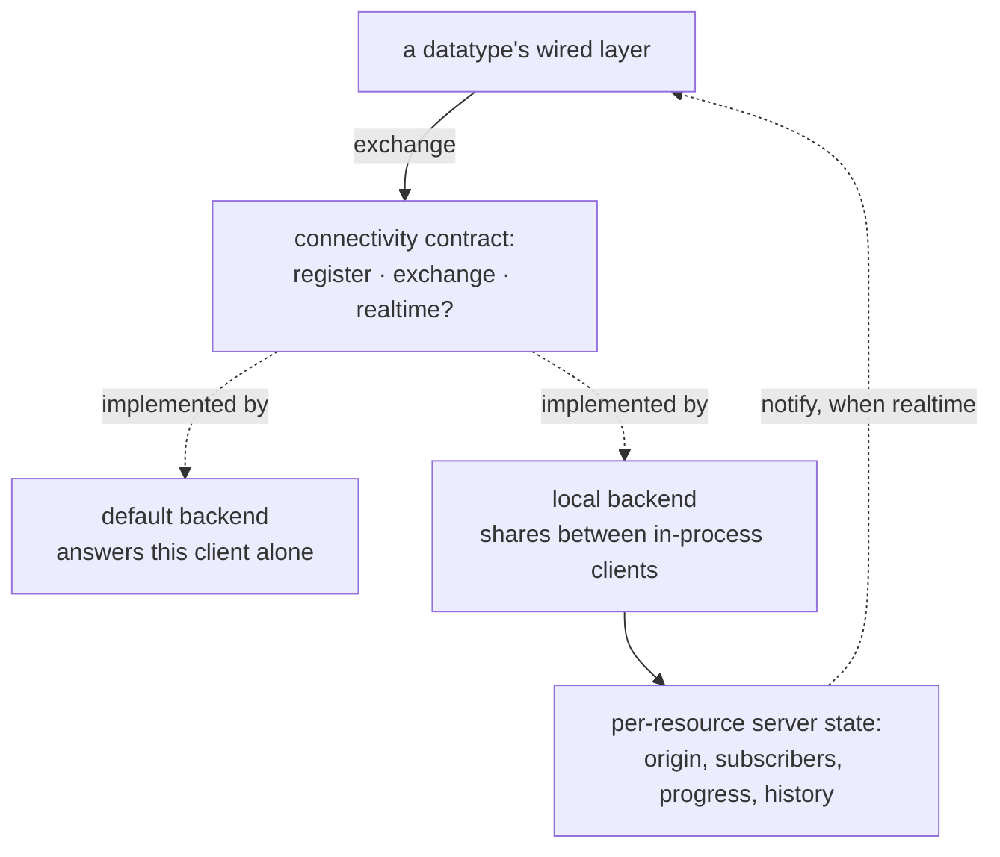

# Connectivity

Connectivity is the seam between a datatype and whatever it synchronizes through. Everything
above it — transactions, convergence, lifecycle — is the same regardless of what sits below,
and everything a backend has to do is expressed as one exchange: take what this client has,
return what it should know. This document defines that contract, what a backend is obliged to
honor, and what the two bundled implementations do. It does not define the schedule on which
exchanges happen; see [`docs/event-loop.md`](event-loop.md).

## Model

| Term | Meaning |
|------|---------|
| Backend | An implementation of the connectivity contract that a client exchanges through |
| Exchange | One call carrying what the client has and returning what the backend answers |
| Package | The value carried in both directions of an exchange, naming the datatype and holding the work |
| Resource | The datatype a package refers to, addressed by collection and key |
| Registration | Attaching a datatype to the backend so it can be notified of work from elsewhere |
| Realtime | Whether the backend tells clients when work arrives, rather than waiting to be asked |
| Progress | The pair of sequence numbers describing how far a client and the backend have acknowledged each other |

A backend is asked for three things: to accept a registration, to perform an exchange, and to
say whether it is realtime. Everything else — how it stores data, whether it is in this process
or across a network, how it decides what to return — is the backend's own business.

## Rules and Guarantees

**One exchange carries everything.** A package names its resource, the client sending it, that
datatype's state, its progress, and the transactions it wants accepted. The response is another
package, carrying what the client should apply and either the new state or an error. There is
no separate handshake and no partial exchange.

**A resource is addressed by collection and key.** Both bundled backends look up their state by
that pair, so two clients converge exactly when they use the same collection and key.

**The datatype's state drives the exchange.** A backend dispatches on the state the client
declares — creating, subscribing, subscribing-or-creating, subscribed, unsubscribing — and its
answer is what moves the datatype's lifecycle forward. Every backend must honor the state set
defined in [`docs/datatype-state.md`](datatype-state.md).

**Progress decides what is sent and what is skipped.** A client sends the transactions the
backend has not acknowledged, and the backend returns those the client has not seen. A
transaction the client already applied is skipped rather than applied twice.

**Registration is what makes notification possible.** A datatype registers with the backend
when its event loop starts, handing over the channel the backend can use to tell it that work
has arrived. A backend that is not realtime never uses it.

**Notification is best-effort.** A realtime backend tells the other clients that a push
succeeded, and a notification that cannot be delivered immediately is dropped rather than
queued. Dropping one costs nothing but latency: the progress comparison in the next exchange
finds the same work.

**Errors come back inside the package.** A backend that refuses reports the reason in the
package rather than by failing the call, so the client can tell a refusal apart from an
unreachable backend. Both become typed errors with recovery actions; see
[`docs/error-handling.md`](error-handling.md).

**Limits on the guarantees.** The default backend is not a network: it answers the calling
client and shares nothing, so two clients built with it never converge. The local backend
shares only within one process. Neither is a durable store — nothing survives the process. The
backend contract is also not yet a public extension point: its error type stays internal, so an
out-of-process backend is possible in shape but not yet supported as published API.

## The bundled backends

**The default backend** is what a client gets when none is supplied. It holds no state and
answers from the declared state alone: a creating or subscribing-or-creating datatype becomes
subscribed, a subscribing one is accepted only if it brings no transactions, an unsubscribing
one becomes disabled, and a readonly client attempting to create is refused. It reports itself
as realtime. It exists so that building a client works with no backend wired up, and so tests
and examples that do not need sharing do not have to set one up.

**The local backend** simulates a server for clients in one process. It keeps per-resource
state created the first time a datatype registers for that resource, and it can be switched
between realtime and manual. Its per-resource state tracks which client is the origin, which
clients count as subscribed, how far each has acknowledged, and every transaction ever pushed,
each stamped with a backend sequence number.

A subscribe is answered from the origin client's own snapshot when that client is still in the
process, and by replaying the recorded history when it is not. When the origin unsubscribes, the
role passes to another in-process subscriber if there is one. The per-resource state is
discarded once no client holds it.

A test-only interceptor can wrap a single datatype's exchanges, inspecting or altering what goes
out and injecting an error on what comes back. It is reachable only from test builds.

## Behavior

**Two clients sharing a datatype.** Both build a datatype with the same collection and key
against the same local backend. The first to push becomes the origin. The second, subscribing,
receives the origin's snapshot and is then at the same point. From there each push is returned
to the other, either on notification or at the next exchange.

**A datatype with the default backend.** Every exchange succeeds and moves the lifecycle
forward, so the datatype reaches subscribed and stays writable, but nothing it pushes reaches
another client and nothing arrives. This is the shape most surprising to a new reader: the
datatype looks fully functional and shares nothing.

**A backend that is switched to manual.** Nothing is pushed until the application asks for a
synchronization. This is what makes an ordering deterministic in a test — with realtime on, a
push can happen before a handler is registered.

**An origin that leaves.** The origin client unsubscribes while another in-process client is
still subscribed; that client becomes the origin. If none remains, a later subscribe is answered
by replaying the history instead, which is slower but produces the same state.

**A refusal.** The backend rejects a push — a type mismatch, a client that is not subscribed, a
protocol violation — and returns the reason in the package. The client turns it into a typed
error whose recovery action disables the datatype.

## Rationale

**The backend is a contract, not a fixed set of choices.** Synchronization is the part most
likely to be replaced: a different transport, a different server, a test double. Expressing it
as something to implement rather than as a closed set of alternatives means adding one does not
touch the datatype layers at all.

**The whole exchange is one call.** A backend that could be asked several questions per
synchronization would have to define what happens when only some of them succeed. One call with
one package makes an exchange atomic from the client's point of view: it either has an answer to
apply or an error to route.

**Refusals travel inside the package rather than as call failures.** "The backend said no" and
"the backend could not be reached" need different recoveries — one is permanent, the other is
worth retrying. Keeping them in different channels means the client does not have to
reverse-engineer which happened from an error string.

**The local backend distinguishes an origin from ordinary subscribers.** Answering a subscribe
from a live client's snapshot is much cheaper than replaying every transaction ever recorded.
Keeping the history as a fallback means losing the origin degrades performance rather than
correctness.

**Notification is allowed to be dropped.** The alternative is queuing notifications, which turns
a slow consumer into unbounded memory. Because progress is compared on every exchange, a
dropped notification delays convergence but cannot break it — which makes dropping the right
trade.

**The interceptor is reachable only from tests.** Nothing in production has a reason to alter an
exchange in flight. Gating the way to obtain it, rather than the type, keeps the wired layer
free of conditional compilation while still keeping the capability out of production builds.

## Code Map

| Concern | Location |
|---------|----------|
| The backend contract: register, exchange, realtime | `src/connectivity/mod.rs` |
| The package exchanged in both directions, and how a resource is addressed | `src/types/push_pull_pack.rs` |
| The default backend | `src/connectivity/null_connectivity.rs` |
| The local backend and its per-resource map | `src/connectivity/local_connectivity.rs` |
| Per-resource state: origin, subscribers, progress, history, and the per-state handling | `src/connectivity/local_datatype_server.rs` |
| The test-only exchange interceptor | `src/datatypes/wired_interceptor.rs` |
| The caller: building the outgoing package and applying the response | `src/datatypes/wired.rs`, `src/datatypes/pull_handler.rs` |

| Verified by | Tests |
|-------------|-------|
| Two clients converge over a shared backend | `can_sync_bidirectionally_between_two_clients` in `src/connectivity/local_datatype_server.rs` |
| Each declared state is handled | `can_process_creating`, `can_process_subscribing`, `can_process_subscribe` in `src/connectivity/local_datatype_server.rs` |
| Refusals: unsubscribed pusher, type mismatch, disabled client, readonly with work | `can_reject_subscribed_push_from_unsubscribed_client`, `can_reject_type_mismatch_in_subscribed_push`, `can_reject_push_from_disabled_client`, `can_reject_readonly_unsubscribing_with_transactions` in `src/connectivity/local_datatype_server.rs` |
| Unsubscribing a client that was never subscribed is not an error | `can_unsubscribe_not_subscribed_client_gracefully` in `src/connectivity/local_datatype_server.rs` |
| A subscribe falls back to replaying history when no origin is present | `can_subscribe_via_history_replay_when_creator_is_unavailable` in `src/connectivity/local_datatype_server.rs` |
| The origin role passes to a remaining client | `can_promote_remaining_client_when_creator_unsubscribes` in `src/connectivity/local_connectivity.rs` |
| Per-resource state is discarded when the last client leaves | `can_remove_server_when_last_client_unsubscribes` in `src/connectivity/local_connectivity.rs` |
| Realtime and manual differ in when work moves | `can_compare_manual_and_realtime_local_connectivity` in `src/connectivity/local_connectivity.rs` |
| A realtime push notifies the other clients | `can_notify_other_clients_after_realtime_push` in `src/connectivity/local_connectivity.rs` |
| The default backend's answers, including its edge cases | `can_deal_with_edge_cases_in_null_connectivity` in `src/connectivity/null_connectivity.rs` |

## Related Concepts

- [`docs/architecture.md`](architecture.md) — where the exchange sits and which lock is held around it
- [`docs/event-loop.md`](event-loop.md) — what schedules an exchange and how notifications are consumed
- [`docs/datatype-state.md`](datatype-state.md) — the states a backend dispatches on and the transitions it may answer with
- [`docs/error-handling.md`](error-handling.md) — how a refusal and an unreachable backend become different recoveries
- [`docs/transaction-and-rollback.md`](transaction-and-rollback.md) — the transactions an exchange carries
- [`docs/core-types.md`](core-types.md) — the identities and sequence numbers a package carries
