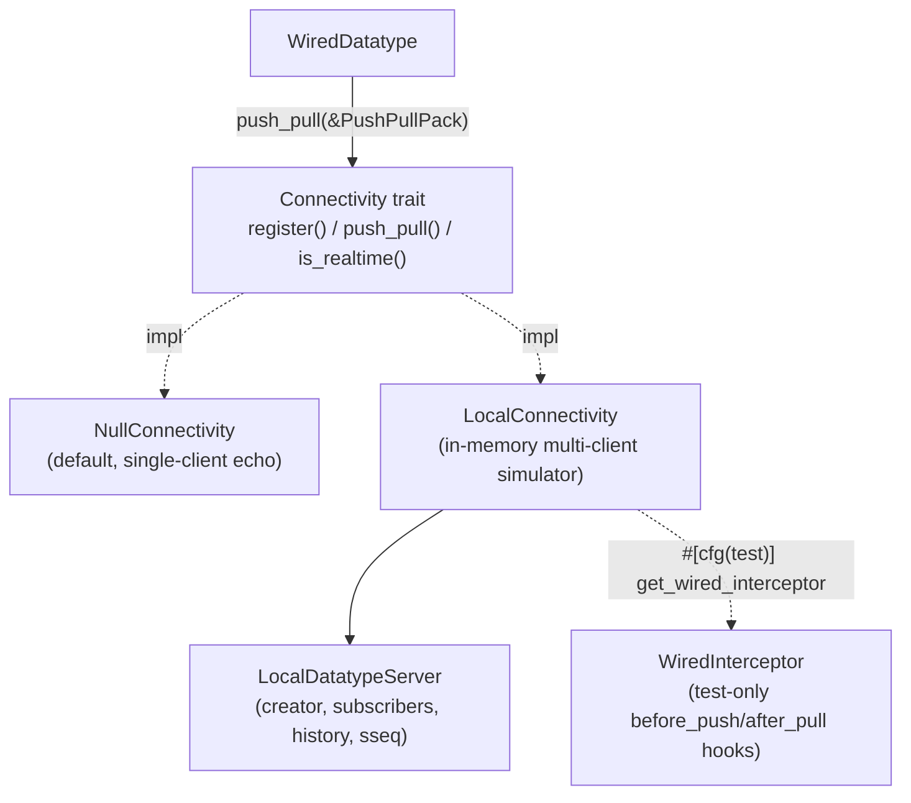

# Connectivity

`Connectivity` abstracts the synchronization backend a `Client` talks to. The crate ships two implementations — `NullConnectivity` (a stateless single-client default) and `LocalConnectivity` (an in-memory multi-client simulator used across the test suite) — plus `WiredInterceptor`, a test-only hook for observing and mutating a single push/pull exchange.

## Overview

## Core Types

| Type | Location | Purpose |
|------|----------|---------|
| `Connectivity` | `src/connectivity/mod.rs` | The backend trait: `register`, `push_pull`, `is_realtime` |
| `PushPullPack` | `src/types/push_pull_pack.rs` | The wire format exchanged in both directions of a sync |
| `NullConnectivity` | `src/connectivity/null_connectivity.rs` | Default no-op backend; always realtime, no cross-client behavior |
| `LocalConnectivity` | `src/connectivity/local_connectivity.rs` | In-memory backend simulating a server for multiple in-process clients |
| `LocalDatatypeServer` | `src/connectivity/local_datatype_server.rs` | Per-resource server state behind `LocalConnectivity`: creator, subscribers, transaction history |
| `WiredInterceptor` | `src/datatypes/wired_interceptor.rs` | Test-only `before_push` / `after_pull` hooks for fault injection and assertions |

## How It Works

### The trait

`Connectivity::register(wired, sender)` wires a datatype's event channel (`crossbeam_channel::Sender<Event>`) into the backend so it can later deliver `Event::Notify` for realtime pushes (see [`docs/event-loop.md`](event-loop.md)). `push_pull(&PushPullPack)` is the core exchange: it takes the client's pushed state and returns the backend's response as another `PushPullPack`. `is_realtime()` tells the event loop whether to auto-push after local writes.

### PushPullPack

`PushPullPack::new(attr, state)` builds the outgoing pack from a datatype's `Attribute`: `collection`, `cuid`, `duid`, `key`, `type`, `state`, `checkpoint` (cseq/sseq), pending `transactions`, an optional `snapshot_transaction`, `is_readonly`, and an `error` slot the responder fills in on failure. `resource_id()` (`"{collection}/{key}"`) is the key both connectivity backends use to look up server-side state.

### NullConnectivity

A stateless, always-realtime echo: it inspects only `pushed.state` and answers directly — `Creating` / `SubscribingOrCreating` become `Subscribed` (unless `is_readonly`, which fails with `ReadonlyViolation`), `Subscribing` requires an empty transaction list, `Unsubscribing` becomes `Disabled`, `Deleting` is unimplemented (`todo!()`), and `Disabled` is unreachable. It never tracks other clients — it exists so a bare `Client::builder(...).build()` works without wiring a real backend.

### LocalConnectivity and LocalDatatypeServer

`LocalConnectivity` holds a `HashMap<ResourceID, Arc<RwLock<LocalDatatypeServer>>>`, created lazily the first time a datatype `register()`s for that resource. `set_realtime(bool)` (default `true`) toggles whether successful pushes trigger notifications.

`LocalDatatypeServer` is the simulated server for one resource. It tracks:
- `creator` — the `Cuid` of the client whose in-process `WiredDatatype` can produce a subscribe-time snapshot
- `subscribers` — the set of clients considered subscribed (broader than `wired_map`, which only holds in-process handles)
- `cseq_map` — per-client checkpoint of the last accepted client sequence number
- `history` — every transaction ever pushed, each stamped with a server sequence number (`sseq`)

`process()` dispatches on `pushed.state` to one `process_*` method per `DatatypeState` variant. On a successful push with transactions and `is_realtime`, `notify_pushed()` sends `Event::Notify` to every *other* registered client's channel via `try_send` — best-effort, matching the bounded channel's capacity-1 drop-if-full semantics in the event loop.

When the creator unsubscribes, the server reassigns `creator` to another in-process subscriber if one exists; otherwise, future `Subscribing` requests fall back to replaying the full `history` instead of a creator-provided snapshot. The server removes itself from `LocalConnectivity`'s map once both `wired_map` and `subscribers` are empty.

### WiredInterceptor

Available only via `LocalConnectivity::get_wired_interceptor()` under `#[cfg(test)]`, `WiredInterceptor` lets a test install a `before_push` closure (inspect or mutate the outgoing pack) and an `after_pull` closure (inspect the incoming pack or return an injected `DatatypeErrorWithAction`) around a single datatype's `push_pull` calls.

## Key Design Decisions

- **`Connectivity` is a trait, not an enum**: the backend is meant to be pluggable. `NullConnectivity` and `LocalConnectivity` ship built-in, but the abstraction exists so out-of-process backends can be added without SDK changes — though `ConnectivityError` itself stays crate-internal until custom backends become a public extension point (see [`docs/error-handling.md`](error-handling.md)).
- **`LocalDatatypeServer` tracks a single "creator" rather than treating all subscribers equally**: a subscribe request can be answered cheaply from the creator's in-process `WiredDatatype` snapshot instead of always replaying history. The explicit fallback to full history replay once no in-process creator remains keeps the server correct — just less efficient — rather than failing.
- **Notification delivery is best-effort (`try_send`)**: this mirrors the event loop's bounded channel, which silently drops a send if one is already queued (see [`docs/event-loop.md`](event-loop.md)). A dropped notify is safe because the next explicit `sync()` or a later notify still converges via the `cseq`/`sseq` comparison — nothing is lost, only delayed.
- **`WiredInterceptor` is reachable only through a `#[cfg(test)]` accessor**: production code has no legitimate reason to intercept the wire exchange. Gating the getter (rather than the type itself) keeps `WiredDatatype`'s internals simple while still preventing accidental production use.

## Related Concepts

- [`docs/architecture.md`](architecture.md) — the Wired layer that calls into `Connectivity`
- [`docs/event-loop.md`](event-loop.md) — the channels `register()` wires up and how `Notify` events are consumed
- [`docs/error-handling.md`](error-handling.md) — how `ConnectivityError` becomes a `DatatypeError`
- [`docs/datatype-state.md`](datatype-state.md) — the state transitions every `Connectivity` implementation must honor
