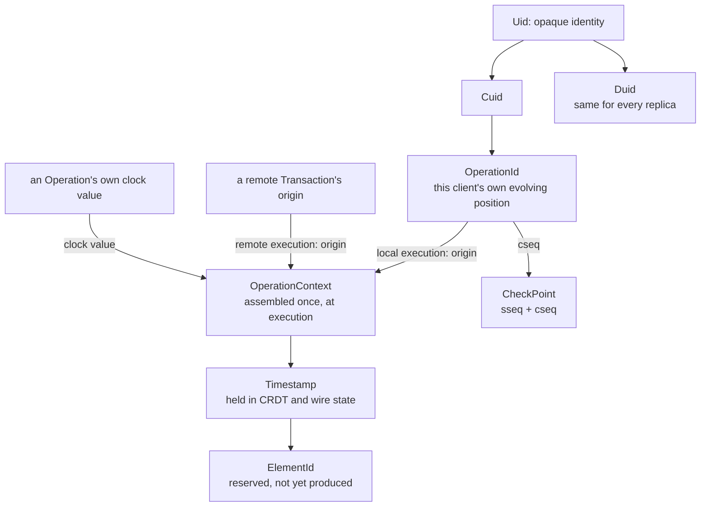

# Core Types

A replicated datatype needs to answer five separate questions: which client or datatype
something belongs to, which of two competing changes has precedence, which exact element an
operation names, how far one client's own work has progressed, and how far a synchronization
exchange has gotten. Qortoo gives each question its own type rather than overloading one
identifier or counter to answer several, so each type has exactly one comparison meaning and
mixing two up is a type error, not a runtime surprise. This document owns those definitions.
How they participate in a specific flow — a local write, a sync exchange — is defined by the
document that owns that flow: [`docs/transaction-and-rollback.md`](transaction-and-rollback.md)
and [`docs/connectivity.md`](connectivity.md).

## Model

| Term | Meaning |
|------|---------|
| `Uid` | Qortoo's one representation of stable, opaque identity |
| `Cuid` | A `Uid` in the role of identifying a client |
| `Duid` | A `Uid` in the role of identifying one logical datatype, shared by every one of its replicas |
| `Timestamp` | The precedence key stamped on a change: a logical clock value paired with its origin client |
| `OperationContext` | The execution-time pairing of one operation's clock value with its correct origin, assembled fresh for each execution and never persisted |
| `ElementId` | An exact identity for one of several elements a single change can produce, distinct from precedence |
| `OperationId` | A client's own evolving position: its next logical clock value and its next transaction number |
| `CheckPoint` | The pair of progress numbers a synchronization exchange advances |

## Rules and Guarantees

**Identity is opaque and carries a role, not a meaning of its own.** A `Uid`'s value
distinguishes one client or datatype from another and encodes nothing else. `Cuid` and `Duid`
share that same representation but name different things — a client versus a logical
datatype — and every replica of one logical datatype carries the *same* `Duid`; replicas are
never assigned separate ones. Because the two share a representation, nothing in the type
system stops a `Cuid` from being passed where a `Duid` is expected; code that carries an
identifier across a boundary is responsible for keeping its role straight. The nil `Uid` is a
sentinel for "no identity assigned," never a generated one.

**A timestamp orders competing writes deterministically; it does not claim recency.** Ordering
compares the logical clock value first, and only when two are equal does it fall back to
origin identity. Two clients can independently produce the same clock value, so the identity
comparison exists purely to break that tie the same way on every replica — it is not a claim
that one client's writes are privileged over another's. What the ordering guarantees is that
every replica resolves the same competing writes to the same winner; it says nothing about
which one happened first in wall-clock time, because there is no wall clock in this
comparison.

**A timestamp is assembled at the point of execution, not read off the wire.** An operation
carries only its own clock value; the identity that completes its timestamp comes from
whichever local state names the operation's true origin — the executing client's own progress
for a local operation, or the enclosing transaction's origin for a remote one. Assembling this
pairing is a single, narrow step that runs immediately before an operation reaches its CRDT and
produces nothing that is stored: the wire format carries only what it always carried, and this
step exists only to construct the value on which precedence is decided.

**Assembling a timestamp is also where a reserved clock value is enforced.** A logical clock
value of zero is reserved for a CRDT's synthetic initial state, so assembling a timestamp for a
real modification — local or remote — refuses a zero clock value outright. This is the one
required check every modification passes through; it is not required when a fresh replica
applies its starting snapshot, since a legitimate initial state is exactly the case the
reservation exists for.

**An element identity adds an exact position within one change, distinct from precedence.** A
single change can produce more than one addressable element, and every element it produces
shares that change's timestamp — so exact identity needs one more part, a value distinguishing
elements produced together, compared only after the timestamp compares equal. Conflict
resolution compares timestamps; looking up or referencing one particular element compares full
element identities. Keeping the two separate means a distinguishing value can never quietly
change which change wins a conflict.

**No current datatype produces more than one element per operation.** Element identity is
defined and tested on its own, but nothing in the SDK today constructs one outside its own
tests — it is reserved for an ordered datatype this SDK does not yet have. Treat it as
infrastructure for later, not as a concept either bundled datatype currently exercises.

**A client's own progress is mutable state; a timestamp is the immutable value taken from it.**
A client's position advances as it works: its logical clock value moves forward after every
successful local operation, and it also absorbs whatever later clock value a remote operation
carries, so a client's own clock never falls behind what it has already seen. Its transaction
counter moves forward once per new local transaction, not once per operation, so several
operations recorded in one transaction share a single transaction number while each still
receives its own successive clock value. A timestamp, by contrast, is a value taken from this
evolving state at one moment and then held fixed inside CRDT and wire state for as long as
that write matters for precedence. An operation that fails, or a transaction that is undone,
must not leave a permanent mark on this evolving position — see
[`docs/transaction-and-rollback.md`](transaction-and-rollback.md) for how a save point restores
it exactly.

**A checkpoint tracks two independent notions of "how far," and only ever advances.** One
number is how far the backend has acknowledged this client's own transactions — a client
offers only the transactions numbered past that point. The other is how far this client has
caught up with the backend's own record of everything it has accepted, from any client. The two
move independently: a client can commit many transactions of its own between two exchanges,
advancing the first number a great deal locally, while the second only ever moves in response to
what an exchange returns. Combining two checkpoints keeps the greater of each number
individually, so a checkpoint can only move forward, never regress. The exact accounting that
decides which buffered or returned transactions are new is defined in
[`docs/connectivity.md`](connectivity.md); this document defines only what the two numbers mean.

**Limits on the guarantees.** Two different writes are never expected to share a timestamp —
that would mean two operations from the same client at the same logical instant — and the
comparison rules make no promise about what happens if one does; where this is checked, it is
treated as corruption rather than a conflict to resolve (see
[`docs/variable.md`](variable.md)). A client's own progress additionally has a full ordering
and a merge helper defined for it, but nothing in the SDK currently compares two of these
values or exercises that merge outside its own tests — the type is complete but that part of
its surface is not yet load-bearing.

## Behavior

**Assembling a local timestamp.** A client executes an operation. Its own next logical clock
value is computed, paired with its own identity, and that pairing becomes the operation's
timestamp for exactly the duration of this execution.

**Assembling a remote timestamp.** A transaction arrives from another client. Each operation
inside it is paired with that transaction's origin identity, not with any identity of the
executing client's own — and the executing client's own logical clock absorbs whatever value
the incoming operations carry, so it never falls behind what it has now seen.

**Rejecting a reserved clock value.** A modification operation is constructed with a zero
logical clock value, whether by a bug or by malformed input. Assembling its timestamp refuses
it immediately, before it reaches any CRDT, on both the local and the remote path alike.

**Two elements from one change.** A single change produces two elements. Both receive the same
timestamp; each receives a different distinguishing value, so the two remain individually
addressable even though neither can be ranked ahead of the other by precedence alone.

**A transaction of several operations.** A client commits one transaction containing three
operations. Its transaction counter advances once, while its logical clock advances three
times — once per operation — so the transaction is one unit for sequencing purposes but three
distinct points for precedence purposes.

**A checkpoint advancing after an exchange.** A client has committed transactions locally that
the backend has not yet acknowledged, and the backend has accepted work from other clients that
this one has not yet seen. Both directions become visible in one exchange: the acknowledgement
of what this client sent moves its own progress number forward, and the transactions returned
in response are used to move its record of the backend's overall progress forward to match.

## Rationale

**One type carries one comparison meaning.** A timestamp answers "which of two changes wins."
An element identity answers "which exact element is this." Keeping the two as separate types
means a distinguishing value literally cannot participate in deciding a conflict, because it is
not part of the type that conflict resolution compares.

**Logical time, not wall-clock time.** A logical clock gives every replica a deterministic
sense of "before" and "after" without requiring synchronized physical clocks anywhere, which a
distributed system cannot assume it has. The cost is that the resulting order says nothing
about real elapsed time, which is a deliberate trade: the guarantee this SDK needs is that
replicas agree, not that they agree with a wall clock.

**Client identity breaks ties, not because origin should matter, but because something must.**
Two clients can produce the same logical clock value entirely legitimately, working
independently. The comparison needs some deterministic answer for that case, and identity is
the one piece of information already attached to every write that is guaranteed to differ
between two different clients producing it.

**Evolving state and retained values are kept apart because they answer to different
consumers.** A client's own progress has to change as it does new work and has to be
undoable when work is undone. A timestamp embedded in CRDT state has to stay exactly what it
was when a write happened, indefinitely, because other replicas' future comparisons depend on
it never drifting. A single mutable type trying to serve both roles would have to guard every
read of it against a concurrent write in progress; two types make each guarantee simple on its
own.

**Two sequence numbers instead of one.** A single counter cannot describe "how far my own work
has been acknowledged" and "how far I've caught up with everyone else's" at the same time,
because those move at different rates and for different reasons — one advances on every local
commit, the other only on what an exchange actually confirms. Merging them into one number
would force one of those two questions to be answered approximately.

## Code Map

| Concern | Location |
|---------|----------|
| `Uid`, `Cuid`, `Duid`, and the nil sentinel | `src/types/uid.rs` |
| `Timestamp`, its comparison, and its wire encoding | `src/types/timestamp.rs` |
| `OperationContext`, including the reserved-clock-value check | `src/types/operation_context.rs` |
| `ElementId` — defined and tested, not yet constructed by any datatype | `src/types/element_id.rs` |
| `OperationId`, its advance methods, and its transaction-boundary logic | `src/types/operation_id.rs` |
| `CheckPoint` and merging two of them | `src/types/checkpoint.rs` |
| Where a local timestamp is assembled and the local clock advances | `src/datatypes/mutable.rs` (`execute_local_operation`) |
| Where a remote timestamp is assembled and the local clock absorbs it | `src/datatypes/mutable.rs` (`execute_remote_transaction`) |

| Verified by | Tests |
|-------------|-------|
| Identity generation, validation, and the nil sentinel | `can_generate_uids`, `can_validate_uids`, `can_create_duid_and_cuid` in `src/types/uid.rs` |
| Ordering compares the clock value first, then breaks ties by identity | `can_order_timestamps_by_lamport`, `can_break_timestamp_ordering_ties_by_cuid` in `src/types/timestamp.rs` |
| The initial timestamp is older than any real one | `can_create_an_initial_timestamp_older_than_real_operations` in `src/types/timestamp.rs` |
| A timestamp is assembled from an operation and its origin | `can_create_an_operation_context_with_an_origin_cuid` in `src/types/operation_context.rs` |
| A zero clock value is refused for a real modification | `can_reject_a_modification_operation_with_zero_lamport` in `src/types/operation_context.rs` |
| Element identities with equal timestamps still compare unequal, and order by timestamp then distinguishing value | `can_compare_exact_element_identity`, `can_order_element_ids_by_timestamp_then_delimiter` in `src/types/element_id.rs` |
| A client's own clock advances only on success, and rollback restores it exactly | `can_next_rollback_compare_operation_ids` in `src/types/operation_id.rs` |
| A transaction advances the transaction counter once regardless of operation count | `can_preserve_transaction_state_when_operation_execution_fails` in `src/datatypes/mutable.rs` |
| Merging two checkpoints keeps the greater of each field | `can_use_checkpoint` in `src/types/checkpoint.rs` |

## Related Concepts

- [`docs/architecture.md`](architecture.md) — where a client's progress and a datatype's identity live among its other state
- [`docs/transaction-and-rollback.md`](transaction-and-rollback.md) — how a client's own progress is saved and restored around a transaction
- [`docs/connectivity.md`](connectivity.md) — how the two checkpoint numbers are exchanged and reconciled
- [`docs/variable.md`](variable.md) — the concrete consumer of timestamp precedence, including what it does if two writes ever share one
- [`docs/error-handling.md`](error-handling.md) — how a rejected zero-clock-value operation surfaces as an error
