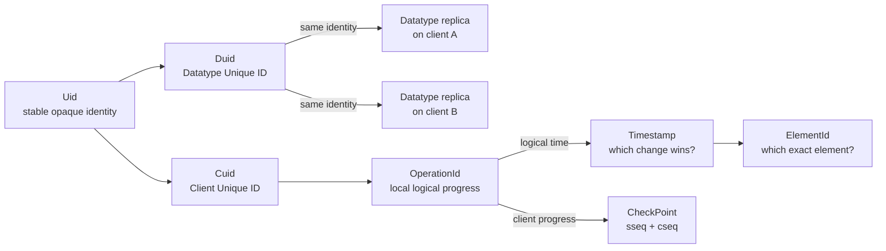
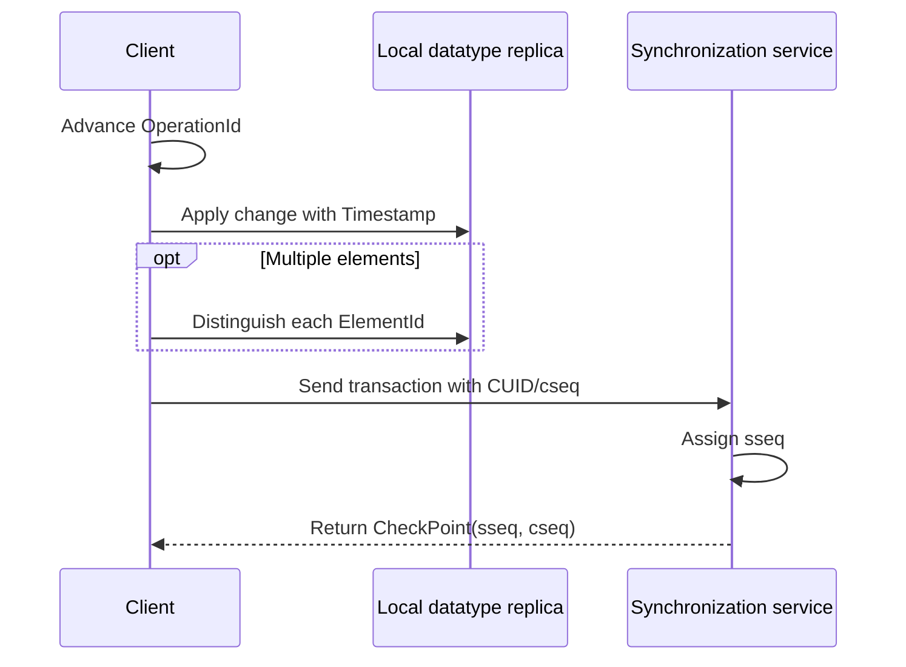

# Core Types

Qortoo separates identity, logical order, element identity, local progress, and
transaction sequencing into distinct concepts. Each type answers one question and
therefore carries one comparison meaning.

## Overview

The core types describe two dimensions of a replicated datatype: what a change belongs
to, and how that change progresses through the distributed system.



These concepts answer different questions:

| Question | Concept |
|----------|---------|
| Which client produced a change? | `Cuid` |
| Which logical datatype do its replicas represent? | `Duid` |
| Which concurrent change has precedence? | `Timestamp` |
| Which exact element does an operation reference? | `ElementId` |
| What logical time and local transaction comes next? | `OperationId` |
| Which server-side and client-side transaction sequences are being carried? | `CheckPoint` |

## Core Types

### Identity: Uid, Cuid, and Duid

`Uid` is Qortoo's common representation of stable identity. The identifier is opaque:
its value distinguishes one client or datatype from another, but does not encode
business meaning.

Two semantic roles are built on that representation:

- `Cuid` means **Client Unique ID**. It identifies a client and remains stable while
  that client produces local operations and transactions.
- `Duid` means **Datatype Unique ID**. It identifies one logical datatype, independent
  of where that datatype is replicated.

A datatype can have replicas on multiple clients. Every replica of the same datatype
has the same DUID; replicas do not receive separate DUIDs. The DUID is therefore the
shared identity that says those replicas represent the same logical datatype.

The nil UID represents an identity that has not been assigned. It is a sentinel, not a
generated client or datatype identity.

`Cuid` and `Duid` share the same representation but have different conceptual roles.
Code that moves an identifier across a boundary must preserve that role explicitly.

### Precedence: Timestamp

A `Timestamp` is the deterministic precedence key for a change:

```text
Timestamp = (Lamport time, client identity)
```

Lamport time establishes logical order. A higher Lamport value has precedence over a
lower value. Two clients can independently produce the same Lamport value, so CUID
provides a deterministic tie-breaker.

```text
compare Lamport time
    └── if equal, compare CUID
```

This creates one stable ordering on every replica of the datatype. It does not claim
that the winning change occurred later in wall-clock time; it only guarantees that all
replicas of the datatype resolve the same competing changes in the same way.

Equality, ordering, and hashing all describe this same `(Lamport, CUID)` identity.
That consistency allows a CRDT rule to read naturally as “the greater timestamp wins.”

### Exact element identity: ElementId

One logical operation can create more than one element. Those elements share a
timestamp, so timestamp equality alone cannot identify a particular element.

`ElementId` adds a delimiter within the operation:

```text
ElementId = (Timestamp, delimiter)
```

The two parts have separate meanings:

- `Timestamp` identifies the producing change and its precedence.
- `delimiter` identifies one element produced by that change.

Different delimiters therefore produce different element identities even when their
timestamps are equal. Conflict resolution compares timestamps; exact lookup and
reference compare element IDs. Keeping these concepts separate prevents element
identity from silently changing a conflict rule.

### Local logical progress: OperationId

`OperationId` is the evolving local position of a client's replica of a datatype:

```text
OperationId = (Lamport time, client identity, client transaction sequence)
```

It combines two forms of progress:

- Lamport time advances for successful local operations and absorbs logical time seen
  from remote operations.
- client sequence (`cseq`) advances for new local transactions.

These counters serve different purposes. Lamport time orders changes, while `cseq`
groups and tracks transactions produced by one client. A transaction containing
multiple operations therefore consumes one client sequence but multiple Lamport
positions.

The operation ID is mutable clock state. A `Timestamp` is an immutable value taken from
that logical-time domain and retained in CRDT state. Failed or rolled-back work must
not permanently advance the local position.

### Transaction sequences: CheckPoint

A `CheckPoint` carries two transaction sequence values used during push-pull:

```text
CheckPoint = (server sequence, client sequence)
```

- server sequence (`sseq`) represents the order of transactions received by the server.
- client sequence (`cseq`) represents the transaction sequence from the perspective of
  one client.

Their role at a particular point in push-pull is determined by that protocol context.
This overview defines only the two sequence domains.

### Code map

The concept definitions are kept together under `src/types/`:

| Concept | Definition |
|---------|------------|
| `Uid`, `Cuid`, `Duid` | `src/types/uid.rs` |
| `Timestamp` | `src/types/timestamp.rs` |
| `ElementId` | `src/types/element_id.rs` |
| `OperationId` | `src/types/operation_id.rs` |
| `CheckPoint` | `src/types/checkpoint.rs` |

## How It Works

The concepts participate in a change from creation to synchronization as follows:

1. A client has a stable `Cuid`. A datatype has a stable `Duid`, and every replica of
   that datatype carries the same DUID.
2. A successful local operation receives the next Lamport time. The first operation in
   a local transaction also advances that client's transaction sequence.
3. A non-commutative CRDT records a `Timestamp` so every replica of the datatype can
   select the same winner when changes compete.
4. If one operation creates multiple addressable elements, each receives an
   `ElementId` with the same timestamp and a distinct delimiter.
5. A transaction carries its client-side `cseq`, and the server places received
   transactions in its server-side `sseq` order. Push-pull exchanges carry both values
   in a `CheckPoint`.



The separation remains important throughout the flow: identity selects the client or
logical datatype, logical time resolves competition, element identity selects an exact
node, and sequence numbers locate transactions in client-side and server-side orders.

## Key Design Decisions

- **One type carries one comparison meaning.** `Timestamp` represents precedence;
  `ElementId` represents exact identity. A delimiter never changes which operation
  wins a conflict.
- **Logical time is not wall-clock time.** Lamport time provides deterministic causal
  progress without depending on synchronized physical clocks.
- **Client identity completes the order.** CUID tie-breaking turns equal Lamport values
  into a stable order shared by every replica of the datatype.
- **Clock state and retained values are distinct.** `OperationId` evolves as work is
  produced, while timestamps and element IDs remain immutable inside CRDT state.
- **Transaction ordering has two reference points.** `cseq` follows one client's
  transaction sequence; `sseq` follows the order of transactions received by the
  server. `CheckPoint` carries both sequence values through push-pull.

## Related Concepts

- [Architecture](architecture.md) — where identity and progress live in the datatype
  layer stack
- [Transaction and Rollback](transaction-and-rollback.md) — how local logical progress
  participates in atomic transactions
- [Connectivity](connectivity.md) — how client and server transaction progress is
  exchanged
- [Event Loop](event-loop.md) — how server progress notifications trigger
  synchronization
