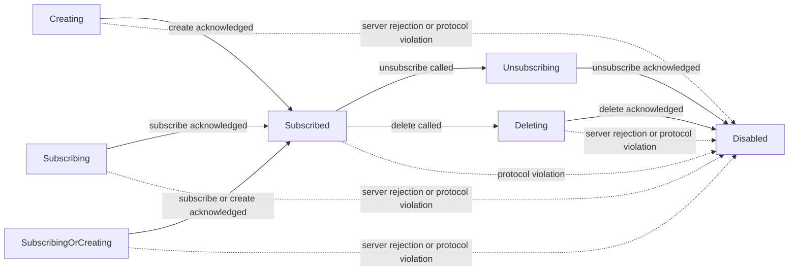

# Datatype State

`DatatypeState` represents the client-side lifecycle of a datatype and controls
whether local writes and push/pull sync are allowed.

The state is intentionally separate from the explicit read-only option set by
`DatatypeBuilder::with_readonly()`. A datatype is writable only when both are
true:

- the current `DatatypeState` allows writes
- the datatype was not built as read-only

## State Reference

| State | Meaning | Writes | Push target | Normal transition |
|-------|---------|--------|-------------|-------------------|
| `Creating` | The datatype exists locally and should be created on the backend. | Yes | Yes | `Subscribed` |
| `Subscribing` | The datatype should subscribe to an existing backend datatype. | No | Yes | `Subscribed` |
| `SubscribingOrCreating` | The datatype should subscribe if it exists, or create it otherwise. | Yes | Yes | `Subscribed` |
| `Subscribed` | The datatype is attached to the backend and can exchange operations. | Yes | Yes, when there are pending transactions or remote notifications | `Unsubscribing`, `Deleting`, or `Disabled` |
| `Unsubscribing` | The datatype has recorded a local unsubscribe intent and is waiting for backend acknowledgement. | No | Yes | `Disabled` |
| `Deleting` | Reserved for backend delete lifecycle. | No | Yes | `Disabled` |
| `Disabled` | The datatype is detached from normal sync and should no longer be used for writes. | No | No | Terminal for the local handle |

`Creating`, `Subscribing`, `SubscribingOrCreating`, `Unsubscribing`, and
`Deleting` are intent states. They mean the local datatype has work that must be
sent to the connectivity backend. In realtime connectivity this push may be
triggered automatically by the event loop. In manual connectivity, the caller
must call `sync()`.

## Write Access

`DatatypeState::is_read_writable()` returns true for:

- `Creating`
- `SubscribingOrCreating`
- `Subscribed`

All other states are state-level read-only. The explicit read-only builder option
can still prevent writes even when the state itself is writable.

## Sync Flow

Typical successful transitions are:

On server rejection or protocol violation, a datatype can transition directly to
`Disabled`. When this happens for a client-managed datatype, the datatype asks
the owning `DatatypeManager` to detach it.
