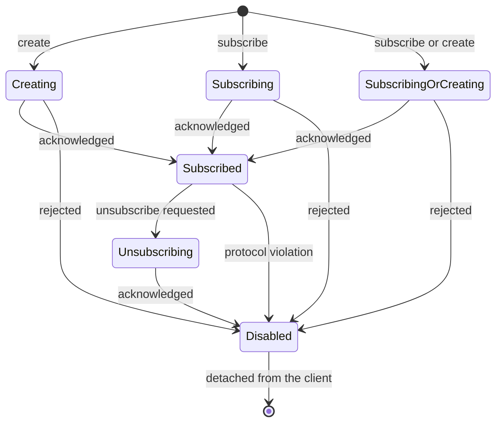

# Datatype State

A datatype's state is what it is currently trying to do with the backend, and it decides
whether the application may write to it. It is set when the datatype is built, advances when
the backend answers, and ends when the datatype is disabled. This document defines the states,
what each permits, and which transitions are possible. It is one of the two things that gate a
write; the other is the readonly option chosen at build time, which this document also
defines the interaction with.

## Model

| Term | Meaning |
|------|---------|
| State | What the datatype is currently trying to do with the backend, and what it permits meanwhile |
| Intent state | A state that exists because there is something to tell the backend, and that resolves when the backend answers |
| Settled state | `Subscribed`, where the datatype is attached and exchanging normally |
| Terminal state | `Disabled`, which nothing transitions out of |
| Readonly option | A build-time choice, independent of state, that forbids local writes for the datatype's whole life |
| Write access | The conjunction of a writable state and the absence of the readonly option |

The states divide into three groups. The intent states — `Creating`, `Subscribing`,
`SubscribingOrCreating`, `Unsubscribing` — each mean the datatype has something to tell the
backend and is waiting for the answer. `Subscribed` is the settled state, where work flows in
both directions. `Disabled` is terminal: the datatype has been detached and nothing brings it
back.

## Rules and Guarantees

**Where a state comes from.** The starting state is chosen by which client method built the
datatype, and nothing in the builder chain can change it — see
[`docs/client-and-datatype-builder.md`](client-and-datatype-builder.md). Later transitions come
from the backend's answer or from a recovery action applied after an error.

**Write access has two independent gates.** A write is permitted only when the state permits it
*and* the datatype was not built readonly. The state gate is open for `Creating`,
`SubscribingOrCreating`, and `Subscribed`, and closed for every other state. The readonly
option never changes and can refuse a write even in a writable state.

**Why the writable set looks like it does.** `Creating` and `SubscribingOrCreating` may be
written before the backend answers, because in both the client is prepared to be the datatype's
origin. `Subscribing` may not: the datatype is asking for someone else's data and has no basis
for local changes until it arrives.

**Reads are always allowed.** No state forbids reading. A disabled datatype still answers with
the last value it held.

**Only the settled state and unresolved intents are pushed.** A datatype offers itself for
synchronization while it has an unresolved intent — creating, subscribing, subscribing-or-
creating, or unsubscribing — or while it holds transactions the backend has not acknowledged.
A datatype that is settled with nothing outstanding is not pushed.

**Disabling detaches.** A datatype that reaches `Disabled` removes itself from its client's
table, and only if the table still holds that same instance. The key becomes available for a
new build at that point, and the new datatype is a distinct instance rather than a revival.

**Unsubscribing is not immediate.** Asking to unsubscribe records the intent and leaves the
datatype in the client's table. It becomes disabled, and detaches, only once the backend
acknowledges. With a realtime backend the event loop drives this; with a manual one the caller
has to synchronize.

**`Deleting` is reserved and unreachable.** It exists in the state set for a delete lifecycle
that is not implemented. No public API produces it, and the paths that would apply a response
for it are unimplemented, so reaching it would abort rather than fail gracefully. Treat it as
absent when reasoning about the lifecycle.

**Limits on the guarantees.** A state describes intent, not confirmation: a writable
pre-subscription state permits writes that the backend may still reject, in which case the
recovery action for that error decides what happens to the datatype and to the work it
buffered. See [`docs/error-handling.md`](error-handling.md).

## State Reference

| State | Meaning | Local writes | Offered for sync |
|-------|---------|--------------|------------------|
| `Creating` | Asking the backend to create this datatype | Permitted | Always |
| `Subscribing` | Asking to attach to a datatype that already exists | Refused | Always |
| `SubscribingOrCreating` | Accepting either outcome | Permitted | Always |
| `Subscribed` | Attached and exchanging | Permitted | When it holds unacknowledged work |
| `Unsubscribing` | Asking to detach, waiting for acknowledgement | Refused | Always |
| `Deleting` | Reserved; not produced and not implemented | Refused | — |
| `Disabled` | Detached; terminal | Refused | Never |

## Behavior

**A normal life.** A datatype is built with one of the three starting intents, is offered for
synchronization immediately, and moves to `Subscribed` when the backend acknowledges. It stays
there, being offered whenever it holds work the backend has not acknowledged, until the
application unsubscribes or an error disables it.

```mermaid
stateDiagram-v2
    [*] --> Creating: create
    [*] --> Subscribing: subscribe
    [*] --> SubscribingOrCreating: subscribe or create

    Creating --> Subscribed: acknowledged
    Subscribing --> Subscribed: acknowledged
    SubscribingOrCreating --> Subscribed: acknowledged

    Subscribed --> Unsubscribing: unsubscribe requested
    Unsubscribing --> Disabled: acknowledged

    Creating --> Disabled: rejected
    Subscribing --> Disabled: rejected
    SubscribingOrCreating --> Disabled: rejected
    Subscribed --> Disabled: protocol violation
    Disabled --> [*]: detached from the client
```

**Writing before the backend answers.** A datatype built to create is writable straight away.
Those writes accumulate as transactions and are sent once the datatype is attached. A datatype
built to subscribe refuses the same writes until it reaches `Subscribed`.

**A rejected subscription.** The backend refuses, the error's recovery action disables the
datatype, and it detaches from the client's table. Its handle keeps working for reads and
refuses writes. The key can be built again, producing a new datatype.

**Unsubscribing with a manual backend.** The request moves the datatype to `Unsubscribing`,
which refuses further writes but is still offered for synchronization. The caller synchronizes;
the backend acknowledges; the datatype becomes disabled and detaches. Until that synchronization
happens the key stays taken.

**A readonly datatype that is subscribed.** The state permits writes and the option refuses
them, so every write fails. Nothing about the state indicates this — the two gates are checked
independently.

## Rationale

**State and the readonly option are separate.** One is a fact about where the datatype is in
its lifecycle and changes over time; the other is a decision the application made once, at
build time. Folding the option into the state would mean inventing a readonly variant of every
state, and would lose the distinction between "cannot write yet" and "will never write".

**Detaching happens on disable rather than on request.** An unsubscribe that removed the entry
immediately would drop a datatype whose request has not been acknowledged, leaving nothing to
retry with if the exchange failed. Keeping the entry until the backend confirms means a failed
unsubscribe leaves a datatype that is still reachable through the client.

**Detach checks instance identity.** The key may already have been rebuilt by the time an old
datatype disables itself. Removing the entry only when it still holds that same instance keeps
a late disable from evicting its successor.

**A settled datatype with nothing outstanding is not offered.** Synchronization exists to move
work. Offering a datatype that has neither an unresolved intent nor unacknowledged transactions
would spend an exchange to learn nothing.

## Code Map

| Concern | Location |
|---------|----------|
| The state set, the writable predicate, and their documented examples | `src/types/datatype.rs` |
| Checking both gates before a write | `src/datatypes/transactional.rs` (`check_writable`) |
| Applying a state change and detaching on disable | `src/datatypes/mutable.rs` (`set_state`) |
| Deciding whether a datatype is offered for synchronization | `src/datatypes/wired.rs` (`need_push`) |
| Applying the state carried in a backend response | `src/datatypes/pull_handler.rs` |
| Removing the client's entry when the instance still matches | `src/clients/datatype_manager.rs` |
| The starting state each build path chooses | `src/datatypes/builder.rs`, `src/clients/client.rs` |

| Verified by | Tests |
|-------------|-------|
| Which states permit writes | `can_check_accessibility_of_datatype_state` in `src/types/datatype.rs` |
| The readonly option refuses writes in a writable state | `can_not_write_when_readonly` in `src/types/datatype.rs`, `can_check_read_only_state` in `src/datatypes/builder.rs` |
| Each build path produces its starting state | `can_use_counter_from_client` in `src/clients/client.rs` |
| A rejected create or subscribe disables and detaches | `can_auto_detach_after_create_failure_disables_datatype`, `can_auto_detach_after_subscribe_failure_disables_datatype` in `src/clients/client.rs` |
| Unsubscribe holds the entry until the backend acknowledges | `can_unsubscribe_datatype_from_client` in `src/clients/client.rs` |
| The same sequence driven by a realtime backend | `can_auto_detach_after_datatype_unsubscribe_in_realtime`, `can_unsubscribe_datatype_from_client_in_realtime` in `src/clients/client.rs` |
| Unsubscribing with work still buffered | `can_unsubscribe_with_pending_transactions` in `src/datatypes/datatype.rs` |
| The backend refuses a push from a disabled or unsubscribed client | `can_reject_push_from_disabled_client`, `can_reject_subscribed_push_from_unsubscribed_client` in `src/connectivity/local_datatype_server.rs` |

## Related Concepts

- [`docs/client-and-datatype-builder.md`](client-and-datatype-builder.md) — which build path produces which starting state, and the readonly option
- [`docs/architecture.md`](architecture.md) — where lifecycle state sits among a datatype's other state
- [`docs/connectivity.md`](connectivity.md) — what a backend does with each state it is offered
- [`docs/error-handling.md`](error-handling.md) — the recovery actions that disable or reset a datatype
- [`docs/handler-system.md`](handler-system.md) — how a transition is reported to the application
- [`docs/transaction-and-rollback.md`](transaction-and-rollback.md) — the buffered work a state change can affect
