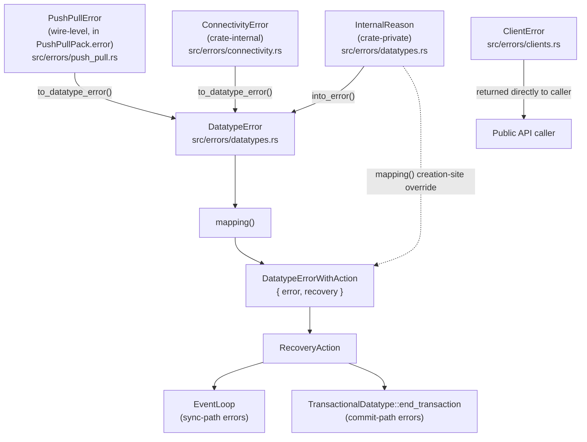
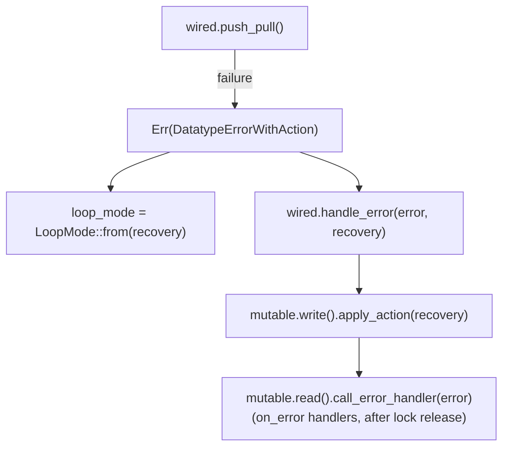
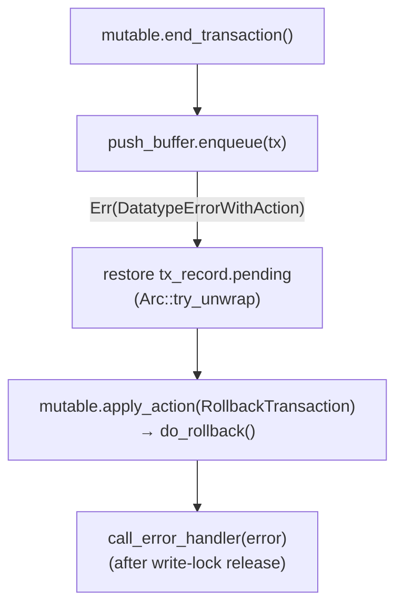

# Error Handling

Qortoo separates *what went wrong* (a typed error) from *how the SDK recovers* (a single
`RecoveryAction`). Wire-level and connectivity errors are translated into a
`DatatypeError`, and `mapping()` pairs that error with the one recovery policy that
applies — the pair travels as `DatatypeErrorWithAction`.

## Overview



---

## Core Types

| Type | File | Purpose |
|------|------|---------|
| `BoxedError` | `src/errors/mod.rs` | `Box<dyn Error + Send + Sync>` — thread-safe opaque error |
| `ClientError` | `src/errors/clients.rs` | Client-side errors (name validation, datatype registration); returned directly to callers |
| `DatatypeError` | `src/errors/datatypes.rs` | User-visible errors surfaced by all datatype operations |
| `ServerRejectReason` | `src/errors/datatypes.rs` | Why the server permanently rejected an operation; carried by `DatatypeError::ServerRejected` |
| `InternalReason` | `src/errors/datatypes.rs` | Crate-private reasons behind `DatatypeError::Internal` |
| `ConnectivityError` | `src/errors/connectivity.rs` | Crate-internal errors from the connectivity backend (not re-exported) |
| `PushPullError` | `src/errors/push_pull.rs` | Wire-level error set by the responder in `PushPullPack.error` |
| `DatatypeErrorWithAction` | `src/errors/datatypes.rs` | `DatatypeError` + its `RecoveryAction` |
| `RecoveryAction` | `src/errors/datatypes.rs` | The single recovery policy applied after a routed error |

---

## Error Taxonomy

### ClientError (codes 100–)

Returned directly to API callers. Never routed through the event loop.

| Variant | Code | Trigger |
|---------|------|---------|
| `InvalidCollectionName` | 100 | Collection name fails naming validation |
| `FailedToSubscribeOrCreateDatatype` | 101 | Re-registering a key on the same client, or type mismatch |

### DatatypeError (codes 200–)

The public-facing error type for all datatype operations, surfaced via API return values
and `on_error` handlers. Variants split into two groups:

**Caller-facing — returned directly, never routed through `mapping()`:**

| Variant | Code | Meaning |
|---------|------|---------|
| `TransactionFailed` | 201 | Transaction closure returned an error or commit failed |
| `Disallowed` | 205 | Access denied for a reason other than state/readonly (e.g., key not managed by this client) |
| `NotWritable` | 206 | Write rejected because the datatype state does not allow writes |

**Routed — carry a `RecoveryAction` via `mapping()`:**

| Variant | Code | Meaning | RecoveryAction |
|---------|------|---------|----------------|
| `Internal` | 202 | Internal SDK fault (see `InternalReason`); not user-actionable | `Disable`* |
| `ReadonlyViolation` | 207 | Write from a client configured as readonly | `Disable` |
| `SyncFailed` | 210 | Transient sync failure (connectivity timeout, server internal error) | `RetryWithBackOff` |
| `PushBufferExceededMaxMemSize` | 211 | Transaction cannot be buffered for pushing | `RollbackTransaction` |
| `ServerRejected(ServerRejectReason)` | 213 | Server permanently rejected the operation | `Disable` |

\* except `InternalReason::NonSequentialCseq`, which is routed to `RollbackTransaction`
at its creation site — see [InternalReason](#3-internalreason--creation-site-routing).

`ReadonlyViolation` appears on both sides: locally it is returned directly to the caller
of a write API; when the *server* reports it (`PushPullError::ReadonlyViolation`), it is
routed through `mapping()` and disables the datatype.

### ServerRejectReason

Carried by `DatatypeError::ServerRejected`. New lifecycle operations (e.g., delete,
merge) add variants here without touching `DatatypeError` itself.

| Variant | Trigger |
|---------|---------|
| `CreateFailed` | Server refused to create the datatype (e.g., already exists) |
| `ResourceNotFound` | Requested resource does not exist or has an incompatible type |
| `MissingSubscription` | Server-side subscription entry is missing (e.g., server restarted) |
| `ProtocolViolation` | Push violated the wire protocol (unexpected state transition, type mismatch) |

### ConnectivityError (crate-internal)

Not re-exported at the crate root; it stays internal until custom connectivity backends
become a public extension point.

| Variant | Trigger | Converts to |
|---------|---------|-------------|
| `TimedOut` | Backend did not respond in time | `DatatypeError::SyncFailed` |

### PushPullError (codes 300–)

The wire-level error set by the responder (the server side) in `PushPullPack.error`.
The client converts it via `to_datatype_error()`; variant names mirror
`ServerRejectReason` where a counterpart exists.

| Variant | Code | Converts to |
|---------|------|-------------|
| `ProtocolViolation` | 301 | `ServerRejected(ProtocolViolation)` |
| `ReadonlyViolation` | 302 | `ReadonlyViolation` |
| `CreateFailed` | 303 | `ServerRejected(CreateFailed)` |
| `ResourceNotFound` | 304 | `ServerRejected(ResourceNotFound)` |
| `MissingSubscription` | 305 | `ServerRejected(MissingSubscription)` |
| `ServerInternalError` | 306 | `SyncFailed` (transient — retry with backoff) |

---

## RecoveryAction

Each variant is a self-consistent recovery policy: it bundles the event-loop scheduling
effect and the datatype-lifecycle side effect that must occur together. Contradictory
pairings (e.g., disabling the datatype while keeping sync scheduled) are unrepresentable
by construction.

| Variant | Lifecycle effect (`MutableDatatype::apply_action`) | Loop effect (`LoopMode`) | Producers |
|---------|-----------------------------------------------------|--------------------------|-----------|
| `NotifyOnly` | none — `on_error` only | `Normal` | *reserved* |
| `RetryWithBackOff` | none | `BackOff` | `SyncFailed` |
| `RollbackTransaction` | `do_rollback()` on the pending transaction | — (never reaches the loop) | `PushBufferExceededMaxMemSize`, `InternalReason::NonSequentialCseq` |
| `Resubscribe` | `reset()` + state → `SubscribingOrCreating` | `Normal` | *reserved* |
| `ResubscribeWithBackOff` | same as `Resubscribe` | `BackOff` | *reserved* |
| `Disable` | `disable()` — state → `Disabled` | `Stopped` | `Internal`, `ServerRejected`, `ReadonlyViolation` |

> **WARNING (reserved variants)**: `Resubscribe` / `ResubscribeWithBackOff` reset local
> state, which discards unpushed transactions in the push buffer. A local data-loss
> policy must be decided before wiring a producer.

`MutableDatatype::apply_action()` is the single dispatch point for the lifecycle side
effect, shared by both consumer paths below.

---

## How It Works

### 1. Sync path — errors routed through the event loop

When `push_pull()` fails, the raw error is converted to a `DatatypeError`
(`to_datatype_error()`), then routed (`mapping()`):



The event loop derives its scheduling mode from the action
(`impl From<RecoveryAction> for LoopMode` in `event_loop.rs`):

| RecoveryAction | LoopMode |
|----------------|----------|
| `NotifyOnly`, `Resubscribe` | `Normal` |
| `RetryWithBackOff`, `ResubscribeWithBackOff` | `BackOff` — exponential backoff (500ms–30s, unlimited retries) |
| `Disable` | `Stopped` — further `PushTransaction` events are rejected |
| `RollbackTransaction` | `debug_assert` — must never reach the loop |

See [`docs/event-loop.md`](event-loop.md) for the full BackOff and Stopped flow.

### 2. Commit path — errors consumed on the user thread

`RollbackTransaction` never travels through the event loop. When
`MutableDatatype::end_transaction()` fails to enqueue the committed transaction into the
push buffer, the pending transaction is restored and the routed error is returned to
`TransactionalDatatype::end_transaction()`, which handles it synchronously:



This path runs in a defer guard after the write API has already returned, so the
`on_error` handler is the only way the user learns about the rollback. See
[`docs/transaction-and-rollback.md`](transaction-and-rollback.md) for the rollback
mechanics.

### 3. InternalReason — creation-site routing

`InternalReason` names the crate-private causes of `DatatypeError::Internal`:
`Deserialize`, `ExecuteOperation`, `EventLoop`, `NonSequentialCseq`,
`GetPushingTransactions`. `into_error()` erases the reason into `Internal(String)`, so a
reason that needs a routing other than the `Internal` default (`Disable`) must be mapped
**before** the erasure, at its creation site, via `InternalReason::mapping()`:

- `NonSequentialCseq` → `RollbackTransaction` (mapped inside `push_buffer.enqueue()`)
- all other reasons → delegate to `DatatypeError::mapping()`, which stays the single
  source of truth per error variant

### 4. with_err_out! Macro

All internal error paths use the `with_err_out!` macro (`src/errors/mod.rs`) to log an
ANSI-colored error message plus a filtered stack trace showing only frames within the
Qortoo SDK:

```rust
let err = with_err_out!(InternalReason::EventLoop(err_msg).into_error());
```

The macro captures `Backtrace::force_capture()` and `Location::caller()`, then calls
`with_stack_trace` which filters frames by `SDK_NAME` and formats them with `↘︎` arrows.

---

## Key Design Decisions

- **Single `RecoveryAction` enum instead of two action axes**: an earlier design paired
  an event-loop action with a lifecycle action, but only three of the twelve
  combinations were ever produced and several were contradictory (e.g., disable the
  datatype but keep syncing). Encoding only the valid policies makes invalid states
  unrepresentable and gives each consumer an exhaustive match.

- **`mapping()` as the translation boundary**: `DatatypeError::mapping()` owns the
  error→action table rather than a central match in the event loop. Adding a routed
  variant means updating one method next to the error definition (Open/Closed
  Principle). Caller-facing variants hitting `mapping()` is a bug and panics via
  `unreachable!`.

- **Names mirror across layers**: `PushPullError` variants align with
  `ServerRejectReason` variants (`CreateFailed`, `ResourceNotFound`,
  `MissingSubscription`, `ProtocolViolation`), so `to_datatype_error()` is
  self-documenting.

- **Variant equality by discriminant**: `ClientError`, `DatatypeError`, and
  `PushPullError` use `mem::discriminant`-based `PartialEq`, not payload equality. Test
  code can assert two errors are the *same kind* without caring about message strings.

- **`#[non_exhaustive]` on all public enums**: adding new variants is not a breaking API
  change for downstream crates.

- **`#[repr(i32)]` numeric codes**: `DatatypeError` (200–) and `PushPullError` (300–)
  assign explicit integer discriminants to support wire-level error code mapping without
  relying on Rust's unstable discriminant values.

---

## Related Concepts

- [`docs/event-loop.md`](event-loop.md) — how `LoopMode` (derived from `RecoveryAction`) drives BackOff and Stopped scheduling
- [`docs/architecture.md`](architecture.md) — overall layer stack; errors surface from the Wired layer upward
- [`docs/transaction-and-rollback.md`](transaction-and-rollback.md) — the rollback that `RecoveryAction::RollbackTransaction` triggers
