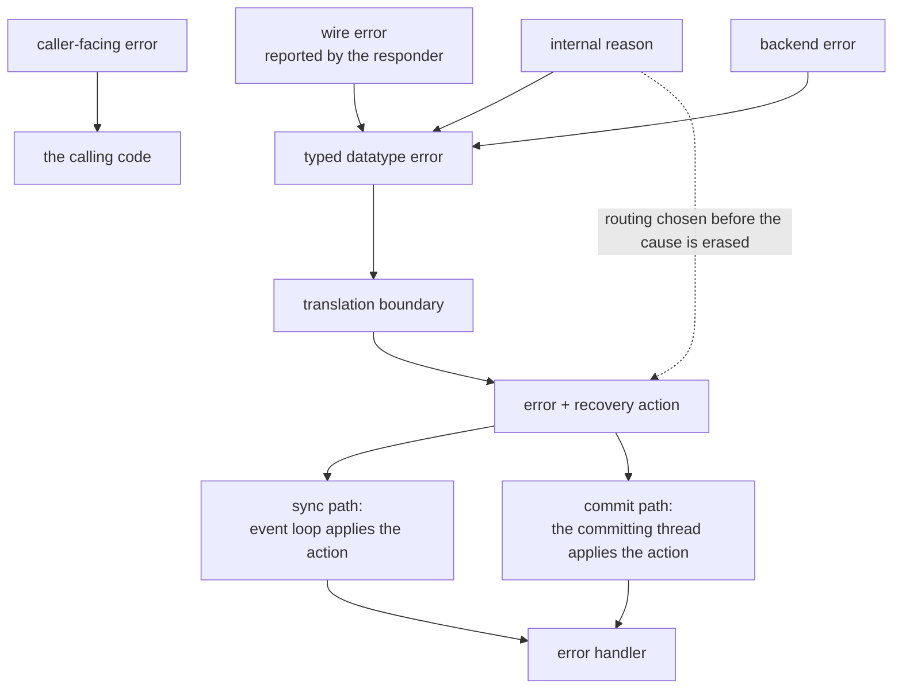

# Error Handling

Qortoo separates *what went wrong* from *how the SDK responds*. An error is a typed value
naming the failure; a recovery action is the single policy that applies to it. Some errors
are answered by the caller and never leave the call that produced them; others are decided
by the SDK, which changes the datatype's lifecycle and its synchronization schedule and then
tells the application what happened. This document defines which errors exist, which of the
two destinations each one has, and what the SDK does on the way.

## Model

| Term | Meaning |
|------|---------|
| Typed error | A value naming a failure, carrying a numeric code and a human-readable message |
| Caller-facing error | An error returned from the call that produced it; the caller decides what to do |
| Routed error | An error the SDK acts on, pairing it with a recovery action before any consumer sees it |
| Recovery action | One whole policy: the lifecycle effect and the scheduling effect that must happen together |
| Translation boundary | The single place that pairs an error with its action, kept next to the error definition |
| Wire error | A failure reported by the responder inside the exchange package, translated on arrival |
| Internal reason | A crate-private cause behind an internal error, used to pick a routing before the cause is erased |

An error reaches one of two destinations, never both. A caller-facing error is a return value:
naming a key this client does not manage, writing to a datatype whose state forbids it, or
handing a datatype a value it cannot represent. Nothing about the datatype changes and the SDK
takes no action. A routed error is one the caller could not have prevented and cannot fix in
place — a backend that timed out, a server that rejected the subscription — so the SDK pairs it
with a recovery action, applies that action, and reports the error through the datatype's
handler.

Routing a caller-facing error is a defect, not a fallback: the translation boundary refuses
those variants rather than assigning them a default action.

```mermaid
flowchart TD
    WIRE["wire error<br/>reported by the responder"]
    CONN["backend error"]
    INT["internal reason"]
    DE["typed datatype error"]
    MAP["translation boundary"]
    PAIR["error + recovery action"]
    LOOP["sync path:<br/>event loop applies the action"]
    COMMIT["commit path:<br/>the committing thread applies the action"]
    HANDLER["error handler"]
    CALLER["the calling code"]
    DIRECT["caller-facing error"]

    WIRE --> DE
    CONN --> DE
    INT --> DE
    INT -.->|routing chosen before the cause is erased| PAIR
    DE --> MAP --> PAIR
    PAIR --> LOOP --> HANDLER
    PAIR --> COMMIT --> HANDLER
    DIRECT --> CALLER
```

## Error Reference

### Client errors (codes 100–)

Returned directly to the caller; never routed.

| Variant | Code | Trigger |
|---------|------|---------|
| `InvalidCollectionName` | 100 | The collection name fails naming validation |
| `FailedToSubscribeOrCreateDatatype` | 101 | The key is already held by this client, or the requested kind or state does not match what is there |

### Datatype errors (codes 200–)

The public error type for datatype operations. Caller-facing variants are returned from the
call; routed variants are paired with an action.

**Caller-facing.**

| Variant | Code | Meaning |
|---------|------|---------|
| `TransactionFailed` | 201 | The transaction closure returned an error, or the commit could not complete |
| `Disallowed` | 205 | Access denied for a reason other than state or readonly configuration, such as a key this client does not manage |
| `NotWritable` | 206 | The datatype's lifecycle state does not permit writes |
| `ValueConversion` | 214 | A value could not be converted to or from the datatype's representation; nothing was applied |

**Routed.**

| Variant | Code | Meaning | Recovery action |
|---------|------|---------|-----------------|
| `Internal` | 202 | An SDK fault, not actionable by the application | `Disable` \* |
| `ReadonlyViolation` | 207 | The server reports a write from a client configured as readonly | `Disable` |
| `SyncFailed` | 210 | A transient exchange failure, such as a timeout or a server-side internal error | `RetryWithBackOff` |
| `PushBufferExceededMaxMemSize` | 211 | The committed transaction does not fit in the push buffer | `RollbackTransaction` |
| `ServerRejected` | 213 | The server permanently refused the operation; the reason is carried inside | `Disable` |

\* except the non-sequential-sequence reason, which chooses `RollbackTransaction` at its
creation site — see **Creation-site routing** below.

`ReadonlyViolation` reaches both destinations depending on who detects it. A local write by a
readonly client is refused as `NotWritable` before anything is applied; the same violation
reported by the server arrives as a routed error and disables the datatype.

### Server rejection reasons

Carried inside a `ServerRejected` error. Lifecycle operations added later extend this set
without changing the datatype error type.

| Variant | Trigger |
|---------|---------|
| `CreateFailed` | The server refused to create the datatype, for example because it already exists |
| `ResourceNotFound` | The requested resource does not exist or has an incompatible type |
| `MissingSubscription` | The server has no subscription entry, for example after losing state |
| `ProtocolViolation` | The push violated the wire protocol, such as an unexpected state transition or a type mismatch |

### Backend errors

Crate-internal and not part of the public surface; they stay internal until custom backends
become a public extension point.

| Variant | Trigger | Becomes |
|---------|---------|---------|
| `TimedOut` | The backend did not respond in time | `SyncFailed` |

### Wire errors (codes 300–)

Set by the responder in the exchange package and translated on arrival. Names mirror the
server rejection reasons where a counterpart exists.

| Variant | Code | Becomes |
|---------|------|---------|
| `ProtocolViolation` | 301 | `ServerRejected(ProtocolViolation)` |
| `ReadonlyViolation` | 302 | `ReadonlyViolation` |
| `CreateFailed` | 303 | `ServerRejected(CreateFailed)` |
| `ResourceNotFound` | 304 | `ServerRejected(ResourceNotFound)` |
| `MissingSubscription` | 305 | `ServerRejected(MissingSubscription)` |
| `ServerInternalError` | 306 | `SyncFailed`, treated as transient |

### Recovery actions

| Action | Lifecycle effect | Scheduling effect | Produced by |
|--------|------------------|-------------------|-------------|
| `NotifyOnly` | none; the handler is told and nothing changes | normal | *reserved* |
| `RetryWithBackOff` | none | exponential backoff | `SyncFailed` |
| `RollbackTransaction` | undo the pending transaction | never reaches the event loop | `PushBufferExceededMaxMemSize`, non-sequential sequence |
| `Resubscribe` | reset local state, return to subscribing | normal | *reserved* |
| `ResubscribeWithBackOff` | reset local state, return to subscribing | exponential backoff | *reserved* |
| `Disable` | disable the datatype | stopped; further sync requests are refused | `Internal`, `ServerRejected`, `ReadonlyViolation` |

## Rules and Guarantees

**One destination per error.** Every error is either returned to its caller or routed, and the
classification is a property of the variant, not of the situation. The translation boundary
treats a caller-facing variant as a defect and refuses it rather than choosing a default.

**One action per routed error.** The translation from error to action lives next to the error
definition, so a new routed variant is added in one place and every consumer matches
exhaustively. No consumer decides policy for itself.

**Recovery actions are whole policies.** An action names a lifecycle effect and a scheduling
effect together. There is no way to express a combination the SDK does not intend, such as
disabling a datatype while leaving its synchronization scheduled.

**One dispatch point for lifecycle effects.** Both consumer paths apply the lifecycle half of
an action through the same code, so a rollback or a disable means the same thing regardless of
which path decided it.

**The sync path.** A failed exchange is routed, the event loop takes its scheduling mode from
the action, the lifecycle effect is applied, and the error is reported to the datatype's
handler. Retrying uses exponential backoff between 500 ms and 30 s, and is not capped by an
attempt count; a disabled datatype refuses further sync requests. See
[`docs/event-loop.md`](event-loop.md).

**The commit path.** Undoing a transaction never travels through the event loop, because the
thread that committed is still the one that has to undo it. When enqueuing a committed
transaction fails, the pending transaction is restored so its undo actions still match, the
undo is applied, and the error is reported to the handler.

**Creation-site routing.** An internal error erases its cause into a message. A cause that
needs a routing other than the internal default must therefore choose its action before the
erasure, at the point the error is created. Every other cause defers to the single table.

**Reserved actions are unwired on purpose.** `Resubscribe` and `ResubscribeWithBackOff` reset
local state, which discards transactions still waiting in the push buffer. No producer routes
to them until that data-loss policy is decided.

**Limits on the guarantees.** A commit-path failure does not change what the call returns: the
value was determined when the operation succeeded, so the caller receives success while the
transaction is undone, and the handler is the only notification. An application that must know
a write survived its commit has to register one — see
[`docs/handler-system.md`](handler-system.md). Stack traces attached to internal errors are
diagnostic only; a platform that cannot produce one omits the trace and preserves the typed
error, and trace formatting never replaces an application error or escapes as a panic across a
language boundary.

## Behavior

**A backend that times out.** The exchange fails, the error becomes a transient sync failure,
and the action is to retry with backoff. Nothing about the datatype changes: its value, its
lifecycle state, and its buffered transactions are all intact, and the handler is told. The
next attempt happens after the backoff interval, which grows with consecutive failures.

**A server that rejects the subscription.** The wire error becomes a server rejection and the
action is to disable. The lifecycle effect runs first, so the datatype is already disabled when
the error notification arrives — a handler that inspects the datatype it is given observes the
disabled state, not the state the request was sent in. The event loop stops and refuses further
sync requests.

**A push buffer that is full.** The transaction closure returned success, but the transaction
does not fit. The action is to undo, which happens on the committing thread rather than in the
event loop. The datatype returns to its pre-transaction value and the handler is told. The call
that made the write still returned its value.

**A value the datatype cannot represent.** Converting the value fails before any operation is
created, so nothing is applied, no transaction opens, and the failure is returned from the call
that supplied the value. Nothing is routed and no handler is involved.

**A transaction that arrives out of sequence.** The push buffer rejects a transaction whose
sequence number is not contiguous. This is an internal fault, whose default routing would
disable the datatype, but it is recoverable by undoing the transaction — so the routing is
chosen where the error is created, and the transaction is undone instead.

## Rationale

**A recovery action is one policy, not two independent axes.** Scheduling and lifecycle
effects are not independent: disabling a datatype while leaving its synchronization scheduled
is not a state the system should be able to express. Naming the valid policies directly makes
the invalid combinations unrepresentable and lets every consumer match exhaustively instead of
reasoning about which pairs are coherent.

**The error-to-action table lives next to the errors.** A central match in the event loop would
make the loop the place every new error variant is remembered, and would give the loop
authority over policy for errors it never sees — the commit path among them. Keeping the
translation next to the error definition means adding a variant is a local change.

**Caller-facing variants have no default action.** Assigning one would make a misrouted error
silently produce a lifecycle change, which is worse than the error itself. Refusing them turns
a routing mistake into a failure that is found immediately rather than a datatype that quietly
disables itself.

**Internal causes are erased, so their routing is chosen first.** The public surface should not
grow a variant for every internal fault, but a few of those faults are recoverable in a way the
generic internal error is not. Choosing the action at the creation site keeps the public error
type small without losing the distinction that matters.

**Wire error names mirror the rejection reasons they become.** The translation between the two
is then obvious to read and hard to get wrong, and a new server-side reason has an evident
counterpart.

**Errors compare by variant, not by message.** Tests and callers ask whether two failures are
the same kind, which is the question that has a stable answer; message strings carry context
that is expected to differ between occurrences of the same failure.

**Public error types are extensible.** Every public error enum is marked non-exhaustive and
carries explicit numeric codes, so adding a variant does not break downstream code and codes
stay stable for language bindings that transmit them.

## Code Map

| Concern | Location |
|---------|----------|
| Datatype errors, rejection reasons, internal causes, recovery actions, and the translation boundary | `src/errors/datatypes.rs` |
| Client errors | `src/errors/clients.rs` |
| Backend errors | `src/errors/connectivity.rs` |
| Wire errors and their translation | `src/errors/push_pull.rs` |
| The boxed error alias and the logging macro that captures a filtered stack trace | `src/errors/mod.rs` |
| Observability-specific errors | `src/errors/observability.rs` |
| Applying the lifecycle half of an action | `src/datatypes/mutable.rs` (`apply_action`) |
| The sync-path consumer | `src/datatypes/wired.rs` (`handle_error`) |
| Deriving the scheduling mode from an action | `src/datatypes/event_loop.rs` |
| The commit-path consumer | `src/datatypes/transactional.rs` (`end_transaction`) |
| Sequence and capacity checks that produce routed errors | `src/datatypes/push_buffer.rs` |

| Verified by | Tests |
|-------------|-------|
| Errors compare by variant rather than by message | `can_compare_errors` in `src/errors/mod.rs` |
| The logging macro preserves the typed error | `can_use_err_macro` in `src/errors/mod.rs` |
| An unavailable stack trace is omitted rather than fatal | `can_omit_an_unavailable_stack_trace` in `src/errors/mod.rs` |
| Client error messages keep a stable format | `can_use_error_msg_format` in `src/errors/clients.rs` |
| Every observability error variant is distinct | `can_describe_every_variant_distinctly` in `src/errors/observability.rs` |
| An invalid collection name is refused at the caller | `can_reject_invalid_collection_names` in `src/clients/client.rs` |
| A create failure disables the datatype and detaches it | `can_auto_detach_after_create_failure_disables_datatype` in `src/clients/client.rs` |
| A subscribe failure disables the datatype and detaches it | `can_auto_detach_after_subscribe_failure_disables_datatype` in `src/clients/client.rs` |
| An unmanaged key is refused at the caller | `can_reject_unsubscribe_for_unmanaged_key` in `src/clients/client.rs` |
| A commit that cannot be enqueued is undone | `can_rollback_on_enqueue_failure` in `src/datatypes/transactional.rs` |
| The server refuses protocol violations and pushes from disabled or unsubscribed clients | `can_reject_subscribed_push_from_unsubscribed_client`, `can_reject_type_mismatch_in_subscribed_push`, `can_reject_push_from_disabled_client` in `src/connectivity/local_datatype_server.rs` |
| An error notification carries the datatype and its state | `can_notify_error` in `src/datatypes/handler.rs` |

## Related Concepts

- [`docs/architecture.md`](architecture.md) — where the two consumer paths sit in the layer model
- [`docs/event-loop.md`](event-loop.md) — backoff, the stopped mode, and how scheduling responds to an action
- [`docs/transaction-and-rollback.md`](transaction-and-rollback.md) — what undoing a transaction does
- [`docs/handler-system.md`](handler-system.md) — how an error reaches the application
- [`docs/datatype-state.md`](datatype-state.md) — the lifecycle states an action moves a datatype between
- [`docs/connectivity.md`](connectivity.md) — where backend and wire errors originate
- [`docs/variable.md`](variable.md) — the value contract whose violations surface as conversion errors
- [`docs/go-binding.md`](go-binding.md) — how numeric codes cross a language boundary
