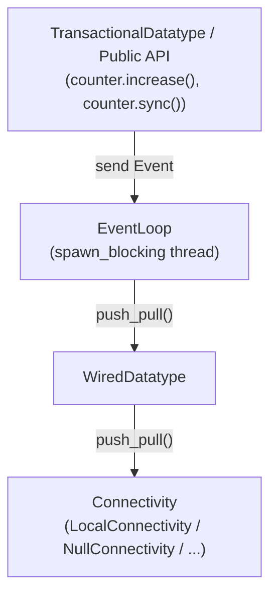
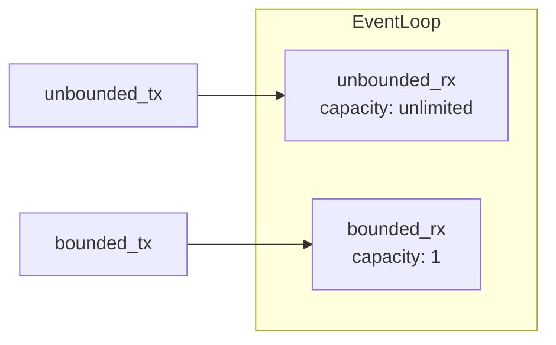
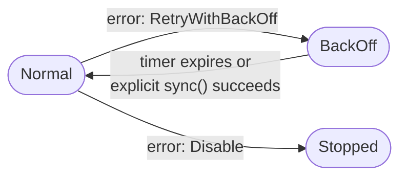
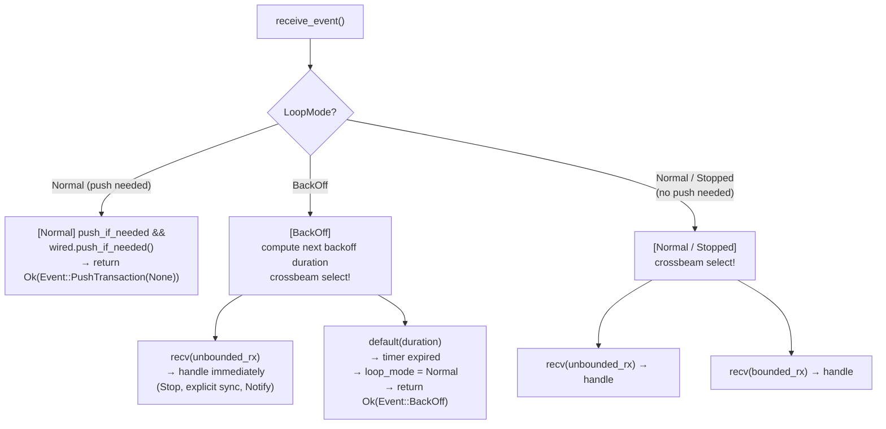
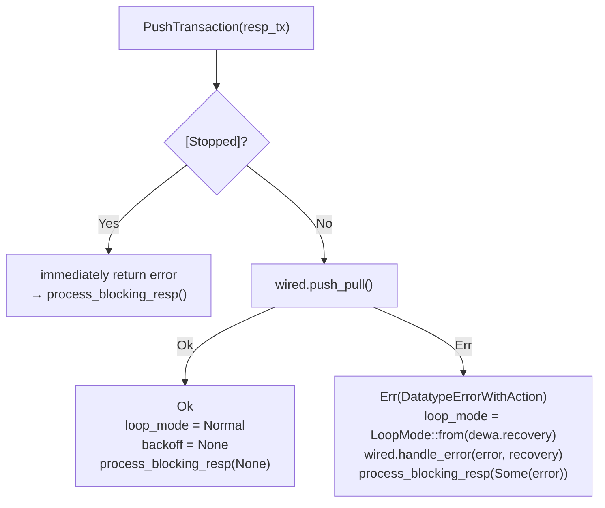
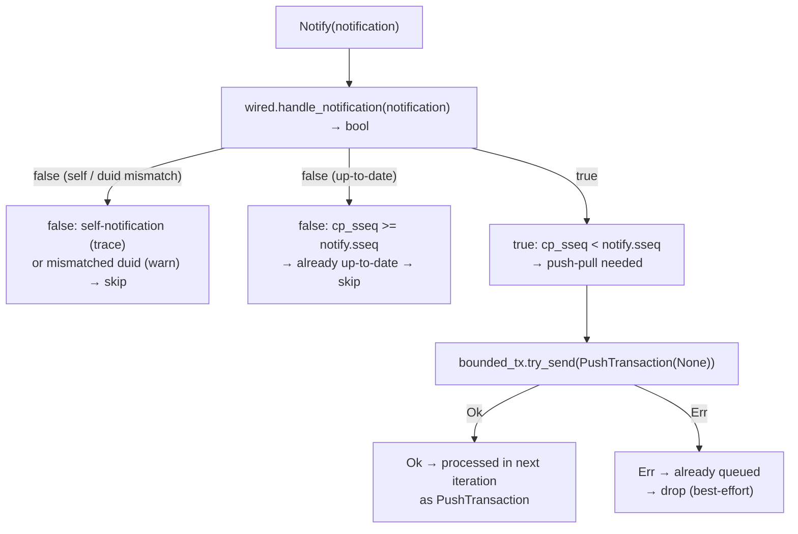
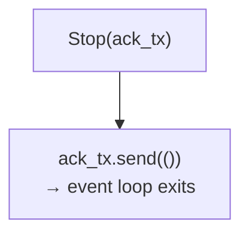
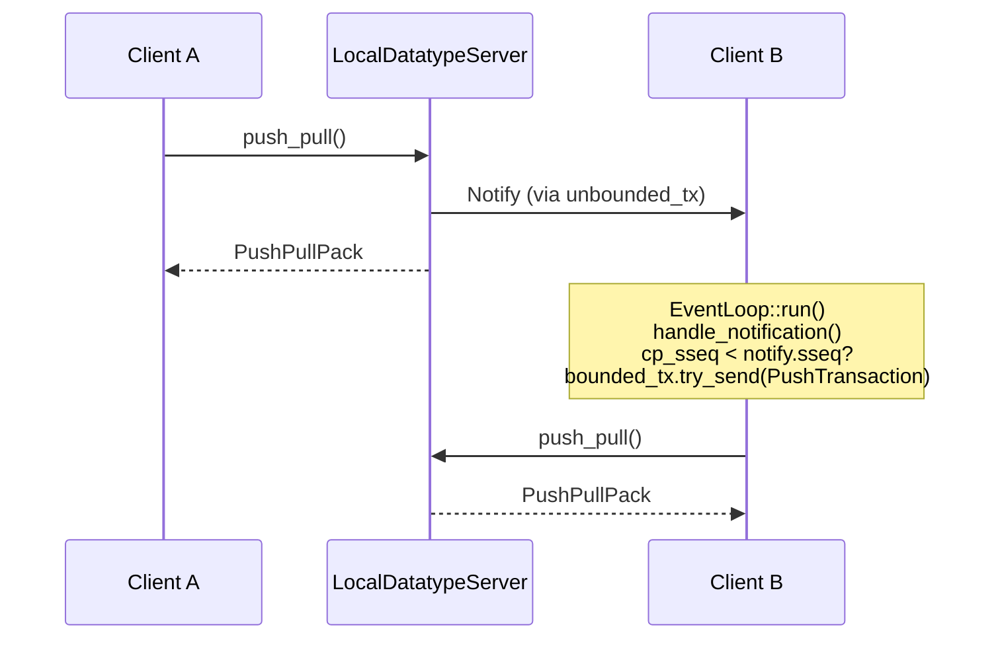

# Event Loop

## Overview

Each datatype instance owns a dedicated `EventLoop`. It runs on a `spawn_blocking` thread and is responsible for:
- Triggering push/pull sync after local writes complete
- Reacting to server-side realtime notifications
- Managing exponential backoff on transient errors



---

## Channel Architecture

The event loop receives events through two crossbeam channels.



| Channel | Purpose | Behavior |
|---------|---------|----------|
| `unbounded` | `Stop`, explicit `sync()`, `Notify` | Always polled; read even during BackOff |
| `bounded` | Realtime auto-push, Notify-triggered push | Capacity=1; silently dropped if already queued |

The `unbounded_tx` registered via `connectivity.register(wired, unbounded_tx)` is the handle the server uses to send `Notify` events to this client.

---

## Event Types

```rust
pub enum Event {
    Stop(Sender<()>),                              // Shut down the event loop (includes ack channel)
    PushTransaction(Option<oneshot::Sender<...>>), // Request push/pull (response channel optional)
    BackOff,                                       // BackOff timer expired (internal signal)
    Notify(Notification),                          // Realtime notification from the server
}
```

`PushTransaction` response channel (`resp_tx`):
- `Some(tx)` — sent by `sync()`; blocks caller until complete, returns error if any
- `None` — sent by realtime auto-push or Notify-triggered push; result is discarded

---

## LoopMode States

The event loop tracks its scheduling mode via `LoopMode`, a loop-private enum derived
from the routed `RecoveryAction` (`impl From<RecoveryAction> for LoopMode`). The routing
decision lives in `RecoveryAction` (see [`docs/error-handling.md`](error-handling.md));
`LoopMode` only tracks how the loop schedules the next sync attempt.



| Mode | Behavior |
|------|----------|
| `Normal` | Auto-push allowed; both channels polled |
| `BackOff` | Auto-push blocked; only `unbounded_rx` polled; retries after timeout |
| `Stopped` | Auto-push blocked; any `PushTransaction` immediately returns an error |

---

## receive_event Logic

`receive_event` is called at the start of every loop iteration.



`push_if_needed()` returns `true` only when `is_realtime() && need_push()`. This prevents auto-push from firing in manual sync mode.

---

## Event Handling

### PushTransaction



### Notify



> **Notify during BackOff**: `bounded_rx` is not polled during BackOff. A PushTransaction queued via `bounded_tx` will only be processed after the BackOff timer expires. This is intentional — Notify must not bypass BackOff protection. Explicit `sync()` uses `unbounded_tx` and bypasses BackOff immediately.

### Stop



---

## BackOff Details

Exponential backoff is implemented via `backon::ExponentialBuilder`.

| Parameter | Value |
|-----------|-------|
| Minimum delay | 500ms |
| Maximum delay | 30s |
| Max retry count | Unlimited |
| Growth factor | Exponential (×2) |

**BackOff entry**: Transient errors such as `DatatypeError::SyncFailed` (connectivity timeout, server internal error) map to `RecoveryAction::RetryWithBackOff` via `.mapping()`, which the loop derives into `LoopMode::BackOff`.

**BackOff exit**:
- Explicit `sync()` succeeds (via unbounded channel, bypasses wait)
- BackOff timer expires → automatic retry succeeds

---

## RecoveryAction — Post-Error Side Effects

On push_pull failure, `DatatypeErrorWithAction.recovery` determines both the loop's next
scheduling mode (`LoopMode::from(recovery)`) and the datatype state change
(`wired.handle_error` → `MutableDatatype::apply_action`). The full routing table lives
in [`docs/error-handling.md`](error-handling.md); for the datatype lifecycle and
write-access rules, see [`docs/datatype-state.md`](datatype-state.md).

| RecoveryAction | Lifecycle effect | LoopMode |
|----------------|------------------|----------|
| `NotifyOnly` *(reserved)* | None — `on_error` only | `Normal` |
| `RetryWithBackOff` | No state change | `BackOff` |
| `Resubscribe` *(reserved)* | `reset()` + transition to `SubscribingOrCreating` | `Normal` |
| `ResubscribeWithBackOff` *(reserved)* | Same as `Resubscribe` | `BackOff` |
| `Disable` | Transition to `Disabled` (sync permanently stopped) | `Stopped` |

`RecoveryAction::RollbackTransaction` never reaches the event loop — it is consumed on
the user thread by `TransactionalDatatype::end_transaction()` (guarded by a
`debug_assert` in `LoopMode::from`).

## Unsubscribe Lifecycle

`Datatype::unsubscribe()` records local intent by moving the datatype from
`Subscribed` to `Unsubscribing`. It does not wait for backend acknowledgement.

```text
Subscribed -> Unsubscribing -> Disabled -> manager detach
```

In realtime connectivity, the event loop can automatically schedule the
push/pull because `Unsubscribing` is a push target. In manual connectivity, the
caller must invoke `sync()` to send the unsubscribe request and receive the
`Disabled` response.

When `Disabled` is committed, a client-managed datatype asks its
`DatatypeManager` to detach the same core instance. This keeps the public
`Client` map aligned with the lifecycle without adding a separate public detach
API.

---

## Realtime Notification Flow (LocalConnectivity)

In realtime mode, when one client pushes transactions the server immediately notifies all other clients subscribed to the same datatype.



`handle_notification` filtering logic:
1. `identical_cuid` — notification originated from this client → skip (`trace`)
2. `different_duid` — notification for a different datatype misrouted → skip (`warn`)
3. `cp_sseq >= notify.sseq` — already at or ahead of the notified sseq → skip (`trace`)
4. Otherwise → schedule `PushTransaction` via `bounded_tx`

---

## Event Sender API

| Method | Channel | Blocking | Use case |
|--------|---------|----------|----------|
| `send_push_transaction_with_best_effort()` | bounded | No | Realtime auto-push after local write |
| `send_push_transaction_with_guarantee()` | unbounded | Yes (oneshot wait) | `sync()` call |
| `send_stop()` | unbounded | Yes (ack wait) | Datatype shutdown |

`send_push_transaction_with_best_effort` returns immediately if `is_realtime()` is `false`, preventing accidental auto-push in manual mode.
