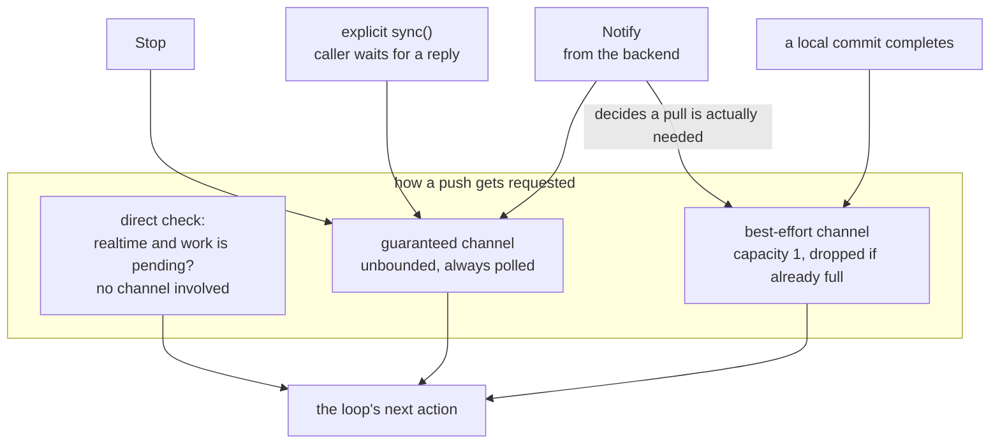
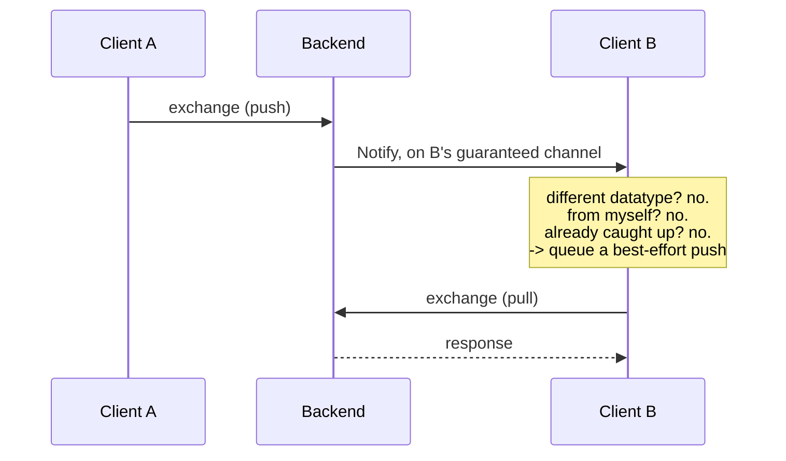

# Event Loop

Every datatype owns one event loop for its entire life. Its job is narrow: decide *when* an
exchange with the backend should happen, and recover on its own when one fails. What an
exchange contains and how a backend answers it belong to
[`docs/connectivity.md`](connectivity.md); what a failure means and how it is routed belong to
[`docs/error-handling.md`](error-handling.md). This document owns the scheduling decision
itself — the channels an exchange can be requested through, why one kind of request can never
be lost while another is allowed to be, and how the loop paces its own retries.

## Model

| Term | Meaning |
|------|---------|
| Guaranteed channel | The channel a request is sent on when losing it would be wrong: it is unbounded and always polled |
| Best-effort channel | The channel a request is sent on when losing it only costs a little latency: capacity one, dropped rather than queued when full |
| Direct check | The loop's own per-iteration decision to push, made before touching either channel at all |
| `PushTransaction` | The event that asks the loop to run one exchange, carrying an optional reply and the requester's trace context |
| `Notify` | The event a backend uses to tell this client that other clients' work may be waiting |
| Loop mode | The loop's own scheduling state — normal, backing off, or stopped — derived from the last routed recovery action |

```mermaid
flowchart TD
    subgraph paths["how a push gets requested"]
        DIRECT["direct check:<br/>realtime and work is pending?<br/>no channel involved"]
        GUAR["guaranteed channel<br/>unbounded, always polled"]
        BEST["best-effort channel<br/>capacity 1, dropped if already full"]
    end

    STOP["Stop"] --> GUAR
    SYNC["explicit sync()<br/>caller waits for a reply"] --> GUAR
    NOTIFY["Notify<br/>from the backend"] --> GUAR
    COMMIT["a local commit completes"] --> BEST
    NOTIFY -->|"decides a pull is actually needed"| BEST

    DIRECT --> LOOP["the loop's next action"]
    GUAR --> LOOP
    BEST --> LOOP
```

## Rules and Guarantees

**A push can be requested three ways, not two.** At the start of every iteration, if the
backend is realtime and the datatype currently needs one, the loop pushes immediately without
touching either channel — this is what fires a datatype's very first create-or-subscribe
exchange, and what lets several needed pushes happen back to back without round-tripping
through a channel in between. Failing that direct check, the loop blocks on its two channels:
the guaranteed one, which is always polled, and the best-effort one, which is skipped entirely
while the loop is backing off.

**What travels on the guaranteed channel can never be silently lost.** Stopping the loop,
waiting for an explicit `sync()` to answer, and every `Notify` a backend ever sends all go
through it — because it is the very channel handle the backend was given when this datatype's
event loop started, there is no second way for a `Notify` to reach this client if it were
dropped here. Losing a `Stop` would leak a blocked thread; losing a `sync()`'s reply would hang
its caller forever. Nothing that travels this channel is safe to drop.

**What travels on the best-effort channel is a nudge, not information.** After a local commit,
or after deciding a `Notify` means a pull is actually needed, the loop asks its future self to
check again — by sending an event that carries no information the loop could not re-derive on
its own. If one such nudge is already queued, capacity one means the new one is dropped rather
than piling up: the pending nudge already promises the next check will happen, and after it
runs, the exchange it triggers picks up whatever is currently outstanding, not only what
prompted this particular nudge. A dropped nudge costs latency and nothing else.

**Backing off excludes only the best-effort channel.** While the loop is in its backoff state,
it polls the guaranteed channel and a timer, and does not poll the best-effort one at all — so
a nudge queued during a backoff wait sits there until the timer expires or something arrives on
the guaranteed channel, while `Stop` and an explicit `sync()` are still served immediately,
bypassing the wait entirely. A client that already knows it is failing does not need to become
more eager just because someone else made progress; letting an explicit request through anyway
is what makes a manual retry actually manual.

**Auto-push depends on the backend being realtime, not on the loop's mode.** Both the direct
per-iteration check and the best-effort nudge sent after a commit are no-ops when the backend
answers that it is not realtime. A caller using a non-realtime backend is expected to call
`sync()` — on the guaranteed channel — whenever it wants an exchange to happen; the loop
schedules nothing on its own in that mode.

**Loop mode is derived from the last routed recovery action, and tracks scheduling only.**
What a recovery action means for the datatype's lifecycle is decided once, in
[`docs/error-handling.md`](error-handling.md); the loop only asks what that action implies for
its own next attempt. A stopped loop refuses every `PushTransaction` immediately, without
contacting the backend at all. A backing-off loop retries after a delay that starts at 500 ms
and doubles up to a ceiling of 30 seconds, with no limit on how many times it retries. Backoff
ends either when its timer expires or when an explicit `sync()` succeeds, and success always
resets the wait, so a manual retry that lands cannot be immediately followed by one more timed
retry left over from before it.

**A recovery action that undoes a transaction never reaches the loop.** That action is produced
and consumed entirely on the thread that is committing, before the loop is ever involved — see
[`docs/transaction-and-rollback.md`](transaction-and-rollback.md). The loop treats reaching it
as a defect, not a case to schedule.

**Every request carries the trace context of whoever asked for it.** A `PushTransaction` event
captures its sender's tracing context at the moment it is sent, and the loop runs the exchange
inside that captured context rather than its own. Without this, every exchange — and every
handler notification it goes on to trigger — would appear to originate from the loop's own
long-lived background task instead of from whoever actually asked for it, which is what breaks
a trace crossing a language boundary; see
[`docs/go-binding.md`](go-binding.md#behavior) ("A caller's trace continuing across the boundary").

**Unsubscribing records intent locally and returns immediately.** It does not contact the
backend itself. Whether and when the backend hears about it depends on the same realtime rule
as any other pending work: a realtime backend's loop notices the pending intent on its own
direct check; a manual one waits for an explicit `sync()`. See
[`docs/datatype-state.md`](datatype-state.md) for what the intervening state permits.

**Limits on the guarantees.** A dropped best-effort nudge is safe only because there is always
another path back to the same check — but if a backend is not realtime and nothing ever calls
`sync()`, nothing schedules a push at all; the loop does not poll on any timer of its own
outside a backoff wait. Coalescing nudges at capacity one also means several local commits made
in quick succession while an exchange is already in flight produce at most one extra nudge,
never one per commit — which loses nothing, since the eventual exchange sends everything
currently buffered, but it does mean the number of nudges observed is not a count of the writes
that caused them.

## Behavior

**A datatype's first exchange.** A datatype is built in a state that has something to tell the
backend. The very first time its loop asks "is a push needed," the answer is yes before any
channel has carried a single event — the direct check alone is what starts a datatype talking
to its backend.

**A local write, then an exchange.** A commit completes and the datatype's backend is realtime.
A best-effort nudge is sent; if the loop was blocked waiting, this wakes it, and its next
direct check finds work pending and runs the exchange. If the loop happened to already be about
to check on its own, the nudge may find the bounded channel already carrying one and be
dropped — the upcoming exchange picks up the same work either way.

**Another client's push, noticed here.** A `Notify` arrives on the guaranteed channel. The loop
first checks whether it names a different datatype entirely and ignores it with a warning if
so; then whether it originated from this same client, in which case it is expected and ignored
quietly; then whether this client has already caught up to the sequence number the notification
carries, in which case there is nothing to do. Only once none of those apply does it queue a
best-effort push.

```mermaid
sequenceDiagram
    participant A as Client A
    participant S as Backend
    participant B as Client B

    A->>S: exchange (push)
    S->>B: Notify, on B's guaranteed channel
    Note over B: different datatype? no.<br/>from myself? no.<br/>already caught up? no.<br/>-> queue a best-effort push
    B->>S: exchange (pull)
    S-->>B: response
```

**A transient failure, then recovery.** An exchange fails with a retryable error. The loop
enters backoff and its next direct check is suppressed; if nothing else happens, the timer
eventually expires and it retries on its own. If instead the application calls `sync()` while
still waiting, that call rides the guaranteed channel, bypasses the wait, and — if it succeeds —
clears the backoff state entirely, leaving no leftover timed retry to fire afterward.

**A permanent failure.** An exchange fails with an error whose recovery action disables the
datatype. The loop enters its stopped mode; every subsequent `PushTransaction`, from any source,
is refused immediately without an exchange ever being attempted again.

**Shutting down.** The datatype's last handle is dropped. This sends `Stop` on the guaranteed
channel; the loop acknowledges it and exits, and the drop does not complete until that
acknowledgement arrives.

## Rationale

**The best-effort channel holds exactly one slot.** Its purpose is only to guarantee that a
check will happen again soon, not to record how many times something asked for one. A queue
deeper than one would let asks pile up under load for no benefit, since one pending check
already promises the guarantee every later one would have promised too.

**Loop mode is its own type rather than reusing the recovery action directly.** A recovery
action can mean things with no scheduling meaning at all — undoing a transaction touches no
loop state whatsoever. Deriving a small, loop-only enum from it keeps the loop's own state
machine limited to exactly the three things it needs to distinguish, instead of forcing it to
handle every variant the error taxonomy happens to define.

**A request's trace context travels with the request, not the loop.** A long-lived background
task has no calling context of its own to attribute an exchange to. The only point at which the
real caller is actually on the stack is the moment the request is sent, so that is the only
point at which its context can be captured.

**An explicit `sync()` is allowed to bypass a wait a nudge cannot.** A backoff wait exists to
stop an already-failing client from hammering the backend on its own initiative. A caller who
explicitly asks for a retry is not the loop being eager; it is a deliberate decision made
elsewhere, and honoring it immediately is what makes a manual retry meaningfully different from
just waiting for the timer.

## Code Map

| Concern | Location |
|---------|----------|
| The loop itself: channels, the direct check, and the receive/dispatch cycle | `src/datatypes/event_loop.rs` |
| Deriving loop mode from a routed recovery action | `src/datatypes/event_loop.rs` (`impl From<RecoveryAction> for LoopMode`) |
| Whether a push is currently needed | `src/datatypes/wired.rs` (`push_if_needed`, `need_push`) |
| Filtering an incoming notification | `src/datatypes/wired.rs` (`handle_notification`) |
| Applying a routed action's lifecycle effect after a failed exchange | `src/datatypes/wired.rs` (`handle_error`) |
| The sender API: guaranteed, best-effort, and stop | `src/datatypes/transactional.rs` (`send_push_transaction_with_guarantee`, `send_push_transaction_with_best_effort`, `send_stop`) |
| Stopping the loop when the last handle is dropped | `src/datatypes/transactional.rs` (`impl Drop`) |
| Where a `Notify` actually originates for the in-process backend | `src/connectivity/local_datatype_server.rs` (`notify_pushed`) |

| Verified by | Tests |
|-------------|-------|
| An explicit `sync()` bypasses a backoff wait already in progress | `can_manually_retry_after_backoff_error` in `src/datatypes/event_loop.rs` |
| A timed retry fires on its own once the backoff delay elapses | `can_auto_retry_after_backoff_timeout` in `src/datatypes/event_loop.rs` |
| A successful manual retry clears backoff so no extra timed retry follows | `can_block_extra_retry_after_successful_manual_retry` in `src/datatypes/event_loop.rs` |
| A disabling failure stops the loop and nothing retries afterward | `can_handle_pause_sync_error_without_auto_retry_loop` in `src/datatypes/event_loop.rs` |
| A realtime push notifies the other clients subscribed to the same datatype | `can_notify_other_clients_after_realtime_push` in `src/connectivity/local_connectivity.rs` |
| Manual and realtime backends differ in when an exchange actually happens | `can_compare_manual_and_realtime_local_connectivity` in `src/connectivity/local_connectivity.rs` |
| Unsubscribing leaves buffered work to be synchronized rather than discarding it | `can_unsubscribe_with_pending_transactions` in `src/datatypes/datatype.rs` |
| Unsubscribing resolves under a realtime backend without an explicit `sync()` | `can_auto_sync_unsubscribe_in_realtime` in `src/datatypes/datatype.rs` |
| Unsubscribing resolves under a manual backend once `sync()` is called | `can_sync_unsubscribe_to_disabled` in `src/datatypes/datatype.rs` |
| A failure during unsubscribe disables the datatype rather than leaving it stuck | `can_disable_unsubscribing_on_protocol_violation` in `src/datatypes/datatype.rs` |

## Related Concepts

- [`docs/architecture.md`](architecture.md) — where the loop sits relative to the shared mutable state it reads and writes
- [`docs/connectivity.md`](connectivity.md) — what an exchange contains and what a backend is expected to do with one
- [`docs/error-handling.md`](error-handling.md) — the recovery action taxonomy that loop mode is derived from
- [`docs/datatype-state.md`](datatype-state.md) — the states that make a push needed, and what unsubscribing changes
- [`docs/transaction-and-rollback.md`](transaction-and-rollback.md) — the recovery action that bypasses the loop entirely
- [`docs/go-binding.md`](go-binding.md) — how a request's trace context is expected to reach a caller across a language boundary
