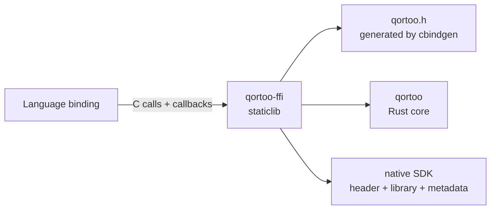

# C ABI and Native SDK

`qortoo-ffi` is the stable language boundary around the Rust core. This repository owns
the C functions, generated header, error mapping, callback/userdata rules, and native SDK
artifacts. Language bindings consume that SDK from their own repositories; the Go API and
its user guides live in [`qortoo-go`](https://github.com/qortoo/qortoo-go).

## Boundary Structure



| Component | Location | Responsibility |
| --- | --- | --- |
| Opaque handles | `qortoo-ffi/src/{client,counter,variable,local_connectivity}.rs` | Own Rust values behind C pointers and expose matching free functions |
| Shared datatype bodies | `qortoo-ffi/src/datatype.rs` | Generic construction, lifecycle, transaction, and handler bodies each per-type symbol forwards to |
| Owned byte buffers | `qortoo-ffi/src/util.rs` | `QortooOwnedBytes` for JSON payloads returned to the caller |
| Error boundary | `qortoo-ffi/src/error.rs` | Map Rust errors to `QortooError { code, msg }` |
| Callback bridge | `qortoo-ffi/src/handler.rs`, `datatype.rs` | Store foreign userdata and invoke handler/transaction callbacks |
| Observability bridge | `qortoo-ffi/src/observability/` | Adapt process-global setup and W3C trace-context headers |
| ABI version | `qortoo-ffi/src/version.rs` | Compile-time constants and runtime ABI/SDK version queries |
| Generated header | `qortoo-ffi/include/qortoo.h` | Public declarations generated by cbindgen |

Each datatype (`Counter`, `Variable`) keeps its own `qortoo_<type>_*` symbols so the C
surface stays explicit, but their bodies are one-line forwards into the generic bodies
in `datatype.rs`. Adding a datatype adds symbols and its own operations, not another
copy of the lifecycle plumbing.

Connectivity implementations remain in the Rust core. A binding can select an exposed
backend through an opaque handle, but it does not implement the transport across the FFI
boundary.

## Handle and String Ownership

- Constructors return opaque pointers allocated by Rust. The matching `*_free` function
  must be called exactly once; using a pointer after it is freed is undefined behavior.
- Input strings are NUL-terminated UTF-8 borrowed for the duration of the call.
- Returned strings are Rust-owned allocations transferred to the caller and must be
  released with `qortoo_string_free`.
- `QortooError.code == 0` means success. On failure, `msg` is either null or another
  transferred Rust string released with `qortoo_string_free`.
- Every public entry point contains Rust panics at the ABI boundary. A caught panic is
  reported as error code 999 instead of unwinding through foreign frames.

`DatatypeBuilder` is not exposed because it borrows a `Client`. Datatype constructors
perform the entire builder chain in one FFI call and receive build-time settings through
`QortooDatatypeOptions`.

## Raw JSON Value Buffers

`Variable` exchanges its value as serialized JSON bytes through an owned buffer:

```c
typedef struct QortooOwnedBytes { uint8_t *data; uintptr_t len; } QortooOwnedBytes;

void qortoo_variable_set_raw(const QortooVariable *variable,
                             const uint8_t *data, uintptr_t len,
                             QortooOwnedBytes *previous_out, QortooError *err_out);
void qortoo_variable_get_raw(const QortooVariable *variable,
                             QortooOwnedBytes *value_out, QortooError *err_out);
void qortoo_owned_bytes_free(QortooOwnedBytes value);
```

- Input is a pointer plus length, borrowed for the call and validated as exactly one
  UTF-8 JSON value. Invalid JSON is error code 214 (`ValueConversion`); the variable and
  the output buffer are left unchanged.
- The output parameter is set to `{NULL, 0}` at the start of the call and, on success,
  replaced with a Rust-owned buffer the caller releases exactly once with
  `qortoo_owned_bytes_free`. `qortoo_owned_bytes_free` is a no-op on `{NULL, 0}`.
- The value bytes are stored verbatim — never reparsed and reserialized — so property
  order, number formatting, and string escapes survive a set/get round trip.
- `set_raw` always reports the previous value (`"null"` for the first set); `get_raw`
  returns the current value, and the initial value is `"null"`.
- The value is never `bincode`, Go `gob`, or any language-specific format: the same
  bytes must be readable from every binding.

## Callback and Userdata Contract

Handler and transaction registrations carry userdata as `uintptr_t`, never as a pointer
owned by Rust. The foreign binding provides a `QortooUserdataDropCallback`; Rust calls it
exactly once when the owning callback registration is dropped. This also applies when
registration or datatype construction fails, so failure paths cannot leak userdata.

Handler callbacks can run asynchronously on Qortoo-owned tokio worker threads. Foreign
handlers must be thread-safe and should return promptly. Transaction callbacks execute
inline on the caller's thread and receive a borrowed datatype handle that is valid only
for the callback duration — it must not be freed or retained past the callback.

The handler bridge captures a shared `Arc<ForeignHandlerCtx>` in every closure. Capturing
the numeric userdata field alone could drop its guard before the closures run; retaining
the complete context keeps the userdata valid and centralizes the exactly-once drop rule.
`set_handler` builds this context before the null-handle check so a failed registration
still drops the userdata exactly once.

## Error Mapping

`QortooError.code` uses the `#[repr(i32)]` discriminants of the core error taxonomy.
Bindings should preserve the numeric code and message instead of translating errors into
an incomplete parallel enum. The 200 range is datatype errors (for example 206
`NotWritable`, 214 `ValueConversion` for a JSON value that is not exactly one UTF-8 JSON
value), the 900 range is reserved for managed observability errors, and 999 reports a
contained Rust panic.

Synchronous validation and operation failures are returned immediately. Errors that
arise on the asynchronous synchronization path are delivered through the registered
error callback. See [Error Handling](error-handling.md) for core recovery behavior.

## ABI Compatibility

The generated header contains `QORTOO_ABI_VERSION_MAJOR` and
`QORTOO_ABI_VERSION_MINOR`. A binding must compare its expected major with
`qortoo_abi_version_major()` before making other calls. A major mismatch is unsafe and
must be rejected; minor additions remain compatible within the major version.

`qortoo_sdk_version()` returns the native SDK package version. During the pre-1.0 period,
native SDK and language-binding releases use lockstep versions.

The minor version increases as compatible symbols are added: it covers the `Client` and
`Counter` surface, the `QortooOwnedBytes` buffer, and the `QortooVariable` handle with
its raw-JSON, lifecycle, transaction, and handler entry points.

Two checks keep the ABI reviewable, and both run in CI:

```shell
make ffi-header-check   # generated qortoo.h must match the checked-in header
make abi-symbols-check  # exported qortoo_* symbols must match the allowlist
```

Any public symbol or declaration change requires an ABI version decision and an update
to `qortoo-ffi/abi-symbols.txt` when appropriate.

`make ffi-coverage` is also available locally as a rough sanity check, but it is not a
CI gate: line coverage isn't a good completeness signal for a boundary crate that's
mostly thin pass-through wrappers, and gating on it tends to reward filler tests over
real contract coverage. Treat the null-pointer/invalid-UTF-8/ownership/error-code test
matrix itself — not a percentage — as the bar for "is this boundary tested."

## Native SDK Staging

```shell
make native-sdk-stage
NATIVE_SDK_PROFILE=release make native-sdk-stage
```

The target writes `target/native-sdk/<profile>/` with:

```text
include/qortoo.h
lib/libqortoo_ffi.a
lib/pkgconfig/qortoo-ffi.pc
manifest.json
```

`manifest.json` records the SDK version, ABI major/minor, build profile, and Rust target.
Consumer CI records checksums for the header and static library it verifies.

The native SDK distributes only `libqortoo_ffi.a`. A Rust `cdylib` on macOS carries the
build machine's absolute install name unless the link is explicitly rewritten, and
dynamic deployment would also require platform-specific loader-path policy. Static
linking removes that runtime lookup contract.

The package supports the Linux and macOS targets exercised by release CI. A binding owns
its own language/compiler support matrix and consumes the matching native artifact.

## Observability Boundary

`QortooObservabilityOptions` adapts foreign configuration into the core's
`ObservabilitySettings`. The FFI owns conversion, error mapping, and exporter lifecycle
calls; the core owns the actual tracing and metrics pipelines.

Context-aware datatype calls (`*_sync_with_context`, `*_transaction_with_context`) accept
W3C `traceparent` and `tracestate`. The FFI restores them as a remote parent, opens the
boundary span, and passes the caller span into the event loop so push/pull work and
notifications remain in the same trace. Missing or malformed headers degrade to a local
trace.

See [Observability](observability.md) for Rust spans, metrics, and exporters. Go-specific
initialization and context examples are in
[`qortoo-go/docs/observability.md`](https://github.com/qortoo/qortoo-go/blob/main/docs/observability.md).

## Related Concepts

- [Architecture](architecture.md) — the Rust layer stack behind the ABI
- [Datatype State](datatype-state.md) — lifecycle values exposed by the FFI
- [Error Handling](error-handling.md) — core error taxonomy and recovery
- [Event Loop](event-loop.md) — asynchronous work and caller-span propagation
- [Performance](performance.md) — Rust core benchmark harness
