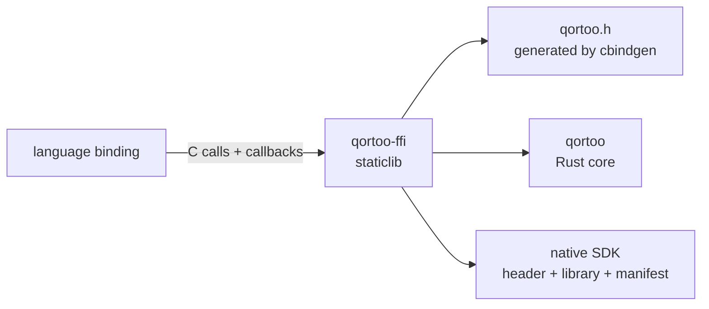

# C ABI and Native SDK

`qortoo-ffi` is the one stable boundary between the Rust core and every language binding.
This repository owns the C functions, the generated header, the error and callback contracts
that cross the boundary, and the artifacts a binding links against. A language binding's own
API, its idioms, and its user guides belong to that binding's own repository — for Go, that is
[`qortoo-go`](https://github.com/qortoo/qortoo-go). This document defines the contract from the Rust side; where a rule only makes
sense next to how a real binding honors it, this document cites `qortoo-go` as the concrete
example, without owning anything defined there.

## Model

| Term | Meaning |
|------|---------|
| Boundary crate | `qortoo-ffi`, the `staticlib` every binding actually links |
| Shared handle | The one `QortooDatatype` pointer every datatype kind can be reached through for the operations that do not depend on which kind it is |
| Concrete handle | A kind-specific pointer (`QortooCounter`, `QortooVariable`) for operations whose signature has to name that kind |
| Guarded entry point | One that wraps its body so a Rust panic cannot unwind into foreign code |
| ABI major/minor | The compatibility contract a binding checks before making any other call |
| Native SDK | The staged header, static library, and manifest a binding's build consumes |

## Rules and Guarantees

**The surface splits on whether an operation's signature names a datatype kind.** An operation
that does not — synchronization, metadata, handler registration — is exported exactly once as
`qortoo_datatype_*`, reached from any concrete handle through `qortoo_<kind>_as_datatype`. An
operation that must name a kind — construction (which returns a concrete pointer), a
transaction (which hands a concrete handle to a foreign callback), or a kind-specific value
operation — keeps its own `qortoo_<kind>_*` symbol. Adding a datatype kind adds its
construction, its transaction entry points, its release function, its `as_datatype` projection,
and its own value operations; it adds no second copy of synchronization, metadata, or handler
registration.

**A shared handle is a borrow, not a second allocation.** The pointer `qortoo_<kind>_as_datatype`
returns names a field of the concrete handle. It is valid for exactly as long as that handle,
it is never released on its own, and releasing the concrete handle invalidates it.

**Construction and its generic operations share one generic implementation; kind-specific
operations do not.** Construction, release, the shared-handle projection, and running a
transaction are identical in shape across every datatype kind, so each kind implements one
small trait and gets those four for free from one generic body. A kind-specific value
operation — incrementing a counter, setting a variable — has no such shared shape to fall back
to, because no two datatype kinds have the same operations; each implements its own body
directly against the Rust core's own API.

**Handle mismatch is rejected at runtime, not only by the type system.** The concrete handle
types are distinct in the generated header, so passing a `QortooVariable*` where a
`QortooCounter*` is expected is already a compile error for a caller in a typed language. Rust
rechecks it anyway at the boundary and rejects a mismatched handle rather than
misinterpreting it, because a caller in an untyped or unsafely-cast context can still construct
the mismatch the header alone cannot prevent.

**Only a subset of entry points can panic without a caller ever finding out.** Every entry point
that carries an `err_out` parameter is wrapped so a Rust panic cannot unwind into foreign
code — it is caught, reported through `err_out` as an internal error, and execution returns a
documented default. A small set of entry points has no `err_out` parameter at all: the plain
`qortoo_datatype_get_*` accessors, a kind's own cheap value getter, releasing a handle, and the
shared-handle projection. These read state behind a lock that does not poison on a panicked
holder and otherwise touch nothing that can fail, so they are not wrapped — there is no error
channel in their signature to report a caught panic through in the first place, and a null
input already has a documented sentinel return (0, -1, a null pointer, or false) rather than an
error. This is a real edge, not just an unlisted default: if one of these ever did panic, the
process aborts rather than reporting a code, because a plain `extern "C"` function is not
declared to unwind.

**Ownership crosses the boundary in one direction at a time.** A pointer a constructor returns
is Rust-owned and must be released with its matching `*_free`, exactly once; using it
afterward is undefined behavior. A string a caller passes in is borrowed for the call only. A
string or byte buffer the library returns is transferred to the caller and must be released
with the matching free function. `QortooError.msg` follows the same rule as any other returned
string.

**A raw value buffer is validated once, then kept verbatim to the language boundary and back.**
`Variable`'s raw entry points accept and return a JSON value as an owned byte buffer rather
than a parsed structure. Input must be exactly one UTF-8 JSON value or the call fails with the
same conversion error the core reports for any other malformed value, leaving the variable and
the output buffer untouched. What passes validation is never reparsed or reserialized on
either side of the boundary, so property order, number formatting, and string escapes survive a
round trip exactly. Nothing about this representation is specific to Rust or to any one
binding's own serialization format — the same bytes must be readable by whichever encoder or
decoder a binding's own language provides. See [`docs/variable.md`](variable.md) for the value
contract this buffer carries.

**Foreign userdata is released exactly once, on every path, including failure.** A handler or
transaction registration carries userdata as a plain integer the binding chose, never a pointer
Rust owns, together with a drop callback the binding supplies. Rust calls that drop callback
exactly once when the registration that owns the userdata is dropped — and constructs the
context that owns it before any validation that could fail, so a registration that never
succeeds still releases the userdata rather than leaking it.

**A handler callback and a transaction callback run under different obligations.** A handler
callback can be invoked from any of the datatype's own worker threads at any later time, so it
must be safe to call from another thread and should return quickly. A transaction callback runs
synchronously, inline, on the thread that opened the transaction, and receives a handle that
is only valid for the callback's duration — it must not be retained or released past it.

**A numeric error code is the entire error contract; bindings are expected to keep it that
way.** `QortooError.code` is the same discriminant the core error taxonomy already assigns —
see [`docs/error-handling.md`](error-handling.md) — plus a boundary-only range for a rejected
argument and a contained panic, and a separate range reserved for observability setup. A
binding should carry the code and message through rather than re-deriving its own parallel
enum from them, both because the taxonomy already has stable numbers and because a caller
comparing codes should be comparing the same numbers on every binding.

**ABI compatibility is a major/minor contract checked before any other call.** A binding
compares the major version it was built against with what the linked library reports; a
mismatch means struct layouts, symbol names, or calling conventions may disagree, and the
binding must refuse to proceed rather than risk undefined behavior. The minor version only ever
adds symbols; it never removes or changes one within the same major version.

**Limits on the guarantees.** The mapping from a core error variant to its numeric code is a
hand-maintained table with a catch-all arm, not something the compiler forces to stay
exhaustive — a new caller-facing variant added to the core does not fail to compile here; it
silently falls through to the generic internal-error code until this table is updated by hand.
The distributed native SDK ships only a static library, so a binding gets no shared-library
loading behavior to rely on. `qortoo-ffi`'s own coverage is not gated on a line-coverage
percentage, because a boundary crate that is mostly thin forwarding makes that number a poor
signal of what is actually tested; the null-pointer, invalid-UTF-8, ownership, and error-code
test matrix is the real bar.

## Behavior

**A binding checking compatibility before doing anything else.** `qortoo-go` compares its
expected ABI major against `qortoo_abi_version_major()` once, at package initialization, and
panics immediately on a mismatch rather than letting a caller reach a single other function
first.

**Constructing a datatype with a handler already attached.** A caller supplies a handler at
construction, not after, specifically so it is in place before the very first state transition
can be reported — which can happen as soon as construction returns, if the connectivity backend
is realtime. `qortoo-go` reflects this by taking a `Handler` as part of its own construction
options rather than only exposing a post-construction registration call.

**A transaction rolling back through a foreign callback.** A caller's callback returns a
non-zero result. The transaction, running through the borrowed handle the callback was given,
is rolled back exactly as it would be if the equivalent Rust closure had returned an error — the
foreign language is a caller of the same transaction machinery, not a special case of it.

**Userdata released across a language's own memory model.** `qortoo-go` passes a `cgo.Handle`
through the userdata integer and supplies a drop callback that deletes it. Whether construction
succeeds, fails after partial setup, or a handler is later replaced or unset, the handle is
deleted exactly once — the binding never has to reason about which of those paths actually ran
to know its own resource is released.

**A caller's trace continuing across the boundary.** A caller passes a W3C `traceparent` into
one of the context-aware entry points. The boundary restores it as a remote parent and passes
the resulting span into the same request the event loop later executes under, so the exchange
and any handler notifications it triggers appear as children of the caller's own span rather
than of the loop's long-lived background context — see
[`docs/event-loop.md`](event-loop.md) for why a request carries its origin this way at all.

## Rationale

**The split is on signature, not on convenience.** An operation with no reason to know which
datatype kind it is talking to should not have to be re-declared, re-implemented, and
re-exported once per kind. An operation whose signature has no other option — construction
returns a concrete type, a transaction's callback is typed to one — keeps its own symbol
because there is nothing to share it with, not because sharing was skipped.

**Handle identity is rechecked at runtime because the header's type safety has a ceiling.** A
generated header stops a mistake a typed caller would make by construction. It does nothing for
a caller working through an unsafe cast, a dynamically-typed language's own FFI layer, or a
manually maintained binding whose declarations have drifted from the real header. Rejecting a
mismatch explicitly turns all of those into a reported error instead of a misinterpreted
pointer.

**Not every entry point needs a panic guard, because not every entry point has anywhere to
report one.** Wrapping a function with no `err_out` parameter would only decide silently
whether a caught panic looks identical to a legitimate default return — it could not surface
the difference either way. The guard earns its cost exactly where a caller can actually observe
its result: entry points that already carry an error out-parameter, or that run foreign
callback code, which is far more likely to panic than a lock read ever is.

**Userdata is a caller-owned integer instead of a pointer Rust holds.** A callback registration
that outlives the call that created it has to be droppable independently of Rust's own
lifetimes, and the one thing every foreign language can hand across a C boundary safely,
without Rust needing to understand that language's memory model at all, is an integer it
already owns the meaning of.

**Numeric error codes travel as-is instead of becoming a per-binding enum.** A hand-translated
enum in every binding is a second place the taxonomy can drift out of sync with the core, and
buys nothing a stable, already-unique integer does not already provide. Keeping the number is
also what lets `errors.Is`-style comparison in a binding work by code alone.

**The native SDK ships static-only.** A dynamic library carries a build-machine-specific install
path unless that path is explicitly rewritten, and fixing that up requires a loader-path policy
specific to each platform. Static linking has neither problem, at the cost of a binding
re-linking rather than swapping a shared object at deploy time.

## Code Map

| Concern | Location |
|---------|----------|
| The `DatatypeHandle` trait and the generic construction, release, projection, and transaction bodies | `qortoo-ffi/src/datatype.rs` |
| Concrete handles and their kind-specific operations | `qortoo-ffi/src/client.rs`, `qortoo-ffi/src/counter.rs`, `qortoo-ffi/src/variable.rs`, `qortoo-ffi/src/local_connectivity.rs` |
| The panic guard and owned-string/byte-buffer helpers | `qortoo-ffi/src/util.rs` |
| Error codes and the core-error-to-code mapping | `qortoo-ffi/src/error.rs` |
| Foreign handler and transaction callback bridging, and the userdata drop contract | `qortoo-ffi/src/handler.rs`, `qortoo-ffi/src/datatype.rs` |
| The observability options bridge | `qortoo-ffi/src/observability/` |
| ABI and SDK version constants and queries | `qortoo-ffi/src/version.rs` |
| The generated header and the symbol allowlist | `qortoo-ffi/include/qortoo.h`, `qortoo-ffi/abi-symbols.txt` |
| Native SDK staging | `Makefile` (`native-sdk-stage`) |
| The Go binding's ABI check at package init | [`qortoo-go/version.go`](https://github.com/qortoo/qortoo-go/blob/main/version.go) |
| The Go binding's error type and code-based equality | [`qortoo-go/errors.go`](https://github.com/qortoo/qortoo-go/blob/main/errors.go) |
| The Go binding's userdata as a `cgo.Handle` | [`qortoo-go/callbacks.go`](https://github.com/qortoo/qortoo-go/blob/main/callbacks.go) |

| Verified by | Tests |
|-------------|-------|
| A panic is caught, reported as code 999, and returns the caller's default | `can_convert_a_panic_into_the_default_value_and_code_999_via_ffi_guard` in `qortoo-ffi/src/util.rs` |
| Every core error variant maps to its exact documented code | `can_map_every_datatype_error_variant_to_its_exact_code`, `can_map_every_client_error_variant_to_its_exact_code` in `qortoo-ffi/src/error.rs` |
| A null pointer on a guarded entry point reports a code rather than crashing | `can_reject_null_counter_fallible_operations_with_invalid_argument` in `qortoo-ffi/tests/client_counter.rs` |
| A null pointer on an unguarded, `err_out`-less accessor returns its documented sentinel | `can_return_documented_defaults_for_null_counter_calls` in `qortoo-ffi/tests/client_counter.rs` |
| A mismatched concrete handle is rejected rather than misinterpreted | `can_reject_a_bad_counter_create_argument` in `qortoo-ffi/tests/client_counter.rs` |
| Userdata is released exactly once, on success, on replacement, on unset, and on every construction-failure path | `can_release_the_old_userdata_exactly_once_when_replacing_a_handler`, `can_unset_a_handler_and_release_its_userdata_exactly_once`, `can_release_userdata_after_an_early_null_client_construction_failure`, `can_release_userdata_after_a_late_duplicate_key_construction_failure` in `qortoo-ffi/tests/handler.rs` |
| A handler registered at construction observes the first transition | `can_receive_a_state_transition_via_an_options_registered_handler` in `qortoo-ffi/tests/handler.rs` |
| A transaction commits multiple operations or rolls back on a non-zero callback result | `can_commit_multiple_operations_in_a_transaction`, `can_roll_back_on_a_non_zero_callback_result` in `qortoo-ffi/tests/transaction.rs` |
| A raw JSON round trip preserves formatting exactly, and invalid input is rejected with code 214 | `can_round_trip_json_and_return_the_previous_value`, `can_reject_invalid_json_with_code_214` in `qortoo-ffi/tests/client_variable.rs` |
| A caller's trace continues through sync and through a transaction | `can_continue_the_callers_trace_through_sync`, `can_continue_the_callers_trace_through_transaction` in `qortoo-ffi/tests/trace_context_e2e.rs` |
| ABI and SDK version queries match their constants | `abi_version_functions_match_the_constants`, `sdk_version_is_a_non_empty_owned_c_string` in `qortoo-ffi/src/version.rs` |

## Related Concepts

- [`docs/architecture.md`](architecture.md) — the Rust layer stack this boundary sits in front of
- [`docs/error-handling.md`](error-handling.md) — the error taxonomy whose codes cross this boundary unchanged
- [`docs/event-loop.md`](event-loop.md) — why a request's trace context has to travel with the request itself
- [`docs/variable.md`](variable.md) — the value contract the raw buffer entry points carry
- [`docs/handler-system.md`](handler-system.md) — the handler contract this boundary bridges to a foreign callback
- [`docs/datatype-state.md`](datatype-state.md) — the lifecycle values exposed through the shared handle
- [`docs/performance.md`](performance.md) — the Rust core benchmark a binding's own numbers are compared against
