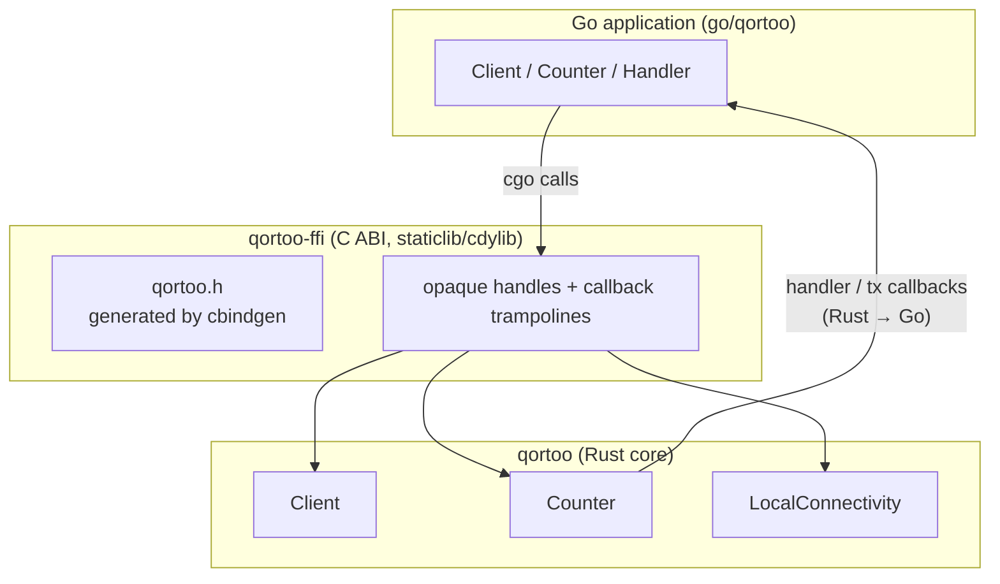

# Go Binding

The Go binding lets Go applications use the Qortoo SDK through a C ABI. It consists of a
dedicated FFI crate (`qortoo-ffi`) that exposes the public Rust API as C functions, and a
cgo-based Go package (`go/qortoo`) that wraps those functions in idiomatic Go types.
Connectivity backends live exclusively in the Rust core; Go selects and configures a
backend but never implements the transport itself (see
[Key Design Decisions](#key-design-decisions)).

## Overview

## Core Types

| Type | Location | Purpose |
|------|----------|---------|
| `QortooClient`, `QortooCounter`, `QortooLocalConnectivity` | `qortoo-ffi/src/{client,counter,local_connectivity}.rs` | Opaque handles (`Box::into_raw`) over the core types; released by `*_free` |
| `QortooError` | `qortoo-ffi/src/error.rs` | Out-parameter `{ code: i32, msg: *mut c_char }`; `code == 0` means success |
| `QortooDatatypeOptions` | `qortoo-ffi/src/counter.rs` | Build-time options (readonly, push-buffer size, handler callbacks) applied in a single FFI call |
| `Client`, `Counter`, `Handler` | `go/qortoo/*.go` | Go-side wrappers with explicit `Close()`; `Handler` mirrors `DatatypeHandler` |
| `LocalConnectivity` (Go) | `go/qortoo/qortoo.go` | Wrapper over the Rust in-memory backend of the same name; shared between clients to synchronize them |

## How It Works

### Calls from Go into Rust (Go → Rust)

1. Every Go object wraps an opaque pointer created by an FFI constructor
   (`qortoo_client_new`, `qortoo_counter_create`, ...). Handles are freed explicitly via
   `Close()`. As a leak backstop, each constructor also registers a `runtime.AddCleanup`
   that frees the native handle once the wrapper becomes unreachable; cleanups are not
   guaranteed to run, so `Close()` remains the contract. A `Counter` keeps its `Client`
   reachable, so a client is never cleaned up while one of its counters is alive, and
   every method applies `runtime.KeepAlive` so a cleanup cannot fire mid-call.
2. Fallible calls pass a `QortooError` out-parameter. The Go side converts it with
   `takeError` (`go/qortoo/errors.go`) into `*qortoo.Error{Code, Msg}`, where `Code` is
   the `#[repr(i32)]` discriminant of the Rust error variant (e.g., `ReadonlyViolation = 207`).
3. `DatatypeBuilder` is intentionally **not** exposed: it borrows the `Client`
   (`DatatypeBuilder<'c>`), so the FFI performs the whole
   `create_datatype(key).with_...().build_counter()` chain inside one call
   (`build_counter` in `qortoo-ffi/src/counter.rs`), receiving options via
   `QortooDatatypeOptions`.

### Callbacks from Rust into Go (Rust → Go)

1. Go exports fixed trampolines with `//export` (`go/qortoo/callbacks.go`):
   `goQortooOnStateChange`, `goQortooOnError`, `goQortooTxCallback`,
   `goQortooUserdataDrop`.
2. The per-registration state travels as a `usize` userdata holding a `cgo.Handle`
   (never a raw Go pointer — this is the pattern required by the Go runtime and its
   `checkptr` mode). Rust calls `goQortooUserdataDrop` exactly once when it drops the
   owning object, which deletes the handle. The contract also covers failure: when a
   handler cannot be registered (null client/counter, failed build), the FFI still fires
   `userdata_drop` exactly once, so the Go handle never leaks.
3. Handler callbacks arrive on Qortoo-owned tokio worker threads (dispatched via
   `rt_handle.spawn` in `src/datatypes/handler.rs`), so Go handlers must be
   thread-safe and must not block for long. Transaction callbacks run inline on the
   calling goroutine's thread.
4. Go panics never unwind into Rust: every trampoline recovers, and every FFI function
   wraps its body in `catch_unwind` so Rust panics surface as error code 999 instead of
   aborting the process.

## Key Design Decisions

- **Connectivity backends are Rust-only**: synchronization transports are implemented
  in the Rust core and exposed to Go as opaque handles; Go selects and configures a
  backend but never implements the transport. A Go-implemented transport is the
  binding's riskiest possible surface — per-sync cgo callbacks, cross-allocator byte
  ownership, and panic containment on worker threads — and that risk is only worth
  taking for a transport the core cannot provide.
- **Go names mirror Rust names 1:1**: the Go wrapper of a core type keeps that type's
  name (e.g., Go `LocalConnectivity` wraps Rust `LocalConnectivity`), so navigating
  between the binding and the core requires no mental mapping.
- **Manual C ABI instead of a bindings generator (uniffi-bindgen-go)**: the binding's
  hard parts are Rust→Go callbacks (handlers, transactions), where the third-party Go
  generator is least mature. The public API surface is small and fully synchronous, so
  the handwritten ABI stays manageable.
- **`usize` userdata, not `void*`**: Go's `checkptr` (enabled by `-race`) rejects
  integer-to-pointer round trips of `cgo.Handle`, so all userdata crosses the boundary
  as `uintptr_t`.
- **Callback closures capture a shared `Arc` context, never a bare userdata field**:
  Rust edition-2021 disjoint capture would capture only the copied `usize` field of a
  drop-guard struct and drop the guard (deleting the Go handle) immediately. The handler
  bridge therefore holds its state in an `Arc<ForeignHandlerCtx>` whose clone is captured
  wholly by each closure, and the userdata-drop callback fires from the ctx's `Drop`
  exactly once (`qortoo-ffi/src/handler.rs`).
- **Explicit `Close()` over finalizers**: dropping a `Client` shuts down its tokio
  runtime, so release must be deterministic. The `runtime.AddCleanup` backstop only
  covers forgotten `Close()` calls; it never runs at process exit and its timing is
  unspecified. `Close()` must not be called concurrently with other methods on the same
  object — everything else is safe for concurrent use.

## Performance

The cost of the binding is measured directly: the same five scenarios are implemented
against the Rust core (`benches/qortoo_bench.rs`) and through the binding
(`go/qortoo/benchmark_test.go`), so the difference between the two is the price of
crossing the FFI boundary.

| Scenario | Rust core | Go binding | Binding overhead |
| --- | --- | --- | --- |
| `GetValue` | 3.655 ns | 30.330 ns | **+26.7 ns** |
| `IncreaseBy` | 227.1 ns | 276.8 ns | **+49.7 ns** |
| `Transaction` (10 ops) | 1.968 µs | 2.701 µs | **+0.73 µs** |
| `SyncLocal` | 7.299 µs | 8.029 µs | not resolvable above the noise |
| `BuildCounter` | 18.83 µs | 37.01 µs | order of magnitude only |

A boundary crossing costs roughly **27 ns**, and its weight falls as the operation gets
more expensive — 88% of a read, 18% of a write, and a rounding error in the sync path.
The transaction row is larger because the callback trampoline crosses back (Go → Rust →
Go) and each inner operation crosses again. The handle-lifetime safety net
(`runtime.AddCleanup`, `runtime.KeepAlive`) is inside these numbers and is not separable
from the noise.

See [`docs/performance.md`](performance.md) for the measurement protocol, the reasons the
harness is shaped the way it is, and how runs are compared over time.

## Related Concepts

- [`docs/architecture.md`](architecture.md) — layer stack the FFI wraps
- [`docs/datatype-state.md`](datatype-state.md) — states mirrored by Go's `DatatypeState`
- [`docs/error-handling.md`](error-handling.md) — error codes surfaced through `QortooError`
- [`docs/event-loop.md`](event-loop.md) — where `Notify` events land
- [`docs/performance.md`](performance.md) — how the binding overhead above is measured
