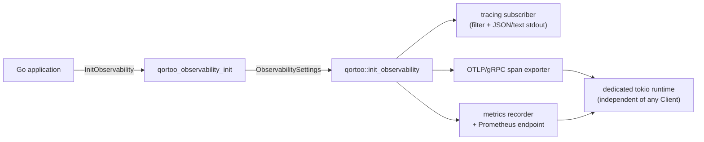
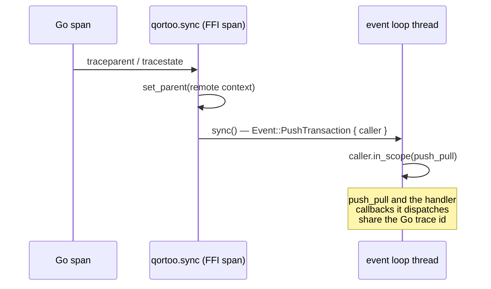

# Go Binding

The Go binding lets Go applications use the Qortoo SDK through a C ABI. It consists of a
dedicated FFI crate (`qortoo-ffi`) that exposes the public Rust API as C functions, and a
cgo-based Go package (`go/qortoo`) that wraps those functions in idiomatic Go types.
Connectivity backends live exclusively in the Rust core; Go selects and configures a
backend but never implements the transport itself (see
[Key Design Decisions](#key-design-decisions)).

## Overview


## Core Types

| Type | Location | Purpose |
|------|----------|---------|
| `QortooClient`, `QortooCounter`, `QortooLocalConnectivity` | `qortoo-ffi/src/{client,counter,local_connectivity}.rs` | Opaque handles (`Box::into_raw`) over the core types; released by `*_free` |
| `QortooError` | `qortoo-ffi/src/error.rs` | Out-parameter `{ code: i32, msg: *mut c_char }`; `code == 0` means success |
| `QortooDatatypeOptions` | `qortoo-ffi/src/counter.rs` | Build-time options (readonly, push-buffer size, handler callbacks) applied in a single FFI call |
| `QortooObservabilityOptions` | `qortoo-ffi/src/observability/mod.rs` | Process-global logging/tracing/metrics setup (see [Observability](#observability)) |
| `Client`, `Counter`, `Handler` | `go/qortoo/*.go` | Go-side wrappers with explicit `Close()`; `Handler` mirrors `DatatypeHandler` |
| `LocalConnectivity` (Go) | `go/qortoo/qortoo.go` | Wrapper over the Rust in-memory backend of the same name; shared between clients to synchronize them |
| `ObservabilityOptions` | `go/qortoo/observability.go` | Go-side telemetry configuration plus the W3C trace-context bridge |

## How It Works

### Calls from Go into Rust (Go → Rust)

1. Every Go object wraps an opaque pointer created by an FFI constructor
   (`qortoo_client_new`, `qortoo_counter_create`, ...). Handles are freed explicitly via
   `Close()`. As a leak backstop, each constructor also registers a `runtime.AddCleanup`
   that frees the native handle once the wrapper becomes unreachable; cleanups are not
   guaranteed to run, so `Close()` remains the contract. A `Counter` keeps its `Client`
   reachable, so a client is never cleaned up while one of its counters is alive, and
   every method applies `runtime.KeepAlive` so a cleanup cannot fire mid-call.
2. Fallible calls pass a `QortooError` out-parameter. The Go side converts it with
   `takeError` (`go/qortoo/errors.go`) into `*qortoo.Error{Code, Msg}`, where `Code` is
   the `#[repr(i32)]` discriminant of the Rust error variant (e.g., `ReadonlyViolation = 207`).
3. `DatatypeBuilder` is intentionally **not** exposed: it borrows the `Client`
   (`DatatypeBuilder<'c>`), so the FFI performs the whole
   `create_datatype(key).with_...().build_counter()` chain inside one call
   (`build_counter` in `qortoo-ffi/src/counter.rs`), receiving options via
   `QortooDatatypeOptions`.

### Callbacks from Rust into Go (Rust → Go)

1. Go exports fixed trampolines with `//export` (`go/qortoo/callbacks.go`):
   `goQortooOnStateChange`, `goQortooOnError`, `goQortooTxCallback`,
   `goQortooUserdataDrop`.
2. The per-registration state travels as a `usize` userdata holding a `cgo.Handle`
   (never a raw Go pointer — this is the pattern required by the Go runtime and its
   `checkptr` mode). Rust calls `goQortooUserdataDrop` exactly once when it drops the
   owning object, which deletes the handle. The contract also covers failure: when a
   handler cannot be registered (null client/counter, failed build), the FFI still fires
   `userdata_drop` exactly once, so the Go handle never leaks.
3. Handler callbacks arrive on Qortoo-owned tokio worker threads (dispatched via
   `rt_handle.spawn` in `src/datatypes/handler.rs`), so Go handlers must be
   thread-safe and must not block for long. Transaction callbacks run inline on the
   calling goroutine's thread.
4. Go panics never unwind into Rust: every trampoline recovers, and every FFI function
   wraps its body in `catch_unwind` so Rust panics surface as error code 999 instead of
   aborting the process.

## Building and Linking

`go/qortoo` carries no default include or library search path — `cgo.go` declares only
`-lqortoo_ffi`. Point `CGO_CFLAGS` at a native SDK's `include/` directory and
`CGO_LDFLAGS` at its `lib/` directory before building or testing:

```sh
make native-sdk-stage                              # stages target/native-sdk/debug
export CGO_CFLAGS="-I$(pwd)/target/native-sdk/debug/include"
export CGO_LDFLAGS="-L$(pwd)/target/native-sdk/debug/lib"
cd go/qortoo && go test -race ./...
```

`make go-test` and `make bench-go` already wire this up (debug and release
respectively); `NATIVE_SDK_PROFILE=release make native-sdk-stage` stages the release
build on its own. The staged directory also carries `lib/pkgconfig/qortoo-ffi.pc` for
consumers that prefer `pkg-config --cflags --libs qortoo-ffi` over the env vars above;
the `.pc` file only describes `qortoo-ffi` itself; `-lm -ldl -lpthread` on Linux are
declared directly in `cgo.go`.

`qortoo-ffi` links **statically only**, producing `libqortoo_ffi.a` and no `cdylib`. A
dynamically-linked build's `install_name` (macOS `LC_ID_DYLIB`) is not rewritten to
`@rpath` by default, so it would carry the exact path of the machine that built it —
harmless inside a single CI job that builds and links in the same step, but broken the
moment the library is installed anywhere else. Static linking has no separate runtime
lookup step, so this failure mode does not apply to it; see `qortoo-ffi/Cargo.toml`.

Before making any other FFI call, a binding should compare its expected ABI major
against `qortoo_abi_version_major()` (see `qortoo-ffi/src/version.rs`) and refuse to
proceed on a mismatch rather than risk undefined behavior.

CI (`.github/workflows/build-test-coverage.yml`, `ubuntu-latest` and `macos-latest`)
validates linux/amd64 and darwin/arm64; linux/arm64 and darwin/amd64 are outside that
matrix. The officially supported platform list for the standalone `qortoo-go` release is
an open decision tracked in the extraction plan.

## Key Design Decisions

- **Connectivity backends are Rust-only**: synchronization transports are implemented
  in the Rust core and exposed to Go as opaque handles; Go selects and configures a
  backend but never implements the transport. A Go-implemented transport is the
  binding's riskiest possible surface — per-sync cgo callbacks, cross-allocator byte
  ownership, and panic containment on worker threads — and that risk is only worth
  taking for a transport the core cannot provide.
- **Go names mirror Rust names 1:1**: the Go wrapper of a core type keeps that type's
  name (e.g., Go `LocalConnectivity` wraps Rust `LocalConnectivity`), so navigating
  between the binding and the core requires no mental mapping.
- **Manual C ABI instead of a bindings generator (uniffi-bindgen-go)**: the binding's
  hard parts are Rust→Go callbacks (handlers, transactions), where the third-party Go
  generator is least mature. The public API surface is small and fully synchronous, so
  the handwritten ABI stays manageable.
- **`usize` userdata, not `void*`**: Go's `checkptr` (enabled by `-race`) rejects
  integer-to-pointer round trips of `cgo.Handle`, so all userdata crosses the boundary
  as `uintptr_t`.
- **Callback closures capture a shared `Arc` context, never a bare userdata field**:
  Rust edition-2021 disjoint capture would capture only the copied `usize` field of a
  drop-guard struct and drop the guard (deleting the Go handle) immediately. The handler
  bridge therefore holds its state in an `Arc<ForeignHandlerCtx>` whose clone is captured
  wholly by each closure, and the userdata-drop callback fires from the ctx's `Drop`
  exactly once (`qortoo-ffi/src/handler.rs`).
- **Explicit `Close()` over finalizers**: dropping a `Client` shuts down its tokio
  runtime, so release must be deterministic. The `runtime.AddCleanup` backstop only
  covers forgotten `Close()` calls; it never runs at process exit and its timing is
  unspecified. `Close()` must not be called concurrently with other methods on the same
  object — everything else is safe for concurrent use.

## Observability

The Rust core is instrumented (`tracing` spans, `metrics` calls) but installs no
subscriber, recorder, or exporter — that choice belongs to the application. A Go process
cannot install Rust ones, so it asks the core to, through the FFI, and only when asked:
creating a client never starts an exporter, and `RUST_LOG` alone produces no output.

The pipelines themselves live in the core behind the `observability-trace` and
`observability-metrics` features. The `observability` umbrella enables both
(`src/observability/{settings,subscriber,lifecycle,prometheus}.rs`), which `qortoo-ffi`
enables. The FFI is the C ABI adapter over them: it converts `QortooObservabilityOptions`
into `qortoo::ObservabilitySettings` and maps failures onto the 900-block error codes.
The same code therefore backs `qortoo::init_observability` for Rust applications, so both
languages get identical resolution rules, resource attributes, and failure semantics.



### Setup and shutdown

```go
err := qortoo.InitObservability(qortoo.ObservabilityOptions{
    ServiceName:    "my-service",   // same service.name as the app's own telemetry
    LogFilter:      "qortoo=debug", // else RUST_LOG, else qortoo=info
    LogFormat:      qortoo.LogFormatJSON,
    TraceEnabled:   true,           // OTLP/gRPC; endpoint from OTEL_EXPORTER_OTLP_* or :4317
    MetricsEnabled: true,           // Prometheus scrape endpoint on 0.0.0.0:9000
})
...
defer qortoo.ShutdownObservability(ctx) // flushes pending telemetry
```

Everything fails loudly rather than silently: a second `InitObservability`, an init after
shutdown, a global subscriber or recorder already owned by another library, an exporter
that cannot start, and invalid options each map to their own error code
(`ErrCodeObservability*`, 900–906). A partial installation that has already claimed an
irreversible Rust global makes the lifecycle terminal and later initialization returns
`ErrCodeObservabilityPartiallyInitialized`. `ShutdownObservability` is a no-op when nothing was
initialized, is safe to repeat, and is **terminal** — `tracing` allows one global
subscriber per process, so a later init fails instead of pretending to restore the
pipelines.

Recommended shutdown order: `Counter.Close` → `Client.Close` → `ShutdownObservability` →
the application's own telemetry shutdown. The exporters live on a dedicated tokio runtime
owned by the observability lifecycle, so the last `Client.Close` never takes them down with
it — and conversely, a handler that blocks delays both.

The Go lifecycle and managed-log integration tests run their initialization sequences in
fresh subprocesses. Rust subscribers and metrics recorders are process-global and cannot be
reset, so subprocess isolation keeps repeated and shuffled Go test runs independent.

### Trace context across the boundary

An OpenTelemetry context does not travel through cgo, so the context-aware methods pass
the W3C headers explicitly and Rust restores them as a remote parent:

```go
ctx, span := tracer.Start(ctx, "checkout")
defer span.End()

err := counter.SyncContext(ctx)                       // or TransactionContext(ctx, ...)
```



The parent survives the hop to the worker thread because `Event::PushTransaction` carries
the requesting span (see [`docs/event-loop.md`](event-loop.md#event-types)). A context
without a span, malformed headers, or an uninitialized pipeline all degrade to a local
trace — the context-aware methods then behave exactly like `Sync`/`Transaction`.

`Sync` and `Transaction` keep calling the plain entry points, so the propagation work is
paid only where it is asked for.

| Surface | FFI | Go |
| --- | --- | --- |
| Setup / teardown | `qortoo_observability_init`, `qortoo_observability_shutdown` | `InitObservability`, `ShutdownObservability` |
| Trace context | `qortoo_counter_sync_with_context`, `qortoo_counter_transaction_with_context` | `Counter.SyncContext`, `Counter.TransactionContext` |
| Configuration | `QortooObservabilityOptions` | `ObservabilityOptions` |

See [`docs/observability.md`](observability.md) for the span catalogue, the metric
catalogue, and the local Grafana/Tempo/Prometheus stack these exporters target.

Runnable Go counterparts of the Rust observability examples live in
[`go/qortoo/examples/observability`](../go/qortoo/examples/observability). From the
`go/qortoo` module, run `go run ./examples/observability/{log,trace,metrics,profile}`;
the examples README documents the local stack and environment variables.

## Performance

The cost of the binding is measured directly: the same five scenarios are implemented
against the Rust core (`benches/qortoo_bench.rs`) and through the binding
(`go/qortoo/benchmark_test.go`), so the difference between the two is the price of
crossing the FFI boundary.

| Scenario | Rust core | Go binding | Binding overhead |
| --- | --- | --- | --- |
| `GetValue` | 3.655 ns | 30.330 ns | **+26.7 ns** |
| `IncreaseBy` | 227.1 ns | 276.8 ns | **+49.7 ns** |
| `Transaction` (10 ops) | 1.968 µs | 2.701 µs | **+0.73 µs** |
| `SyncLocal` | 7.299 µs | 8.029 µs | not resolvable above the noise |
| `BuildCounter` | 18.83 µs | 37.01 µs | order of magnitude only |

A boundary crossing costs roughly **27 ns**, and its weight falls as the operation gets
more expensive — 88% of a read, 18% of a write, and a rounding error in the sync path.
The transaction row is larger because the callback trampoline crosses back (Go → Rust →
Go) and each inner operation crosses again. The handle-lifetime safety net
(`runtime.AddCleanup`, `runtime.KeepAlive`) is inside these numbers and is not separable
from the noise.

See [`docs/performance.md`](performance.md) for the measurement protocol, the reasons the
harness is shaped the way it is, and how runs are compared over time.

## Related Concepts

- [`docs/architecture.md`](architecture.md) — layer stack the FFI wraps
- [`docs/datatype-state.md`](datatype-state.md) — states mirrored by Go's `DatatypeState`
- [`docs/error-handling.md`](error-handling.md) — error codes surfaced through `QortooError`
- [`docs/event-loop.md`](event-loop.md) — where `Notify` events land, and the span a sync request carries
- [`docs/observability.md`](observability.md) — spans, metrics, and the local stack the exporters target
- [`docs/performance.md`](performance.md) — how the binding overhead above is measured
