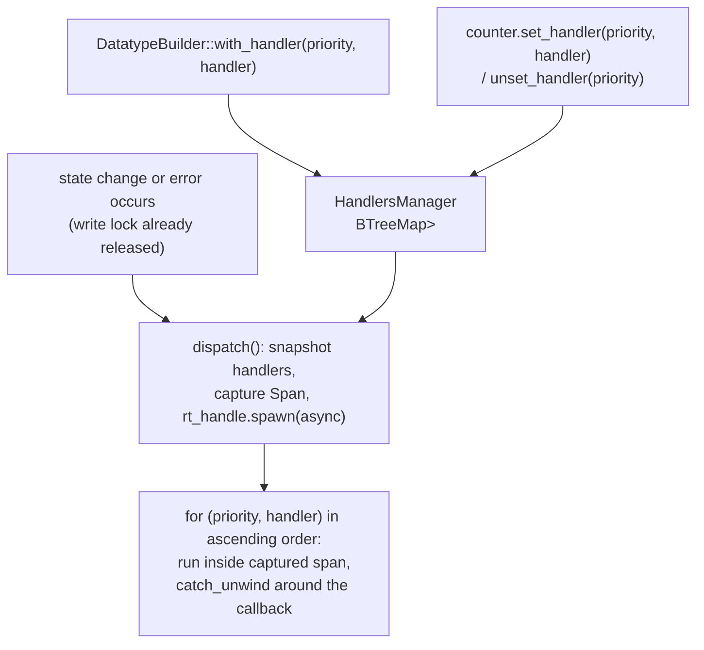

# Handler System

`DatatypeHandler` pairs an `on_state_change` and an `on_error` callback for a single datatype. Handlers are registered per-priority and dispatched asynchronously, off the thread that triggered the notification.

## Overview

## Core Types

| Type | Location | Purpose |
|------|----------|---------|
| `DatatypeHandler` | `src/datatypes/handler.rs` | Holds one `on_state_change` and one `on_error` closure; both are no-ops by default |
| `HandlersManager` | `src/datatypes/handler.rs` | Owns the priority-keyed handler set for one datatype and dispatches notifications |
| `OnStateChangeFn` | `src/datatypes/handler.rs` | `Fn(DatatypeSet, DatatypeState, DatatypeState)` — old and new state |
| `OnErrorFn` | `src/datatypes/handler.rs` | `Fn(DatatypeSet, DatatypeError)` |

## How It Works

`DatatypeHandler::new()` starts with two no-op closures; `.set_on_state_change(f)` and `.set_on_error(f)` are consuming builder methods that replace them.

Handlers reach `HandlersManager` two ways: at build time via `DatatypeBuilder::with_handler(priority, handler)` (collected into a `BTreeMap<usize, DatatypeHandler>` and passed into the datatype's construction), or after creation via `counter.set_handler(priority, handler)` / `unset_handler(priority)` — trait methods on `Datatype` (`src/datatypes/datatype.rs`) that forward through the transactional and mutable layers down to `HandlersManager::set_handler` / `unset_handler`, which store the handler as `Arc<DatatypeHandler>`.

When a state change or error needs to be reported, `HandlersManager::notify_state_change` / `notify_error` both call a shared `dispatch()` helper:
1. Snapshot the current handlers into a `Vec<(usize, Arc<DatatypeHandler>)>` — the `BTreeMap` key (priority) gives ascending iteration order for free.
2. Capture `Span::current()` so the async task runs inside the caller's tracing context.
3. `rt_handle.spawn` an async task that iterates the snapshot in priority order, entering the captured span and emitting `begin`/`end` span events around each handler invocation.

`DatatypeHandler::notify_state_change` / `notify_error` wrap the actual closure call in `std::panic::catch_unwind(AssertUnwindSafe(...))`; a panic is logged (`error!("... handler panicked: {e:?}")`) rather than propagated, so one broken handler cannot stop the others in the same dispatch or crash the event loop.

## Key Design Decisions

- **Dispatch always happens after the write lock is released**: notifications are spawned onto the tokio runtime rather than called inline from the code path that mutated state. A handler that calls `get_value()` takes a read lock on `mutable`, so invoking handlers while still holding `mutable.write()` would deadlock — see the Concurrency Model in [`docs/architecture.md`](architecture.md).
- **`BTreeMap<usize, Arc<DatatypeHandler>>` instead of a `Vec`**: priority doubles as the map key, so registering a second handler at an already-used priority replaces the first (via ordinary map insertion) instead of accumulating duplicates, and ascending iteration order comes from the map itself rather than a separate sort.
- **The handler list is cloned into `Arc`s before spawning**: the async dispatch task must not hold any lock on `HandlersManager` while it runs arbitrary user code for a potentially unbounded time; snapshotting `Arc<DatatypeHandler>` clones lets the lock be released immediately.
- **`catch_unwind` wraps each handler call individually, not the whole dispatch loop**: isolating the boundary per-handler means one panicking callback doesn't prevent lower-priority handlers in the same notification from still running.
- **`unset_handler` reports on the map entry, not on sole ownership**: because a dispatch holds its own `Arc` clone, a handler unset while one of its notifications is still running is removed from the map but not solely owned there. Reporting removal as a `bool` keeps the answer independent of that timing — callers ask whether a registration existed, not whether the handler died at that instant. The handler itself is dropped once the last notification holding it finishes, which is also what releases a binding's userdata exactly once.
- **Handlers live on `Attribute`, scoped per datatype**: this follows the same design as other per-datatype cross-cutting concerns — see `Attribute` in [`docs/architecture.md`](architecture.md) — rather than a single process-wide registry, so handler state naturally scales with however many datatypes a `Client` manages.

## Related Concepts

- [`docs/architecture.md`](architecture.md) — the concurrency model that requires dispatch to happen after lock release, and `Attribute` as the shared cross-cutting hub
- [`docs/client-and-datatype-builder.md`](client-and-datatype-builder.md) — registering handlers via `.with_handler()` at build time
- [`docs/event-loop.md`](event-loop.md) — the sync-path events (`PushTransaction`, `Notify`) whose outcomes ultimately trigger `notify_state_change` / `notify_error`
