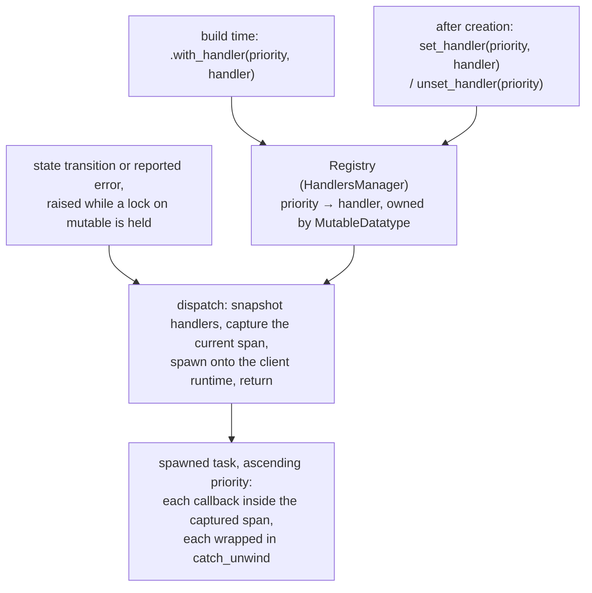
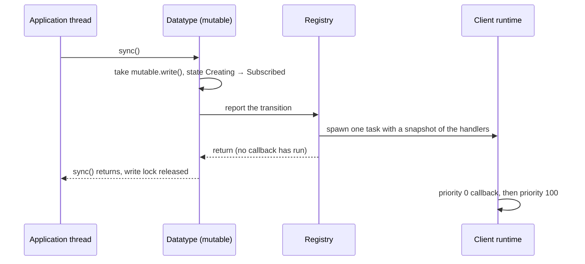

# Handler System

A handler is a pair of user callbacks — one for state changes, one for errors — that a
datatype invokes to report what happened to it. Handlers are how a datatype pushes to the
application: outcomes that arrive after an API call has already returned, such as a sync
completing or a server rejecting a subscription, have no other route to user code. Each
datatype owns its own handlers, keyed by priority, and every callback runs later on the
client runtime rather than on the stack that produced the event.

## Model

| Term | Meaning |
|------|---------|
| Handler | One `on_state_change` and one `on_error` closure registered together as a unit; either may be left as its default no-op |
| Priority | A `usize` that is both the ordering key and the identity of a registration within one datatype |
| Registry | The priority-keyed handler set belonging to a single datatype, owned by its mutable layer |
| Notification | One reported event — a state transition or an error — delivered to every handler in the registry |
| Dispatch | Scheduling a notification onto the client runtime and returning immediately |

A registry belongs to one datatype and reports only that datatype's events; there is no
process-wide handler registry. It lives on the mutable layer, next to the lifecycle state
whose transitions it reports, so the code that changes the state also raises the
notification. Because that code is holding a lock on the mutable layer at the moment it
raises one, the registry never invokes a callback itself: it snapshots the handlers, hands
them to a task on the client runtime, and returns to its caller.

## Rules and Guarantees

**Registration.** A handler is registered at a priority either at build time through the
datatype builder or at any later point through the datatype's `set_handler`. Priority is the
identity of the registration, so registering at a priority that is already in use replaces
the handler there instead of adding a second one. `unset_handler(priority)` removes the
registration and reports whether one was present; it answers about the registry entry, not
about whether the handler was dropped. A handler whose callbacks are left at their defaults
is registered normally and does nothing.

**Triggering.** A state change is reported only for an actual transition: assigning a
datatype the state it already holds notifies nothing. A transition into `Disabled`
additionally detaches the datatype from the client's datatype table. An error is reported
when the datatype's recovery path raises one — after the event loop applies a recovery
action, or when a transaction fails to commit — and is delivered independently of any state
change the same failure may have caused.

**Dispatch.** No callback ever runs on the stack that triggered the notification. Dispatch
snapshots the registry, spawns one task onto the client runtime, and returns; the callbacks
run on a runtime worker thread. A dispatch is skipped in full when the datatype handle
passed to the callbacks cannot be resolved, which is the case once the transactional layer
has been dropped.

**Ordering.** Within one notification, handlers run sequentially in ascending priority
order, and each callback completes before the next begins. Handlers are free to re-enter the
datatype they were notified about; a re-entrant read blocks until the triggering code
releases its lock.

**Isolation and lifetime.** A panic inside a callback is caught at that callback's boundary
and logged; it does not propagate, does not abort the remaining handlers in the same
notification, and does not disturb the event loop. Each in-flight notification holds its own
reference to every handler it is notifying, so a handler removed or replaced mid-flight
keeps running to completion and is dropped once the last notification holding it finishes.
That drop is what releases any resource a language binding attached to the handler, exactly
once.

**Limits on the guarantees.** Dispatch removes the callback from the triggering stack and
nothing more. It does not order the callback against the triggering lock: the spawned task
may start while that lock is still held. Ordering by priority holds inside a single
notification only — two notifications are two independent tasks and may overlap on different
worker threads, so callbacks must be safe to run concurrently with themselves. Delivery is
not guaranteed either: a notification spawned while the datatype or the runtime is being torn
down may never run, and nothing reports that it was dropped.

## Behavior

**A sync that changes state.** A datatype created through the builder starts in `Creating`.
When its first sync succeeds, the event loop moves it to `Subscribed` under the mutable
write lock, which raises a state-change notification carrying the old and new states plus a
handle to the datatype. Handlers registered at priorities 0 and 100 run in that order on the
runtime, and each may read the datatype's current value through the handle it was given.

**A rejected subscription.** When the server rejects a subscribe, the event loop applies the
recovery action for that error first and then reports the error. For a rejection the action
is to disable the datatype, so the state-change notification for the transition into
`Disabled` is raised before the error notification. A handler that inspects the datatype
handle it receives with the error therefore observes `Disabled`, not the state the datatype
had when the request was sent.

**A handler removed while it is running.** Unsetting a priority whose handler is at that
moment inside a callback removes the registry entry and reports `true`; the running callback
finishes normally because the notification holds its own reference. A second unset at the
same priority removes nothing and reports `false`.

**A handler that panics.** The panic is caught where that callback was invoked and logged at
error level. The next handler in the same notification runs, later notifications are
unaffected, and the triggering thread — which has already returned — never observes the
panic.

## Rationale

**Callbacks run off the triggering stack because inline invocation would deadlock.** The
code raising a notification holds a lock on the mutable layer, and a handler is expected to
call back into the datatype it was told about — reading the new value is the obvious thing
to do. Invoking a callback from under the write lock would make that read block on a lock the
callback's own caller holds. Spawning removes the callback from that stack, which is the
whole of what the design promises; it deliberately does not promise that the lock is already
released when the callback starts, because guaranteeing that would require holding the
notification until an unrelated caller finishes its work.

**Priority is a map key rather than a list position.** Keying the registry by priority makes
registering at an occupied priority a replacement rather than a silent duplicate, and makes
ascending iteration a property of the registry instead of a sort the dispatch path has to
remember to perform.

**The registry is snapshotted before spawning.** The dispatch task runs arbitrary user code
for an unbounded time. Cloning shared references to the handlers lets the registry lock be
released before any of that code runs, so a slow handler cannot block registration, removal,
or a concurrent notification.

**Panics are caught per callback, not per notification.** A single boundary around the whole
loop would let the first broken handler suppress every lower-priority handler in the same
notification. Isolating each invocation keeps one application's bug from silently disabling
another part of the same application.

**Removal reports on the registry entry, not on ownership.** Because every in-flight
notification holds its own reference, whether the handler is uniquely owned at the moment of
removal depends on dispatch timing the caller cannot see. Answering "was a registration
here?" is a question the caller can actually act on, and it keeps the binding-visible
lifetime — the handler drops after the last notification, releasing its userdata once —
independent of when removal happened.

**The registry sits on the mutable layer.** Handlers live next to the state whose changes
they report, so a transition raises its notification in the same place it happens rather than
through a separate lookup. Per-datatype ownership also means handler state scales with the
number of datatypes a client manages. The registry keeps a reference to the datatype's
shared attributes to reach the runtime handle it spawns on and to resolve the datatype handle
passed to each callback.

## Code Map

| Concern | Location |
|---------|----------|
| `DatatypeHandler`, its builder methods, and the per-callback `catch_unwind` boundary | `src/datatypes/handler.rs` |
| `HandlersManager` — the registry, `set_handler` / `unset_handler`, and the shared `dispatch` helper | `src/datatypes/handler.rs` |
| Callback signatures `OnStateChangeFn` and `OnErrorFn` | `src/datatypes/handler.rs` |
| Registry ownership, `set_state` (transition check and `Disabled` detach), and `call_error_handler` | `src/datatypes/mutable.rs` |
| Error reporting on the event-loop path (`WiredDatatype::handle_error`) | `src/datatypes/wired.rs` |
| Error reporting on the transaction-commit path (`end_transaction`) | `src/datatypes/transactional.rs` |
| `set_handler` / `unset_handler` on the public `Datatype` trait | `src/datatypes/datatype.rs` |
| `.with_handler(priority, handler)` at build time | `src/datatypes/builder.rs` |
| Runtime handle and datatype-handle resolution (`Attribute::get_datatype_set`) | `src/datatypes/common.rs` |

| Verified by | Tests |
|-------------|-------|
| Ascending priority order, build-time and post-creation registration | `can_notify_state_change` in `src/datatypes/handler.rs` |
| Removal reported on the registry entry while a notification is in flight | `can_report_removal_while_a_notification_is_in_flight` in `src/datatypes/handler.rs` |
| Error notification ordering and the `Disabled` state observed from the handle | `can_notify_error` in `src/datatypes/handler.rs` |
| The datatype handle matches the datatype's type | `can_pass_a_variable_datatype_set_to_the_handler` in `src/datatypes/handler.rs` |
| Re-entrant reads from a callback, one notification per actual transition | `can_use_datatype_handler` in `tests/datatype_handler.rs` |
| Binding-side registration, replacement, and exactly-once userdata release | `qortoo-ffi/tests/handler.rs` |

## Related Concepts

- [`docs/architecture.md`](architecture.md) — the layer stack and the shared state model that places the registry on the mutable layer
- [`docs/datatype-state.md`](datatype-state.md) — the lifecycle states whose transitions are reported
- [`docs/error-handling.md`](error-handling.md) — the error taxonomy and the recovery actions that decide what is reported alongside an error
- [`docs/client-and-datatype-builder.md`](client-and-datatype-builder.md) — registering handlers at build time
- [`docs/event-loop.md`](event-loop.md) — the sync path whose outcomes trigger most notifications
- [`docs/go-binding.md`](go-binding.md) — the callback and userdata contract a language binding layers on top of a handler
