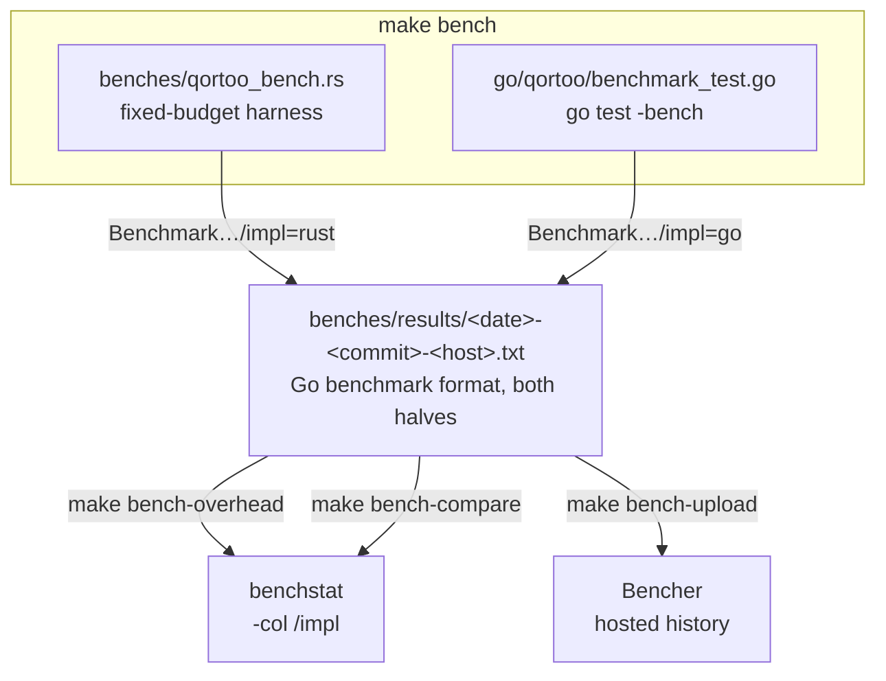

# Performance

Qortoo measures the same five scenarios twice — once against the Rust core directly and
once through the Go binding — so that the difference between the two figures is the cost
of crossing the FFI boundary, expressed per operation. This document describes how that
measurement is built, why it is shaped the way it is, and how results are compared over
time.

## Overview

Both halves emit the [Go benchmark format](https://go.dev/design/14313-benchmark-format)
under identical scenario names, one tagged `impl=rust` and the other `impl=go`. That
single format is the hinge of the whole setup: one merged file carries the entire pair,
and the Go performance tooling then works on the Rust half as well.



## Core Types

| Component | Location | Purpose |
|-----------|----------|---------|
| Rust harness | `benches/qortoo_bench.rs` | Five scenarios against the core; `harness = false`, own `main`, fixed budget per round |
| Go harness | `go/qortoo/benchmark_test.go` | The same five scenarios through the binding, each wrapped in `b.Run("impl=go", …)` |
| Budget constants | `BUDGET_*` (Rust) ↔ `-benchtime <n>x` (Go, in the `bench-go` target) | Pin both halves to the same operation count |
| Reset constants | `RESET_EVERY_*` (Rust) ↔ `resetEvery*` (Go) | Replace the datatype periodically, outside the measured region |
| Result files | `benches/results/<date>-<commit>-<host>.txt` | One merged run; untracked (see [Key Design Decisions](#key-design-decisions)) |
| Make targets | `Makefile` | `bench`, `bench-save`, `bench-overhead`, `bench-compare`, `bench-upload` |

```shell
make bench          # both halves to the console
make bench-save     # measure, save to benches/results/, print the overhead table
make bench-overhead # rust vs go for the newest saved run
make bench-compare BASE=benches/results/<older>.txt   # regression check over time
make bench-upload   # push a saved run to Bencher (needs BENCHER_API_KEY)

go install golang.org/x/perf/cmd/benchstat@latest     # required by all but the first
```

## How It Works

### Scenarios

| Scenario | Workload | What it isolates |
|----------|----------|------------------|
| `GetValue` | `get_value` / `Value` | The cheapest call in the API — where the binding weighs most |
| `IncreaseBy` | one write | Pure CRDT bookkeeping plus one boundary crossing |
| `Transaction` | commit of 10 operations | The callback trampoline (Go → Rust → Go) plus 10 inner crossings |
| `SyncLocal` | one write + one manual push-pull | The protocol path, where the binding should be a rounding error |
| `BuildCounter` | build and release a counter | One-time cost per datatype, including the binding's `runtime.AddCleanup` |

Common conditions on both sides: `LocalConnectivity` in manual mode (`set_realtime(false)`)
so no background sync interferes, single-threaded measurement, and no handler registered —
the handler trampoline cost is represented by the transaction scenario instead.

### Why a fixed budget

Cost per operation is not constant in this SDK (see [Limitations](#limitations-of-the-core-that-shape-this-harness)),
so what a run reports depends on how many iterations it performs. That is fatal for a
comparison: a time-driven harness derives its iteration count from throughput, which
differs between the two languages, so each half settles in a different regime and their
difference stops meaning anything — the binding can even come out ahead of the core it
wraps.

Both sides therefore run a pinned budget: `BUDGET_*` operations per round, `ROUNDS`
rounds, with the datatype replaced every `RESET_EVERY_*` operations outside the measured
region so each round starts from an empty push buffer and an empty server history.
Changing a budget on one side without the other silently invalidates the pair.

### Measurement protocol

- **Release linkage is mandatory.** `go/qortoo/cgo.go` lists `target/debug` before
  `target/release`, so a leftover debug artifact would be linked silently and make every
  number meaningless. `make bench-go` removes it, builds release, and refuses to run if
  one is still there. Restore the debug build afterwards with `make ffi`.
- Numbers are per-round medians over 10 rounds. The Rust harness discards one warm-up
  round first, because it runs before the Go half in `make bench` while the machine is
  still settling from the build, and an unsettled machine inflates the first rounds
  severalfold.
- Compare only pairs measured on the same machine in the same session, and read the order
  of magnitude rather than the last digit.

### Reading a result

`benchstat -col /impl` splits the merged file by the implementation tag, which turns the
raw samples into the binding-overhead table with confidence intervals and p-values:

```
             │     rust     │                   go                   │
             │    sec/op    │    sec/op      vs base                 │
IncreaseBy     227.1n ±  2%    276.8n ±  2%   +21.84% (p=0.000 n=10)
GetValue       3.655n ±  2%   30.330n ±  5%  +729.82% (p=0.000 n=10)
```

The `±` column is the first thing to check: above ~10% the machine was busy and the run
should be repeated. The measured noise floor on a quiet M4 Pro is ±1–2%.

### Tracking over time

`make bench-save` writes a run to `benches/results/`, and a regression check is a two-file
benchstat run:

```shell
$ make bench-compare BASE=benches/results/2026-07-25-1d688e8-hgroh14.txt
IncreaseBy/impl=go   288.7n ± 2%   312.5n ± 3%  +8.24% (p=0.000 n=10)
GetValue/impl=go     30.53n ± 2%   30.61n ± 4%       ~ (p=0.481 n=10)
```

The `~` is the point of the exercise: it says a 4% swing is noise rather than a
regression, which no single-number comparison can. `make bench-upload` additionally pushes
a run to [Bencher](https://bencher.dev/perf/qortoo-sync), which keeps the shared history
across machines and commits; the `go_bench` adapter reads the merged file as-is, so one
report carries both halves as ten benchmarks. The credential is read from
`BENCHER_API_KEY` only and must never be written into a tracked file.

Guidelines that apply to every comparison:

- **Only compare runs from the same machine.** The host is part of the file name and of
  the Bencher testbed for exactly that reason; absolute numbers do not transfer.
- **`B/op` and `allocs/op` are deterministic** (±0% across every run), which makes them a
  far more sensitive regression signal than wall time.
- **Record the budget alongside any number.** Because per-operation cost depends on
  accumulated state, a result measured at a different budget is a different experiment,
  not a regression.

## Baseline

Apple M4 Pro, macOS 26.5, rustc 1.97.1 release, Go 1.24, 2026-07-25:

| Scenario | Budget | Rust core | Go binding | Binding overhead |
| --- | --- | --- | --- | --- |
| `GetValue` | 2,000,000 | 3.655 ns ± 2% | 30.330 ns ± 5% | **+26.7 ns** (+730%, p=0.000) |
| `IncreaseBy` | 200,000 | 227.1 ns ± 2% | 276.8 ns ± 2% | **+49.7 ns** (+21.8%, p=0.000) |
| `Transaction` (10 ops) | 20,000 | 1.968 µs ± 3% | 2.701 µs ± 5% | **+0.73 µs** (+37.2%, p=0.000) |
| `SyncLocal` | 20,000 | 7.299 µs ± 7% | 8.029 µs ± 4% | +0.73 µs (+10.0%, unstable) |
| `BuildCounter` | 100 | 18.83 µs ± 27% | 37.01 µs ± 43% | +18.2 µs (order of magnitude only) |

A boundary crossing costs roughly **27 ns**, which matches the expectation for cgo, and
its weight falls exactly as the operation gets more expensive — 88% of a read, 18% of a
write, 9% of a sync. `IncreaseBy` costs about twice a bare crossing because the Go side
also allocates (16 B/op) for the result and error out-parameter. The transaction delta is
the largest in absolute terms because the callback trampoline crosses back (Go → Rust →
Go) and each of the 10 inner operations crosses again — roughly 11 crossings plus the
trampoline, at 15 allocations. Go allocates 16 B/op for a write, 0 B/op for a read,
304 B/op for a transaction, 32 B/op for a sync, and 104 B/op for a counter build.

The safety net of the binding's handle lifetimes (`runtime.AddCleanup` registration,
`runtime.KeepAlive` on every call) is inside these numbers: `AddCleanup` is paid once per
handle in `BuildCounter`, and `KeepAlive` is free at runtime — neither is separable from
the noise.

**The first three rows are stable across runs; the last two are not.** In `SyncLocal`
the run-to-run noise (±4–13%) is the same size as the effect, so its sign is not
reliable; in `BuildCounter` the spread is wide enough that significance itself flips
between runs. Quote those two rows as bounds, never as measurements. Machine state moves
them further: the same machine in a different session measures `SyncLocal` around 50%
slower on both halves, consistently across repeats, which is why only same-session pairs
are comparable.

## Key Design Decisions

- **A fixed budget instead of criterion.** Criterion's time-driven sampling cannot be
  pinned to an iteration count, and this SDK's per-operation cost depends on that count.
  The hand-rolled harness trades criterion's statistics for the one property the
  comparison actually requires: both halves doing the same amount of work. Reconsider
  criterion once the accumulated-state issues below are fixed.
- **One output format for both languages.** Emitting the Go benchmark format from the Rust
  harness costs a few lines and buys the entire Go performance ecosystem — benchstat,
  Bencher, and anything else that speaks the format — for both halves at once, with no
  custom parser to maintain.
- **Result files are not tracked in git.** They are large, regenerated constantly, and
  only meaningful next to the machine that produced them. Bencher holds the shared history
  instead; `benches/results/` is a local scratch area whose files exist to feed benchstat
  in the session that produced them.
- **The machine is part of the identity.** `BENCH_HOST` (derived from the host name) names
  both the result file and the Bencher testbed, so the tooling cannot silently compare
  across machines. Override it to keep history on one testbed after a rename.
- **No CI gating.** Shared runners are far too noisy for wall-clock measurement at this
  resolution. Run the benchmarks manually and attach a benchstat comparison to PRs that
  change performance. Alert thresholds on Bencher are deliberately unset for the same
  reason: `SyncLocal` and `BuildCounter` would fire constantly, so any threshold should
  cover the three stable scenarios first.
- **A dry run must not be able to destroy a saved run.** Make executes any recipe line
  mentioning `$(MAKE)` even under `-n`, so a redirect on that line would truncate the
  result file during what reads as a no-op. `bench-save` therefore spells the recursion
  `$${MAKE}`, writes to a temp file, and replaces the saved run only once the output is
  known to contain measurements.

## Limitations of the core that shape this harness

These are properties of the core, not of the binding, and they are why the harness looks
the way it does. Both are open follow-ups:

- **Per-operation cost grows with accumulated state.** A datatype keeps its pending push
  buffer and its server-side history; left alone, `IncreaseBy` degrades from ~280 ns to
  ~690 ns over five million operations, and a long enough run exceeds the push buffer
  limit outright. Hence the periodic datatype reset.
- **A dropped `Client` does not promptly release its tokio worker threads, and a client
  never unregisters a datatype.** Creating clients in a loop therefore exhausts the OS
  thread limit (`OS can't spawn worker thread`), and the per-build cost climbs steeply
  with the number of datatypes already registered (~13 µs at 200 registered, ~13 ms at
  1000). `BuildCounter` is pinned to 100 builds per fresh client for that reason, and its
  numbers still drift upward across rounds, which is why that row's significance is not
  stable between runs.

## Related Concepts

- [`docs/go-binding.md`](go-binding.md) — the binding whose overhead is measured here
- [`docs/architecture.md`](architecture.md) — the layer stack each operation traverses
- [`docs/observability.md`](observability.md) — runtime instrumentation, as opposed to
  the offline measurement described here
