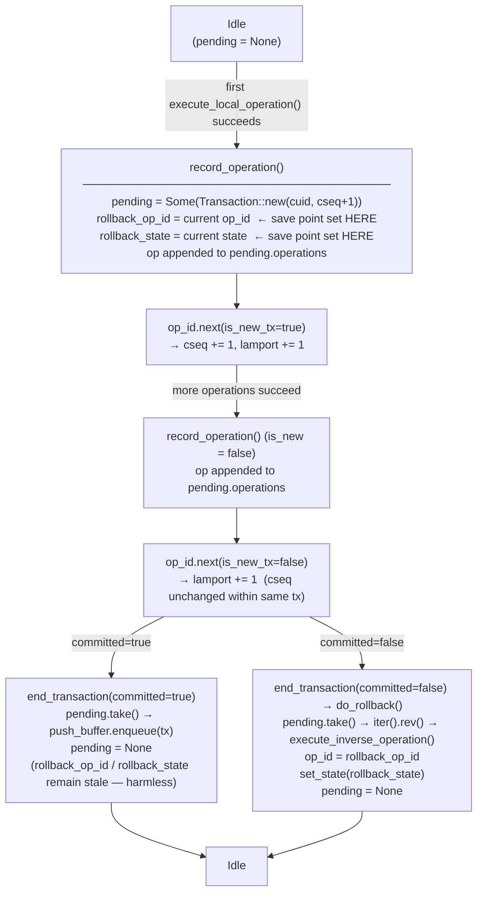
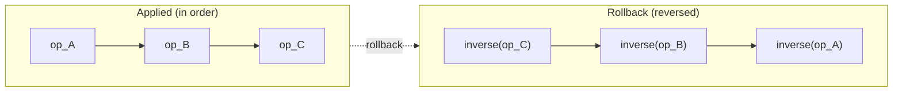
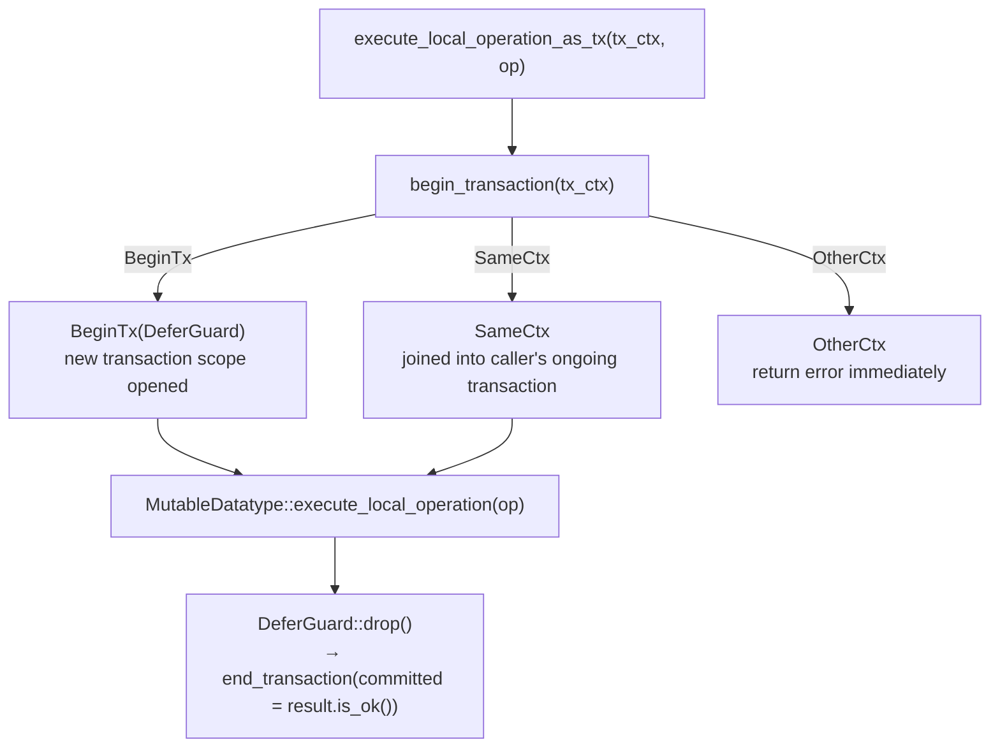

# Transaction and Rollback

## Overview

Every local write in Qortoo-rs is atomic. If any operation in a transaction fails, all previously applied operations are undone via **inverse operations** — no CRDT clone is kept.

The central struct is `TxRecord` (`src/datatypes/tx_record.rs`), which lives inside `MutableDatatype` and manages:
1. The **pending transaction buffer** — operations applied but not yet committed
2. The **rollback save point** — the `OperationId` and `DatatypeState` to restore on failure

## TxRecord Structure

```rust
pub struct TxRecord {
    pub pending: Option<Transaction>,   // None = no active transaction
    pub rollback_op_id: OperationId,    // op_id before the transaction started
    pub rollback_state: DatatypeState,  // state before the transaction started
}
```

- `pending` is `None` when idle, `Some(tx)` while a transaction is in progress.
- `rollback_op_id` and `rollback_state` are captured at the moment the **first operation of a new transaction** is recorded (`record_operation`). They are not updated for subsequent operations in the same transaction.

## Transaction Lifecycle



## Success-Only Advance Pattern

`op_id` is advanced **only after a successful operation**. This eliminates the need for a "revert" path on failure:

```rust
// MutableDatatype::execute_local_operation
op.set_lamport(self.op_id.lamport + 1);          // compute, do not advance yet
let result = self.crdt.execute_local_operation(&op);
if result.is_ok() {
    let is_new_tx = self.tx_record.record_operation(&self.op_id, self.state, op);
    self.op_id.next(is_new_tx);                  // advance only on success
}
```

On failure: `op_id` is untouched, `pending` is unchanged. The next operation retries the same lamport slot.

## Rollback via Inverse Operations

Instead of keeping a shadow clone of the CRDT, rollback applies the **inverse of each operation in reverse order**:



Each CRDT operation must implement `execute_inverse_operation`. For `CounterIncrease(delta)`, the inverse is `increase_by(-delta)`.

```rust
// MutableDatatype::do_rollback
if let Some(tx) = self.tx_record.pending.take() {
    for op in tx.iter().rev() {
        self.crdt.execute_inverse_operation(op);
    }
    self.op_id = self.tx_record.rollback_op_id.clone();
    self.set_state(self.tx_record.rollback_state);
}
```

If `pending` is `None` (no op was ever applied), `do_rollback` is a no-op — nothing to restore.

## TransactionContext and DeferGuard

At the `TransactionalDatatype` level, a transaction is scoped by `TransactionContext` and `DeferGuard`:



- `SameCtx` — op is joined into the caller's ongoing transaction (no new `DeferGuard`).
- `OtherCtx` — another transaction is in progress; the call returns an error immediately.
- `BeginTx(DeferGuard)` — a new transaction scope is opened; `DeferGuard` commits or rolls back on drop.

## OperationId Semantics

`OperationId = (lamport: u64, cuid: Cuid, cseq: u64)`

| Field | Meaning | Advances when |
|-------|---------|---------------|
| `lamport` | Logical clock | Every successful local operation |
| `cuid` | Client unique ID | Never (set at construction) |
| `cseq` | Transaction sequence number | Each new transaction committed |

`rollback_op_id` captures the `(lamport, cuid, cseq)` snapshot from before the transaction. Restoring it on rollback returns the clock to exactly the pre-transaction state.

## Adding a New CRDT Operation Type

When adding a new `OperationBody` variant, two implementations are required:

1. `execute_local_operation` — apply the operation to the CRDT state
2. `execute_inverse_operation` — undo the operation (used by rollback)

Both must be implemented at the concrete CRDT level (e.g., `CounterCrdt`) and dispatched through the `Crdt` enum wrapper in `src/datatypes/crdts/mod.rs`.
