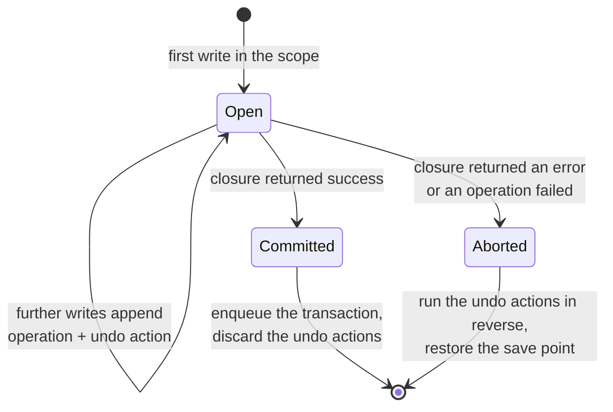

# Transaction and Rollback

A transaction is the unit in which local changes to one datatype become visible and become
eligible for synchronization. Every local write happens inside one, whether the application
asks for it or not: a single write runs in a scope of its own, and several writes can be
grouped into one scope that either takes effect completely or leaves no trace. This document
defines how a scope is opened, what happens when two threads want one at the same time, and
how an abandoned scope is undone. It does not describe how a committed transaction reaches
other clients — see [`docs/event-loop.md`](event-loop.md) and
[`docs/connectivity.md`](connectivity.md) for that.

## Model

| Term | Meaning |
|------|---------|
| Transaction | A group of one or more local operations on a single datatype, committed or undone as a unit |
| Scope | The span during which a transaction is open; opening and closing it is what commits or undoes the work |
| Standalone write | A write made outside an explicit transaction, which opens and closes a scope of its own |
| Transaction context | The token that identifies one scope, so a write can tell whether it belongs to the scope already open |
| Pending transaction | The operations recorded so far in the open scope, in the form that will be sent to other clients |
| Rollback action | A local-only instruction that undoes one applied operation; never sent to other clients |
| Save point | The progress counters and lifecycle state captured when the scope opened, restored if it is undone |

A datatype has at most one open scope at a time. Operations accumulate into the pending
transaction as they succeed, each paired with the action that would undo it. Closing the
scope resolves both: a commit hands the pending transaction to the push buffer and throws the
undo actions away, an abort runs the undo actions and throws the pending transaction away.

Rollback is by recorded inverse, not by snapshot. Nothing keeps a copy of the CRDT value, and
nothing about undoing is ever serialized — a rollback action exists only on the client that
created it, and only until its scope closes.

## Rules and Guarantees

**Scope.** A write outside an explicit transaction opens a scope, applies its operation, and
closes the scope before returning. An explicit transaction opens one scope around a closure;
writes made through the handle the closure receives join it rather than opening their own. The
scope closes when the closure returns.

**Atomicity.** A scope commits only if the closure returns success. If it returns an error, or
if any operation inside it fails, every operation already applied in that scope is undone and
the datatype is left as it was when the scope opened. A committed transaction is enqueued whole
or not at all.

**Concurrency.** A thread that asks for a scope while another thread holds one waits until the
open scope closes, then proceeds. It is not refused and no error is returned. Writes within one
open scope are serialized against each other, so operations accumulate in a defined order.

**Progress counters.** A datatype's operation counters advance only after an operation
succeeds. A failed operation leaves them untouched, and the next operation takes the slot the
failed one would have used. Committing a transaction advances the transaction sequence once,
however many operations it contained; each successful operation advances the logical clock.

**Save point.** The counters and lifecycle state are captured when the first operation of a
scope is recorded, not when the scope is requested. An undo restores exactly that snapshot, so
a datatype that rolls back is indistinguishable from one where the scope never opened.

**Undo order.** Rollback actions are applied in reverse of the order their operations were
applied, so an operation is undone before anything it depended on.

**Enqueue.** A committed transaction is enqueued for synchronization only if it originated on
this client. Transactions are enqueued in sequence, and a gap in that sequence is rejected
rather than accepted out of order. Buffered transactions stay in the buffer until the backend
acknowledges them; see [`docs/connectivity.md`](connectivity.md).

**Limits on the guarantees.** The value a write returns is determined when the operation
succeeds, which is before its scope closes. If the commit then fails — the push buffer is full,
or the sequence is not contiguous — the transaction is rolled back and the failure is reported
through the datatype's error handler, but the value already returned to the caller does not
change and the call does not report an error. An application that must know a write survived
its commit has to register an error handler; see
[`docs/handler-system.md`](handler-system.md). Atomicity is also per datatype: there is no
scope spanning two datatypes.

## Behavior

**A standalone write.** `counter.increase_by(1)` opens a scope, applies the operation to the
CRDT, records the operation and its undo action, advances the counters, and returns the new
value. The scope then closes as a commit, and the transaction — holding that one operation —
is enqueued.

**An explicit transaction that commits.** `counter.transaction("tag", |c| { … })` opens one
scope and hands the closure a handle carrying that scope's context. Each write through that
handle joins the open scope instead of opening its own. When the closure returns success, the
scope closes as a commit and all the operations are enqueued as one transaction with one
sequence number.

```mermaid
stateDiagram-v2
    [*] --> Open: first write in the scope
    Open --> Open: further writes append<br/>operation + undo action
    Open --> Committed: closure returned success
    Open --> Aborted: closure returned an error<br/>or an operation failed
    Committed --> [*]: enqueue the transaction,<br/>discard the undo actions
    Aborted --> [*]: run the undo actions in reverse,<br/>restore the save point
```

**An explicit transaction that aborts.** The closure returns an error after two successful
writes. Both are undone in reverse order, the counters and lifecycle state return to the save
point, and the transaction is never enqueued. The datatype's value is what it was before the
closure ran, and the call reports the error.

**An operation that fails mid-transaction.** A write inside the closure returns an error — an
invalid value, or a state that does not permit writes. That operation applied nothing, so no
undo action is recorded for it and the counters do not advance. Whether the scope survives is
the closure's decision: if it propagates the error, the scope aborts and the earlier writes are
undone; if it handles the error and returns success, the scope commits with the operations that
did succeed.

**A commit that fails to enqueue.** The closure returned success, but the push buffer rejects
the transaction. The transaction is restored so its undo actions still match, the scope is
undone as if it had aborted, and the error reaches the application through the error handler.
Callers that already received values from writes in that scope are not notified individually.

**A datatype that is disabled or unsubscribed with work pending.** Buffered transactions are
not discarded by a lifecycle change on their own; what happens to them is decided by the
recovery action for the triggering error, described in
[`docs/error-handling.md`](error-handling.md).

## Rationale

**Undo is recorded, not snapshotted.** Keeping a copy of the CRDT value before each scope would
cost memory proportional to the value rather than to the change, and for a datatype that is
mostly read and rarely rolled back that cost is paid on every write. Recording one action per
applied operation costs only what the scope actually changed.

**Undo actions never reach the wire.** A rollback is a local decision about work that no other
client ever saw. Putting undo information into the operation would grow every message with data
only the originating client can use, and would let a peer replay a rollback that means nothing
in its own history.

**Counters advance only on success.** The alternative — advance first, revert on failure — needs
a correct revert path for every failure mode, including ones that occur between advancing and
detecting the failure. Advancing after success means a failed operation needs no cleanup at all:
the state it would have changed was never changed.

**The save point is captured at the first recorded operation, not when the scope opens.** A
scope that opens and closes without applying anything has nothing to restore, and capturing at
scope entry would make every read-only scope carry a snapshot it never uses.

**Each CRDT owns its own action type.** The top-level rollback action has one variant per CRDT
rather than one per operation, and only the CRDT wrapper matches an action family to a CRDT
instance. Adding a datatype adds one variant and touches no existing rollback code.

**Some operations restore rather than invert.** An increment can be undone by adding its
inverse, but a last-writer-wins assignment cannot: the new value carries no trace of what it
replaced. Those operations capture the previous state in their undo action instead. Both shapes
satisfy the same rule — the action restores what the operation changed — so the scope logic does
not need to know which shape it holds. See [`docs/variable.md`](variable.md).

## Extending: adding a local operation

A new local operation has to implement two halves that fit together, at the concrete CRDT
level:

1. **Local execution** locates its target once, captures whatever the undo needs, applies the
   change, and returns both the caller-facing value and the undo action.
2. **Undo application** restores what that operation changed.

An error from local execution must leave the CRDT untouched, because a failed operation records
no undo action and nothing will be run to clean up after it. Remote execution is a separate
path: it applies an operation that already happened elsewhere and never produces an undo action,
because a remote transaction is never rolled back locally.

## Code Map

| Concern | Location |
|---------|----------|
| `TxRecord` — pending transaction, undo actions, and the save point | `src/datatypes/tx_record.rs` |
| Applying an operation, recording it, and advancing the counters | `src/datatypes/mutable.rs` (`execute_local_operation`) |
| Closing a scope: enqueue on commit, undo on abort | `src/datatypes/mutable.rs` (`end_transaction`, `do_rollback`) |
| Opening and joining scopes, waiting for a scope held elsewhere | `src/datatypes/transactional.rs` (`begin_transaction`, `execute_local_operation_as_tx`, `do_transaction`) |
| Scope-exit handling that commits or undoes | `src/utils/defer_guard.rs` |
| The public `transaction(tag, closure)` entry point | `src/datatypes/counter.rs`, `src/datatypes/variable.rs` |
| Sequence checks and capacity limits on enqueue | `src/datatypes/push_buffer.rs` |
| Undo action families and the wrapper that routes them | `src/datatypes/crdts/` |
| Counter arithmetic and its inverse | `src/datatypes/crdts/counter_crdt.rs` |

| Verified by | Tests |
|-------------|-------|
| A transaction commits as a unit; an aborted one leaves no trace | `can_use_transaction` in `src/datatypes/counter.rs` |
| Concurrent transactions from several threads all complete | `can_run_transactions_concurrently` in `src/datatypes/counter.rs` |
| Operations and undo actions accumulate and are taken together | `can_record_and_take_rollback_actions` in `src/datatypes/tx_record.rs` |
| A failed operation leaves the scope and counters unchanged | `can_preserve_transaction_state_when_operation_execution_fails` in `src/datatypes/mutable.rs` |
| Undo actions live exactly as long as their scope | `can_manage_rollback_action_lifetimes` in `src/datatypes/mutable.rs` |
| A commit that fails to enqueue is rolled back | `can_rollback_on_enqueue_failure` in `src/datatypes/transactional.rs` |
| Counter undo, including the self-inverse extreme | `can_return_and_apply_a_counter_rollback_action` in `src/datatypes/crdts/counter_crdt.rs` |
| Restore-shaped undo is routed to the right CRDT | `can_dispatch_local_variable_execution_and_rollback` in `src/datatypes/crdts/crdt.rs` |
| Restoring the save point returns the counters exactly | `can_next_rollback_compare_operation_ids` in `src/types/operation_id.rs` |
| Buffered transactions survive an unsubscribe | `can_unsubscribe_with_pending_transactions` in `src/datatypes/datatype.rs` |

## Related Concepts

- [`docs/architecture.md`](architecture.md) — where the transactional layer sits and what it shares with synchronization
- [`docs/core-types.md`](core-types.md) — the logical clock and transaction sequence the counters carry
- [`docs/datatype-state.md`](datatype-state.md) — the lifecycle states that permit or refuse writes
- [`docs/variable.md`](variable.md) — the restore-shaped undo and why assignment is not invertible
- [`docs/error-handling.md`](error-handling.md) — recovery actions, including the one that undoes a transaction
- [`docs/handler-system.md`](handler-system.md) — how a commit failure reaches the application
- [`docs/connectivity.md`](connectivity.md) — what happens to a transaction after it is enqueued
