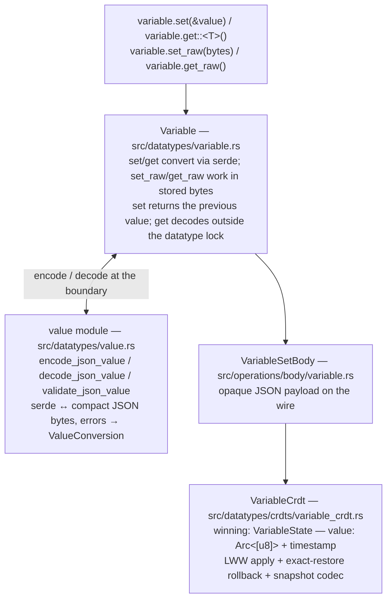

# Variable

`Variable` is a conflict-free datatype that stores a single JSON value with
**last-writer-wins (LWW)** semantics. Every write carries a `Timestamp`, and all
replicas converge to the value with the greatest timestamp. It is the first Qortoo
datatype whose payload is user-defined data rather than a fixed numeric state, so it
also establishes the SDK's language-neutral value contract: validated UTF-8 JSON bytes.

## Overview



A `Variable` reuses the whole datatype layer stack (transaction scope, push buffer,
sync, handlers — see [Architecture](architecture.md)); this document covers only what
is specific to Variable.

## Core Types

| Type | Location | Purpose |
|------|----------|---------|
| `Variable` | `src/datatypes/variable.rs` | Public API: serde-generic `set`/`get`, byte-level `set_raw`/`get_raw`, and `transaction`; implements `DatatypeBlanket` |
| `VariableCrdt` | `src/datatypes/crdts/variable_crdt.rs` | LWW state machine holding the single `winning` state |
| `VariableState` | `src/datatypes/crdts/variable_crdt.rs` | The unit of LWW state: JSON payload (`Arc<[u8]>`) bound to its winning `Timestamp` |
| `VariableSetBody` | `src/operations/body/variable.rs` | Wire operation body carrying the JSON payload as opaque bytes |
| `VariableRollbackAction` | `src/datatypes/crdts/variable_crdt.rs` | `Restore { previous }` — exact restore of a captured `VariableState` |
| `encode_json_value` / `decode_json_value` / `validate_json_value` | `src/datatypes/value.rs` | The public value boundary: serde values ↔ exactly one UTF-8 JSON value; `validate_json_value` checks caller-supplied bytes without reserializing |
| `DatatypeError::ValueConversion` | `src/errors/datatypes.rs` | Caller-facing conversion failure; returned directly, never routed through the event loop |

## How It Works

### The value contract: validated JSON bytes

A Variable's value is always **exactly one valid UTF-8 JSON value**, produced by the
writer's standard JSON serializer (`serde_json` in Rust) and preserved byte-for-byte
end to end — the SDK never re-serializes or canonicalizes a payload. LWW compares only
timestamps, never payload bytes, so semantically equal JSON with different byte
representations (key order, number formatting) needs no normalization. Values that
JSON cannot express (functions, cyclic references, non-string map keys) fail at the
boundary with `DatatypeError::ValueConversion`, before any operation is created.

This is what lets different languages share one Variable: any binding that writes a
valid JSON value and reads it back with its own JSON decoder interoperates, and
schema-level choices (how to encode binary, time, decimals) belong to the application,
not the SDK.

### Initial state and the reserved Lamport zero

A Variable always has a value; its initial value is JSON `null`, paired with the
synthetic `Timestamp::initial()` (`lamport = 0`, nil CUID). Lamport `0` is reserved
for this sentinel: every real modification gets a positive Lamport, and
`OperationContext::try_new` rejects Lamport-0 modifications for local and remote
execution alike. The initial timestamp is therefore older than every real write
regardless of how the nil CUID compares lexically.

An explicit `set(&Value::Null)` stores the same JSON `null` payload but with a real
timestamp — the public value contract does not distinguish the two, while the CRDT
does. Readers accept either through a nullable destination (`Option<T>`,
`serde_json::Value`); decoding `null` into a non-nullable type is a `ValueConversion`
error.

### LWW apply

`VariableCrdt::apply_set` compares the incoming timestamp with the current winning
timestamp using `Timestamp`'s total order (Lamport first, then CUID — see
[Core Types](core-types.md)):

| Incoming timestamp | Handling |
|--------------------|----------|
| Greater than current | Replace value and timestamp (`Applied { previous }`) |
| Less than current | Stale write — ignore (`Unchanged`) |
| Equal, same payload | Duplicate operation — ignore (`Unchanged`) |
| Equal, different payload | Same operation identity with conflicting content — error |

The equal-but-different case cannot be produced by a correct client; treating it as an
error surfaces corruption instead of letting replicas silently diverge. Local
execution additionally requires `Applied` — a local Set that did not advance the
winning timestamp indicates a broken local clock.

### Set, Get, and rollback

- **`set<T: Serialize>`** encodes once at the boundary, executes a `VariableSet`
  operation through the shared transaction machinery, and returns the value the
  variable held just before the write — as `serde_json::Value`, because consecutive
  Sets may store different JSON types. The returned previous payload and the recorded
  rollback action share one `Arc<[u8]>`; nothing is copied twice.
- **`get<T: DeserializeOwned>`** is a local read: no operation, no version change,
  allowed in every state. It clones the `Arc` handle under the datatype read lock and
  decodes after releasing it.
- **`set_raw` / `get_raw`** are the byte-level counterparts for a caller that already
  holds serialized JSON — a non-Rust binding forwarding its own encoder's output, or a
  dynamic pipeline. `set_raw` validates the input as exactly one UTF-8 JSON value
  (`validate_json_value`, no reserialization) and returns the previous value's stored
  bytes; `get_raw` returns the current bytes verbatim and cannot fail. Both share the
  execution and rollback path of `set`/`get`.
- **Rollback** is an exact restore, not an inverse operation. `Set(new)` alone cannot
  reconstruct the previous value or its winning timestamp, so local execution captures
  the full previous `VariableState` in `VariableRollbackAction::Restore`. Applying a
  transaction's actions in reverse returns both value and timestamp to the
  pre-transaction state, including the initial `null` state for a rolled-back first
  Set (see [Transaction and Rollback](transaction-and-rollback.md)).

### Snapshot

A new subscriber receives the Variable as a version-1 binary snapshot that preserves
**both** the winning value and the winning timestamp:

```text
version:u8 = 1
winning_timestamp: lamport:u64 LE + cuid:[u8; 16]
json_length:u64 LE
json_payload:[u8; json_length]
```

Carrying the timestamp is what makes the catch-up correct: if a snapshot replaced the
winning timestamp with its own transaction metadata, an old write arriving after the
snapshot could incorrectly win. The decoder (`SnapshotCodec::decode_snapshot`)
validates version, lengths, CUID, JSON well-formedness (streamed, without allocating a
JSON tree), trailing bytes, and the Lamport-0 rule (only `null` + initial timestamp),
and returns a fully validated instance — a failed decode leaves the existing state
untouched.

## Key Design Decisions

- **`Variable` is not generic over `T`; its methods are.** The runtime registry,
  `DatatypeSet`, and handlers cannot know a concrete `T`, and successive Sets may
  store different JSON types. `set`/`get` take type parameters per call instead, and
  `set` returns the previous value as dynamic JSON for the same reason. `set_raw`/
  `get_raw` sidestep type parameters entirely by working in the stored JSON bytes,
  which is what every non-Rust binding uses.
- **Opaque payload on the wire.** `VariableSetBody` stores the JSON as bytes it never
  interprets; `Display`/`Debug` expose only the byte size, and `MemoryMeasurable`
  counts the real payload length. Validation happens once at the public boundary.
- **Rollback state is local-only.** The previous value never rides in the wire
  operation — it is not data any other replica needs, and it would inflate operations
  whose payloads are large. `TxRecord` keeps the restore action alongside the pending
  transaction instead.
- **No JSON canonicalization (RFC 8785) in the initial scope.** LWW never compares
  payloads for precedence, and duplicate detection relies on byte-preserved payloads
  of the *same* wire operation, so canonical byte equality across independently
  produced operations is not required.
- **No `Unset` operation.** `null` is a first-class value and the initial value. A
  future deletion concept would need its own tombstone semantics rather than
  overloading `null`.

## Related Concepts

- [Core Types](core-types.md) — `Timestamp` precedence and the `OperationContext`
  that stamps each execution
- [Transaction and Rollback](transaction-and-rollback.md) — the rollback-action model
  Variable's exact restore plugs into
- [Client and DatatypeBuilder](client-and-datatype-builder.md) — obtaining a
  `Variable` via `build_variable()`
- [Architecture](architecture.md) — the layer stack every datatype shares
