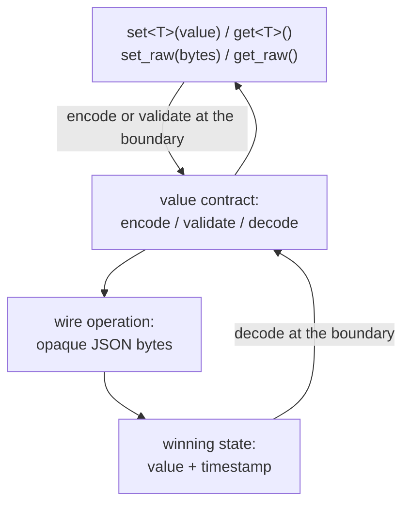

# Variable

A variable holds one JSON value and resolves concurrent writes by last-writer-wins: every
write carries a timestamp, and whichever timestamp is greatest is what every replica ends up
holding. It is the first Qortoo datatype whose payload is application-defined data rather than
a fixed numeric state, so it also establishes the SDK's language-neutral value contract —
exactly one UTF-8 JSON value, carried byte-for-byte. This document owns that contract and the
LWW rules built on it. Everything a variable shares with other datatypes — transaction scope,
the push buffer, synchronization, handlers — is defined in [`docs/architecture.md`](architecture.md)
and [`docs/transaction-and-rollback.md`](transaction-and-rollback.md).

## Model

| Term | Meaning |
|------|---------|
| Value contract | The rule that a stored value is always exactly one UTF-8 JSON value, unmodified end to end |
| Winning state | The value and timestamp a variable currently holds |
| Timestamp | The logical clock stamped on a write, whose total order decides which write wins |
| Set | A write that replaces the winning state if its timestamp is greater than the current one |
| Exact restore | A rollback that reinstates a captured prior winning state, rather than inverting an operation |
| Snapshot | The binary encoding of the winning state given to a new subscriber |

A variable always has a value — there is no absent or unset state — and it always has exactly
one. The value contract exists because a variable's payload is opaque to the SDK: unlike a
counter, whose state is one integer the SDK itself defines, a variable's state is whatever the
application put there, so the SDK needs one representation every language can produce and
consume without agreeing on anything else.



## Rules and Guarantees

**The value contract.** A stored value is always exactly one UTF-8 JSON value. Once accepted,
it is kept byte-for-byte — the SDK never reparses and re-emits it — so property order and
number formatting survive exactly as written. Because last-writer-wins compares only
timestamps, two payloads that are semantically equal but byte-different are simply two
different writes; nothing needs canonicalizing for correctness.

**What fails at the boundary, and when.** A value that does not implement Rust's
serialization trait is a compile-time error, not a runtime one — the type system refuses it
before any conversion runs. A value that does implement it but cannot become a single JSON
value fails at encoding time with a conversion error, before any operation is created and
without changing the variable: a map keyed by something that cannot become a JSON string, such
as a tuple or a struct, is the case this SDK exercises. A map keyed by a string, a number, or a
boolean succeeds — those key types convert to their string form. Bytes handed to the raw entry
point fail the same way if they are not exactly one well-formed UTF-8 JSON value.

**Numbers with no exact JSON representation are not rejected.** A floating-point value that
JSON cannot express, such as one produced by a division by zero, encodes successfully as JSON
`null` rather than failing. This means encoding is not a strict correctness fence for every
input; a value that reaches `set` in that state is stored as `null` with no error.

**The initial value and the reserved zero timestamp.** A variable starts holding JSON `null`
paired with a synthetic timestamp older than any real write can produce. That reservation is
enforced on every execution path, local and remote, so no real write can ever collide with the
initial one. An explicit set of `null` is a distinct, real write with a real timestamp; reading
cannot tell the two apart, so a reader that must distinguish "still initial" from "explicitly
set to null" needs its own signal outside the value.

**Applying a set.** Comparing an incoming timestamp against the current winning one has four
outcomes: a strictly greater timestamp replaces the value; a strictly lesser one is ignored as
stale; an equal timestamp with the same payload is ignored as a duplicate delivery; an equal
timestamp with a different payload is an error, because two different real writes can never
share a timestamp — reaching that case means something is corrupt, not merely conflicting. A
local write is held to a stricter version of the first rule: it must strictly advance the
timestamp, or it indicates the local clock itself is broken.

**Rollback restores, it does not invert.** A set's undo action is a copy of the winning state
from immediately before it, because the new value alone carries no trace of what it replaced.
Undoing a transaction's sets in reverse returns both the value and its timestamp exactly to
where they were before the transaction opened, including back to the initial state if the
transaction contained the first-ever set. See
[`docs/transaction-and-rollback.md`](transaction-and-rollback.md) for the mechanism this plugs
into.

**Reading never fails and is always allowed.** Reading is a local operation that creates no
operation and changes no version, so it is permitted in every lifecycle state including
read-only ones. Reading in the byte form cannot fail, because the stored bytes are always
exactly one JSON value already. Reading in a typed form can fail only if the requested type
cannot hold what is stored — most commonly, a non-nullable type asked to hold `null`.

**A snapshot carries the timestamp, not just the value.** Handing a new subscriber only the
current value and stamping it with catch-up metadata would let an old write that arrives after
the snapshot incorrectly win, because the snapshot's own timestamp would look newest. Carrying
the real winning timestamp keeps a late-arriving stale write correctly recognized as stale. A
snapshot that fails to decode leaves the existing state untouched.

## Behavior

**Setting and getting a typed value.** `variable.set(&value)` encodes once, executes the write,
and returns the value the variable held immediately before — decoded as dynamic JSON, because
successive sets are not required to store the same type. `variable.get::<T>()` decodes the
current value into whatever type the caller asks for.

```rust
let previous = variable.set(&Profile { name: "qortoo".into(), age: 3 })?;
assert_eq!(previous, serde_json::Value::Null); // the initial value
let value: Profile = variable.get()?;
```

**Distinguishing initial from explicitly null.** Both the untouched initial value and an
explicit `set(&Value::Null)` read back as `null` through a nullable destination; a non-nullable
destination fails to decode either one the same way. The value alone cannot tell them apart.

**Working in raw bytes.** A caller that already holds serialized JSON — a non-Rust binding
forwarding its own encoder's output — uses `set_raw` and `get_raw` instead, which validate or
return bytes without going through Rust's serializer at all, preserving the caller's own
formatting exactly.

**A transaction of several sets.** `variable.transaction("tag", |v| { v.set(&a)?; v.set(&b)?;
Ok(()) })` applies both sets as one scope. If the closure returns an error, both are undone and
the variable is exactly as it was before the transaction opened — including its timestamp.

**Two clients converging.** Client A sets a value and synchronizes; client B, sharing the same
backend, receives it and reads the same value with the same timestamp. If both set concurrently
before either synchronizes, the write with the greater timestamp wins on both sides once they
exchange — deterministically, because ties are broken by client identity rather than left
ambiguous.

**A late write that turns out to be stale.** A transaction created before a newer write reaches
the backend, but delivered after it. Applying it finds its timestamp already behind the current
winning one and ignores it; the newer value is undisturbed.

**A new subscriber catching up.** A client subscribes after the variable has already been set
several times. Instead of replaying every write, it receives one snapshot carrying the current
value and its timestamp, and is caught up in one step.

**A value that fails to encode.** `variable.set(&map_with_a_tuple_key)` fails before any
operation exists; the variable is untouched and the caller receives the encoding error directly,
with no handler involved.

## Rationale

**`Variable` itself is not generic; its methods are.** The datatype has to be storable in the
same runtime registry and passed to the same handlers regardless of what it currently holds,
and successive sets are not required to store the same type. Putting the type parameter on each
call, rather than on the type, is what makes that possible — and it is also why `set` returns
the previous value as dynamic JSON rather than as the caller's type.

**The wire payload is opaque bytes.** The operation that carries a set across the wire never
interprets its payload — it only measures its size for memory accounting and hides its content
from logs. Validation happens exactly once, at the public boundary, rather than being repeated
by every consumer of the operation.

**The undo action never travels with the operation.** The previous state a rollback needs is
data only the client that produced it can use; putting it on the wire would grow every
operation by the size of a value nobody else needs, for the sole benefit of an undo that might
never happen.

**Byte-for-byte storage, not canonical JSON.** Last-writer-wins never compares payloads for
precedence, and detecting a duplicate relies on comparing bytes from the same wire operation
rather than independently produced ones. Canonicalizing would spend work solving a problem this
datatype does not have.

**No delete operation.** JSON `null` is a first-class, ordinary value and also the value a
variable starts with. A concept of deletion is a different guarantee — it needs its own way to
tell "there was never a value" apart from "the value is null" — and overloading `null` to mean
both would erase that distinction rather than provide it.

## Code Map

| Concern | Location |
|---------|----------|
| Public API: `set`, `get`, `set_raw`, `get_raw`, `transaction` | `src/datatypes/variable.rs` |
| The value contract: encode, validate, decode | `src/datatypes/value.rs` |
| The LWW state machine, timestamp comparison, and rollback | `src/datatypes/crdts/variable_crdt.rs` |
| The wire operation body | `src/operations/body/variable.rs` |
| Timestamp construction and total order | `src/types/timestamp.rs` |
| Snapshot encoding and decoding | `src/datatypes/crdts/variable_crdt.rs` (`SnapshotCodec` impl) |

| Verified by | Tests |
|-------------|-------|
| Typed round trip, including a value that changes shape between sets | `can_round_trip_typed_values`, `can_return_the_previous_value_across_json_types` in `src/datatypes/variable.rs` |
| Initial and explicit null are indistinguishable when read | `can_read_initial_and_explicit_null_into_nullable_destinations` in `src/datatypes/variable.rs`, `can_apply_an_explicit_null_over_the_initial_null_value`, `can_preserve_the_real_timestamp_of_an_explicit_null_set` in `src/datatypes/crdts/variable_crdt.rs` |
| A non-nullable destination rejects null | `can_reject_null_for_a_non_nullable_destination` in `src/datatypes/variable.rs`, `can_reject_null_for_non_nullable_destination` in `src/datatypes/value.rs` |
| A failed encode leaves the variable untouched | `can_keep_the_variable_unchanged_when_encoding_fails` in `src/datatypes/variable.rs` |
| A composite map key fails to encode; a primitive-keyed map does not | `can_reject_value_that_fails_to_encode` in `src/datatypes/value.rs` |
| Raw bytes round-trip without reformatting, and invalid raw input is rejected before write access is even checked | `can_round_trip_raw_json_bytes_without_reformatting`, `can_reject_raw_json_that_is_not_exactly_one_value`, `can_validate_raw_json_before_consulting_write_access` in `src/datatypes/variable.rs` |
| Reading creates no operation and is allowed in every state | `can_read_without_changing_state_version_or_push_buffer` in `src/datatypes/variable.rs` |
| The four outcomes of applying a set | `can_apply_a_newer_variable_set_and_return_the_previous_state`, `can_ignore_a_stale_variable_set`, `can_ignore_a_duplicate_variable_set`, `can_reject_different_values_for_the_same_variable_timestamp` in `src/datatypes/crdts/variable_crdt.rs` |
| A local set must strictly advance the timestamp | `can_reject_a_local_variable_set_without_a_newer_timestamp` in `src/datatypes/crdts/variable_crdt.rs` |
| Ties are broken by client identity | `can_break_variable_set_ties_by_cuid` in `src/datatypes/crdts/variable_crdt.rs`, `can_converge_via_cuid_tie_break_regardless_of_sync_order` in `src/datatypes/variable.rs` |
| Rollback restores value and timestamp, including back to the initial state | `can_execute_and_rollback_local_variable_sets_in_reverse_order` in `src/datatypes/crdts/variable_crdt.rs` |
| A transaction of several sets commits or undoes as a unit | `can_use_transaction` in `src/datatypes/variable.rs` |
| A stale write arriving late is still ignored | `can_ignore_a_stale_transaction_that_arrives_after_a_newer_value` in `src/datatypes/variable.rs` |
| A late subscriber catches up via snapshot | `can_catch_up_a_late_subscriber_to_the_current_value_and_timestamp` in `src/datatypes/variable.rs`, `can_round_trip_a_variable_snapshot_with_its_winning_timestamp` in `src/datatypes/crdts/variable_crdt.rs` |
| A malformed snapshot is rejected without disturbing existing state | `can_reject_malformed_variable_snapshots` in `src/datatypes/crdts/variable_crdt.rs` |
| Two clients converge over a real exchange | `can_propagate_a_sequential_set_between_two_clients` in `src/datatypes/variable.rs` |

## Related Concepts

- [`docs/architecture.md`](architecture.md) — the layer stack every datatype shares
- [`docs/core-types.md`](core-types.md) — the timestamp's total order and the identity it is built from
- [`docs/transaction-and-rollback.md`](transaction-and-rollback.md) — the rollback mechanism exact restore plugs into
- [`docs/client-and-datatype-builder.md`](client-and-datatype-builder.md) — obtaining a variable via `build_variable()`
- [`docs/error-handling.md`](error-handling.md) — the conversion error's place in the error taxonomy
- [`docs/go-binding.md`](go-binding.md) — how a non-Rust binding produces and consumes the same JSON bytes
